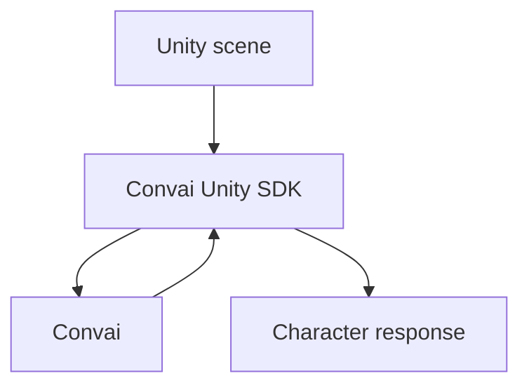

# GitBook block usage

Use GitBook blocks to improve scanability, comprehension, navigation, and accessibility. Native
GitBook blocks are part of the page design system, not optional decoration. When GitBook has a native
block that matches the content intent, use it instead of plain Markdown, generic bullet lists, or ad
hoc HTML.

## Block selection table

| Content need | Required GitBook pattern | Do | Avoid |
|---|---|---|---|
| Important note, prerequisite context, non-critical constraint | Hint with `info` style | Use a short hint near the affected step. | Burying the note in a paragraph after the step. |
| Expected success state | Hint with `success` style | State the observable success condition. | Ending a procedure without confirmation. |
| Common mistake, compatibility issue, silent failure | Hint with `warning` style | Put the warning before the risky action. | Mentioning the risk only after the step. |
| Security risk, destructive action, data loss, broken production behavior | Hint with `danger` style | Make the consequence and safer action explicit. | Using normal prose for critical warnings. |
| Short linear procedure | Stepper | Use for guided setup or walkthroughs with ordered steps. | Manual `Step 1`, `Step 2` headings. |
| Long or branching procedure | Normal `##` sections, optionally with smaller steppers inside | Keep branches visible and scannable. | One large stepper with branches, warnings, and references hidden inside. |
| Equivalent alternatives | Tabs | Use for OS, engine version, Inspector vs C#, package source, or language variants. | Using tabs for unrelated topics or different reader intents. |
| Hub/index navigation | Cards | Route readers to major child pages. | Dense bullet lists of page links on a hub page. |
| Strong related page or next step | Content reference | Use after the surrounding sentence explains why the link matters. | Generic "Related articles" dumps. |
| API endpoint reference | OpenAPI block | Use when REST endpoints are documented and an OpenAPI source exists. | Manually duplicating endpoint schemas that can drift. |
| Code with syntax highlighting | Code block | Specify the language. | Screenshots of code. |
| Code tied to a file path, line numbers, or wrapping | GitBook code block with title/options | Add the file path as the code title. | Plain fenced code when file context matters. |
| UI state, Inspector configuration, visual result | Image/file block with alt text and caption | Use images to clarify visual state. | Images without alt text or screenshots as the only instruction source. |
| Architecture flow, state machine, decision tree | Mermaid diagram | Add nearby explanatory text. | Long prose that is harder to scan than a diagram. |
| Field list, support matrix, comparison, troubleshooting matrix | Table | Use clear headers and concise cells. | Tables for visual layout. |
| Side-by-side comparison | Columns, only when mobile readability remains acceptable | Use for compact comparisons. | Columns for required linear reading. |
| Optional detail that interrupts the main flow | Expandable section/details | Hide non-required detail only. | Hiding prerequisites, warnings, or required steps. |
| External URL with a rich preview (video, repo, tool) | Embed block | Use for demo videos, repository links, or tool pages. | Embedding URLs that add no context or become stale quickly. |
| Prerequisite or pre-flight checklist the reader ticks off | Task list | Use for things that must be true before starting. | Using a checklist for a procedure the reader performs in order. |
| Freehand sketch of a system | Mermaid diagram | Keep diagrams as text so they diff, search, and survive edits. | Drawing blocks — they go stale invisibly. |
| A relationship prose cannot express cleanly | Math and TeX block | Add the meaning in prose alongside the formula. | A rendered formula as the only explanation. |
| A reusable AI prompt the reader runs | Prompt block | Use when the reader's next action really is an AI task. | Prompt blocks added as decoration. |
| Content identical on multiple pages | Reusable content (Snippet) | Sync one source block across all pages. | Copy-pasting the same content to multiple pages manually. |
| Downloadable file (sample project, config template, script) | File block | Attach the file directly to the page. | Linking to an external host that may go offline. |
| Changelog or versioned release notes | Updates block | Add timestamped entries with optional tags. | Long bullet-list changelogs in normal prose. |
| Pull quote or attributed third-party citation | Quote block | Use for attributed quotes. | Using quote blocks for ordinary emphasis; that is hint territory. |
| Content for specific versions, platforms, or roles | Conditional content block | Show/hide blocks based on context without duplicating the page. | Separate pages for minor differences affecting a few blocks. |

### Block selection rules

- Prefer a GitBook-native block when it improves the reader's ability to scan, decide, copy, verify, or navigate.
- Do not use blocks for decoration, visual novelty, or to make weak content look important.
- Do not over-pack blocks. If a stepper, tab, hint, or expandable section becomes long, split into headings or pages.
- Keep required information visible in the main flow.
- Keep block titles specific: `Inspector`, `C#`, `Windows`, `Unity 2022.3` — not `Option 1`, `Tab 2`, or `More`.
- Every page review must include a block-fit pass: identify structured content that should be upgraded to a native block.

## Hints

```md

Use a clean Unity project when evaluating the SDK for the first time. This makes package conflicts easier to isolate.

```

| Style | Use for |
|---|---|
| `info` | Optional context, prerequisites, neutral notes |
| `success` | Expected success state |
| `warning` | Common mistakes, silent failures, important constraints |
| `danger` | Data loss, broken builds, security risks, destructive actions |

Do not use hints for ordinary prose. Limit hints to two per page on normal task and concept pages.
More than two hints signals that the content has structural problems — restructure rather than hinting.

## Steppers

Use steppers for short, linear procedures.

```md


### Open Package Manager

In Unity, select **Window > Package Manager**.



### Add the SDK package

Select **Add package from git URL**, then enter the package URL for your SDK version.


```

Rules: step headings use `###` inside the stepper; step titles are action-oriented; do not title steps
`Step 1`, `Step 2`, or `Next`; include the expected result in the step body when useful; keep long or
branching procedures as normal `##` sections instead.

## Tabs

Use tabs for equivalent alternatives.

```md


Configure the field in the Unity Inspector.



Configure the field from a script.


```

Good tab sets: `Windows`/`macOS`/`Linux`; `Inspector`/`C#`; `Unity Package Manager`/`Local package`.
Do not use tabs for unrelated topics — split them into separate pages instead. Do not hide critical
warnings or prerequisites in one tab only.

## Expandable sections

Use expandable sections for optional detail that would interrupt the main flow.

```md
<details>
<summary>View package resolution details</summary>

Unity resolves Git packages through Package Manager and stores the resolved version in `Packages/packages-lock.json`.

</details>
```

Do not hide required setup steps or warnings inside expandable sections.

## Code blocks

Always specify the language.

````md
```csharp
ConvaiSettings.ApiKey = "YOUR_API_KEY";
```
````

Use a titled code block when the file path matters.

````md

```csharp
using UnityEngine;

public class ConvaiBootstrap : MonoBehaviour
{
    private void Awake()
    {
        ConvaiSettings.ApiKey = "YOUR_API_KEY";
    }
}
```

````

Rules: examples must compile or be clearly marked as pseudocode; use realistic names and paths; use
placeholders only when necessary, such as `YOUR_API_KEY`; do not use screenshots for code or terminal output.

## Content references

```md

[Configure the API key](../authentication/configure-api-key.md)

```

Use descriptive surrounding text. Do not create long lists of content refs where cards would work better.

## Cards

Use cards for hub pages and section index pages.

```html
<table data-view="cards">
<thead>
<tr>
<th></th>
<th data-hidden data-card-target data-type="content-ref"></th>
</tr>
</thead>
<tbody>
<tr>
<td><strong>Install the Unity SDK</strong><br>Install the package and verify that Unity loads it correctly.</td>
<td><a href="install-the-unity-sdk.md">install-the-unity-sdk.md</a></td>
</tr>
<tr>
<td><strong>Configure the API key</strong><br>Add authentication settings required for SDK requests.</td>
<td><a href="configure-the-api-key.md">configure-the-api-key.md</a></td>
</tr>
</tbody>
</table>
```

Cards are for routing. Do not use them inside dense procedural pages.

## Mermaid diagrams

Use Mermaid for architecture flows, state machines, or decision trees. Describe the diagram in nearby
text for search and screen reader context.

````md

````

## Tables

Use tables for comparisons, field references, platform support, and troubleshooting. Do not use tables
for page layout.

## Columns

Use columns only when side-by-side comparison improves comprehension. Avoid columns on pages that need
to read well on mobile.

```md

{% column width="50%" %}
**Inspector**

Use this path for scene-based setup.



**C#**

Use this path for runtime configuration.


```

## OpenAPI blocks

Use OpenAPI blocks only for REST API reference pages.

```md


```

## Conditional content

Use conditional content blocks to show or hide sections based on visitor context — without duplicating
the page. Supported conditions: URL parameter, cookie, feature flag, visitor token.

Rules: use when the variation is small (a few blocks) — if entire page sections differ, use Content
Variants; never hide required safety warnings or prerequisites behind a condition; every conditional
block must have a sensible default; document active conditions in space settings; do not use
conditional content as a substitute for a well-split page.

## Reusable content (Snippets)

Use reusable content for blocks that appear identically on multiple pages: shared prerequisites,
standard environment requirements, repeated API key warnings, or boilerplate setup steps. Create a
snippet once, then insert it by reference. Editing the source updates every page that uses it.

Rules: use snippets for content that must stay byte-for-byte identical across pages; do not
snapshot-copy snippet content into pages; name snippets descriptively (`prerequisite-unity-2022-3`,
`warning-api-key-commit`); treat snippets as a shared codebase — review impact before editing a
widely-used snippet. In this repo, snippets live under `.gitbook/includes/`.

## File blocks

Use file blocks to attach downloadable assets directly to a page: sample projects, migration scripts,
configuration templates, or exported settings files. Store files in `.gitbook/assets/`. Name files
descriptively. Do not use file blocks for content that should be selectable text — use code blocks.

## Updates block

Use the Updates block on changelog and release notes pages to maintain timestamped entries with an
auto-generated RSS feed. Use only on designated changelog or release notes pages. Available on paid
GitBook plans only.

## Quote block

Use the Quote block for attributed third-party quotes or pull quotes that require typographic
distinction. Do not use quote blocks as an alternative to hint blocks. SDK documentation rarely needs
quote blocks.

## Embed blocks

Use embed blocks for external URLs where a rich link preview adds context — demo videos, repositories,
interactive tools.

```md

```

Use embed blocks for content the reader needs to watch or interact with, not for general references.
Plain inline links are better for URLs that require no preview. Do not embed URLs that are likely to
change, go offline, or require authentication.

## Task lists

Use a task list for a checklist the reader ticks off as they work — prerequisites before a setup page,
or a pre-flight check before a build. It is not a procedure. A procedure carries order and a checklist
does not, so anything the reader performs in sequence belongs in a stepper instead.

```md
* [ ] Unity project set to the Android build target
* [ ] Convai API key configured in `ConvaiSettings`
* [ ] Microphone permission granted in Player Settings
```

Never use a task list as a substitute for real prose about what each item means. If an item needs
explaining, it needs a section, not a checkbox.

## Drawings

Do not use drawing blocks in Convai documentation. Use a Mermaid diagram instead.

A Mermaid diagram is text: it diffs in a pull request, it is searchable, an AI assistant can read it,
and the next person can edit it without redrawing it. A drawing is none of those, so it becomes stale
the moment the thing it depicts changes, and nobody can tell that it has.

## Math and TeX

Use a math block only where a formula is genuinely the clearest expression of a relationship — a
sample-rate conversion, a blend weight, a coordinate transform. It is rare in this documentation.

Always state what the formula means in prose as well. A reader using a screen reader, and an AI
assistant answering a question, get nothing from the rendered formula alone.

## Prompt blocks

A prompt block holds a reusable AI prompt. The reader copies it in one click or opens it directly in a
supported AI tool.

Use one only where the reader's next real action is an AI task: a troubleshooting prompt that collects
the right diagnostic information, an integration scaffold, a migration analysis over their own project.
Do not add one as a novelty, and do not use one where a code block or a procedure is what the reader
actually needs.

Write the prompt the way you want it used: state the task, define the output format, and name the
constraints, exactly as the writing standards require of any instruction.

## Page options and rendering

| GitBook feature | Standard |
|---|---|
| Page icon | Set one on hub and section index pages so cards and the sidebar read at a glance. Keep icon use consistent within a section rather than per page. |
| Cover image | Use only on a section landing page, and only when the image carries meaning. A decorative cover pushes the lead paragraph below the fold. |
| Tags | Apply the tags the section already uses. Do not invent a new tag vocabulary for one page. |
| Page title | Treat as the only page H1. Keep it specific, unique, and sentence case. |
| Page description | Target 120–160 characters; hard max 200. One outcome-focused sentence. |
| Page outline | Make the `##` and `###` structure useful enough to navigate from the outline alone. |
| Sidebar label | Short but meaningful. Avoid vague labels like `Setup`, `Basics`, `Advanced`. Must match the page `title` frontmatter exactly. |
| Page link title | Set a separate link title only when the full page title does not fit the sidebar. Make the link title shorter, never vaguer. |
| Next/previous links | Keep enabled for linear getting-started and tutorial flows. Disable only for custom landing pages or standalone reference surfaces. |
| Layout width | Default for normal prose and procedures. Wide for cards, wide tables, OpenAPI blocks, or horizontally dense code. |
| Page metadata | Use canonical and alternate URLs for duplicate, versioned, or localized pages. Do not canonicalize pages that are only related but materially different. |
| Hidden pages | Use intentionally for drafts, private support pages, reusable content, or deprecated pages. Hidden pages still need a clear owner and review state. |
| Search indexing | Do not hide production-useful support, troubleshooting, migration, or reference pages from search without a specific reason. |
