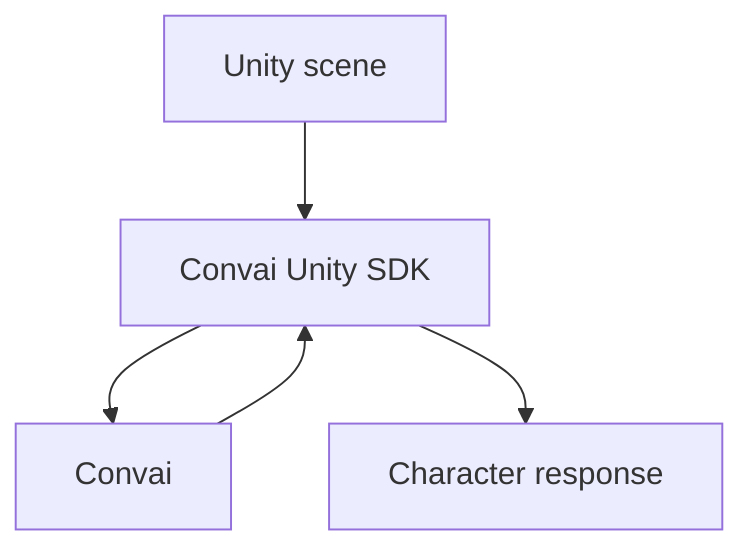

<!--
EXPLANATION TEMPLATE. Take a wide perspective: background, rationale, alternatives, tradeoffs.
Use reasoning statements ("The reason X works this way is…"). No step-by-step instructions and no
close-up reference detail — link those out. Concept headings are noun phrases.
Replace all content. No body `#`. No `## Overview`. Delete this comment before publishing.
-->

This page explains how a conversation flows between a Unity scene, the Convai Unity SDK, and Convai,
and why the pipeline is structured this way.

## <Concept — noun phrase>

<Background and mental model. Use a Mermaid diagram for the flow, with explanatory text nearby.>

## <Rationale — noun phrase>

<Why it works this way. Reasoning statements. Tradeoffs and alternatives considered.>

## <Relationships — noun phrase>

<How this system relates to others. Link to reference and how-to pages for detail.>

## Related concepts


[<Related concept title>](<related-concept>.md)

