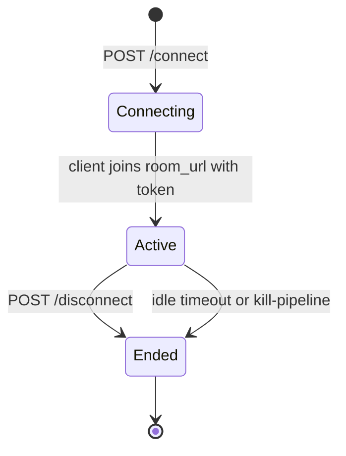

A session is the server-allocated container that pairs a client with a Convai character for the duration of a conversation. It begins when `POST /connect` is accepted, continues while the client and character exchange RTVI messages over the transport, and ends with a `POST /disconnect` call or a server-side timeout.

## Session states

A session moves through three phases: connecting, active, and ended.

**Connecting** begins when the server accepts the `POST /connect` request and allocates a room on the chosen transport. The server returns a `ConnectResponse` containing `session_id`, `room_url`, `token`, `character_session_id`, and `request_trace_id`.

**Active** begins when the client joins the transport room using `room_url` and `token`. The client sends RTVI messages to control the character and receives RTVI messages from the character until the session ends. The server holds the session state and the AI pipeline for as long as the session is active.

**Ended** occurs when the client sends `POST /disconnect`, the server detects an idle timeout, or the client sends the `kill-pipeline` RTVI message. Once ended, the session cannot be resumed under the same `session_id`.

## Session identifiers

`POST /connect` returns several identifiers. Each serves a distinct purpose across the session.

| Field | Description |
|---|---|
| `session_id` | Client-facing session token. Pass this as the `session_id` query parameter on `POST /disconnect`. |
| `character_session_id` | Server-side character session row ID. Used for analytics, conversation history, and resuming sessions with `mode: "join"`. |
| `request_trace_id` | Server-side trace ID that correlates this specific `/connect` request in logs, telemetry, and session records. |

`session_id` identifies the active connection; `character_session_id` identifies the conversation record. The two values are distinct because a reconnect with `mode: "join"` creates a new `session_id` while reusing the existing `character_session_id`.

## One connection per session

The `/chat` WebSocket endpoint enforces a one-connection-per-session rule. Convai closes the WebSocket with close code `1008` when any of the following conditions occur:

- A duplicate connection attempts to join an already-active session.
- The `session_id` is not found or has expired.
- The transport type in the request does not match the transport used when the session was created.


Close code `1008` from `/chat` means the session is unavailable. Confirm that `session_id` is copied exactly from the `POST /connect` response and that no other connection is already open for that session.


## Session modes

The `mode` field in the `POST /connect` request body controls whether to create a new session or join an existing shared one.

| Value | Behavior |
|---|---|
| `"create"` (default) | Creates a new session with a fresh `session_id` and transport room. |
| `"join"` | Joins an existing shared session. The response returns the same `room_url` as the original session but a new `token` for the joining participant. |

When `mode` is `"join"`, the new participant is placed into the existing shared session alongside any participants already present.

## Related concepts


[RTVI message protocol](rtvi-protocol.md)



[End-user identity](end-user-identity.md)

