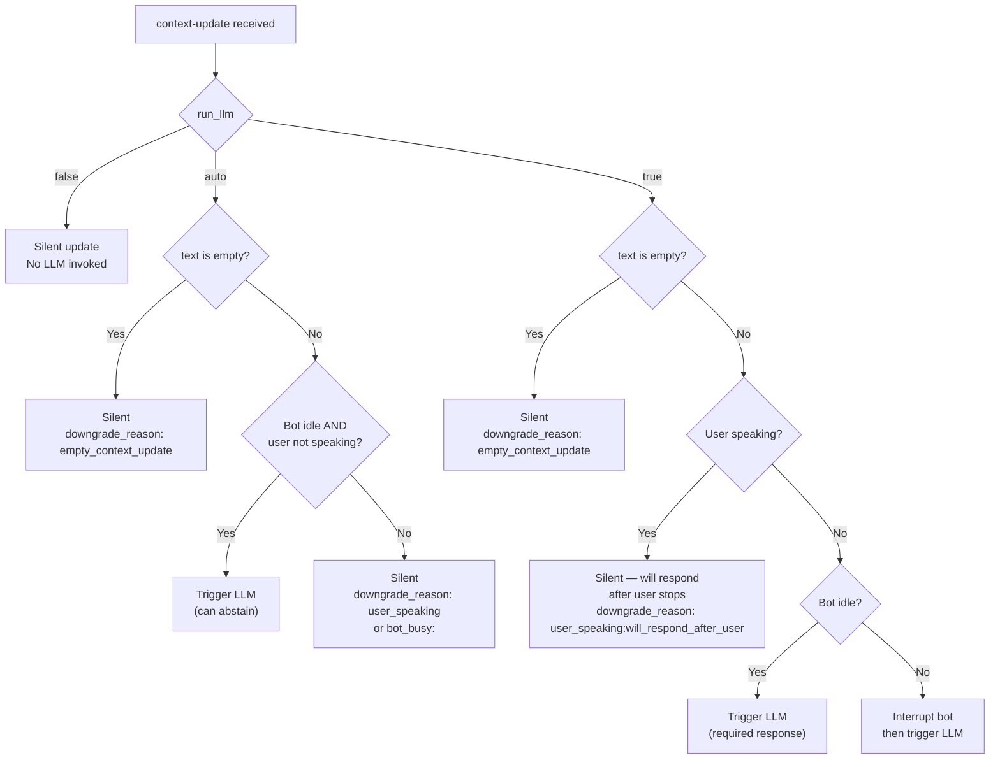

Every `context-update` message includes a `run_llm` field that tells Convai whether to invoke the language model immediately after applying the update. The server may silently downgrade the requested behavior depending on session state. Understanding the decision logic lets you avoid unexpected silence or unwanted interruptions.

## The three run_llm values

| Value | Requested behavior |
|---|---|
| `"false"` | Apply the context update silently. Never invoke the LLM. |
| `"auto"` | Let Convai decide based on session state. The LLM is invoked only when the bot is idle and the user is not speaking. |
| `"true"` | Invoke the LLM after the update. If the bot is mid-response, interrupt it and trigger a new response. |

The default value when `run_llm` is omitted is `"auto"`.

## Decision tree

The following diagram shows how Convai resolves the final LLM invocation decision. The `actual_run_llm` field in the server response reflects the resolved decision, which may differ from what you requested.



## How to read the server response

Check `actual_run_llm` and `llm_triggered` in the server-response `extras` to confirm what happened.

```json
{
  "type": "server-response",
  "event_type": "context-update",
  "status": "success",
  "extras": {
    "requested_run_llm": "auto",
    "actual_run_llm": "false",
    "downgrade_reason": "bot_busy:speaking",
    "interrupted": false,
    "llm_triggered": false
  }
}
```

| Field | What it tells you |
|---|---|
| `requested_run_llm` | The value you sent in the `run_llm` field. |
| `actual_run_llm` | The value Convai applied after evaluating session state. Always `"false"` when no LLM was invoked. |
| `downgrade_reason` | Why the LLM was not triggered. `null` when the LLM was triggered or `run_llm` was `"false"`. |
| `interrupted` | Whether the bot's current response was interrupted before this update's LLM call. |
| `llm_triggered` | `true` if Convai invoked the LLM as a result of this update. |

## Downgrade reason values

| Value | Meaning |
|---|---|
| `null` | No downgrade. The LLM was triggered as requested, or `run_llm` was `"false"`. |
| `"empty_context_update"` | The effective update text was empty. The LLM is never invoked for empty updates, regardless of `run_llm`. |
| `"user_speaking"` | The user is currently speaking. Convai will not invoke the LLM while the user holds the floor. |
| `"user_speaking:will_respond_after_user"` | `run_llm` was `"true"` but the user is speaking. Convai will invoke the LLM after the user finishes. |
| `"bot_busy:<state>"` | The bot is not idle (for example, `bot_busy:speaking`). Only `run_llm="true"` overrides this by interrupting the bot. |

## Choosing the right value for your use case

**Use `"false"`** when you are updating background state and the bot does not need to react — for example, silently recording that a trainee passed a checkpoint while the conversation continues.

**Use `"auto"`** when the update carries information the bot might want to comment on, but you do not want to interrupt an active turn. The bot will respond on its next idle opportunity.

**Use `"true"`** when the update requires an immediate reaction — for example, an alarm triggers mid-conversation and the bot must acknowledge it right away, even if it was mid-sentence. Use `"true"` sparingly because it interrupts the user experience.


When `run_llm="true"` interrupts an in-progress bot response, the bot discards that response and starts over with the updated context. Inform users if you use this pattern frequently so that interrupted responses do not cause confusion.


## Next steps


[Update runtime context](update-runtime-context.md)



[Reset context](reset-context.md)



[context-update field reference](context-update-reference.md)

