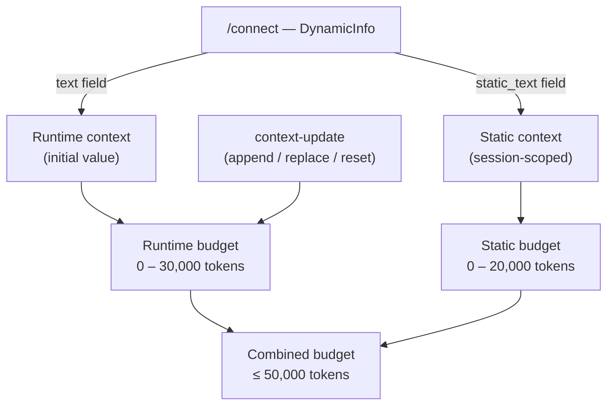

Dynamic context gives a bot live awareness of information that changes during a session. Instead of relying solely on the character's static system prompt, you inject situational data — a trainee's current station, hazards triggered, or checkpoint completion — through `context-update` RTVI messages. This page explains how Convai stores, limits, and applies that information.

## Static and runtime budgets

Convai tracks two separate context stores per session.

**Static context** is established at connection time through the `DynamicInfo` model in the `/connect` request body. The `static_text` field populates the static budget and persists for the entire session, surviving runtime resets unless you explicitly clear it. The static budget holds up to 20,000 estimated tokens.

**Runtime context** is the mutable store updated by `context-update` messages during a session. The runtime budget holds up to 30,000 estimated tokens. It is this store that `append`, `replace`, and `reset` modes operate on.

The combined total of both stores must not exceed 50,000 estimated tokens. All limits use provider-agnostic token estimates.

The diagram above shows how the two budgets are populated. The `text` field of `DynamicInfo` seeds the initial runtime context; `static_text` seeds the static budget. Subsequent `context-update` messages only affect the runtime store.

## Update modes

Every `context-update` message carries a `mode` field that controls how the runtime store changes.

| Mode | Effect on runtime context |
|---|---|
| `"append"` | Adds the supplied `text` after the existing runtime content. Prior content is preserved. |
| `"replace"` | Discards the entire runtime context and writes `text` in its place. Static context is unaffected. |
| `"reset"` | Clears the runtime context entirely. When `remove_static` is `true`, also clears the static budget. The `text` field must be omitted. |

The `mode` field defaults to `"append"` when omitted.

## LRU eviction

When an `append` or `replace` operation would push the runtime store past 30,000 estimated tokens, Convai applies least-recently-used (LRU) eviction. The server retains the newest runtime context and trims the oldest content until the store fits within the budget. The evicted content is not recoverable within the same session.

## Prompt-rebuild flow

Applying a `context-update` does not always rebuild the system prompt immediately. The `prompt_rebuild` field in the server response reports one of two states.

| Value | Meaning |
|---|---|
| `"immediate"` | The system prompt was rebuilt synchronously as part of this update. |
| `"deferred"` | The prompt was marked dirty. It will be rebuilt before the next LLM boundary (the next time the LLM would generate a response). |

Deferred rebuilds are an optimization that avoids redundant prompt construction when multiple context updates arrive in rapid succession. The LLM always receives the most recent context before it generates any response.

## Context revision tracking

Every successful `context-update` response includes two equivalent fields: `context_revision` and `revision`. Both return the same monotonically increasing integer for the session. The first update produces `1`, the second produces `2`, and so on. You can use this value to confirm that an update was applied and to correlate server responses with the specific update that triggered them.

## Warning threshold

When the combined dynamic context reaches 40,000 estimated tokens, Convai emits a server-side warning log. This threshold does not block the update, but it signals that the session is approaching the 50,000-token combined limit. Monitor the `remaining_tokens` field in each server response to track headroom proactively.

## Next steps


[Update runtime context](update-runtime-context.md)



[Control when the LLM responds](control-llm-response.md)



[context-update field reference](context-update-reference.md)

