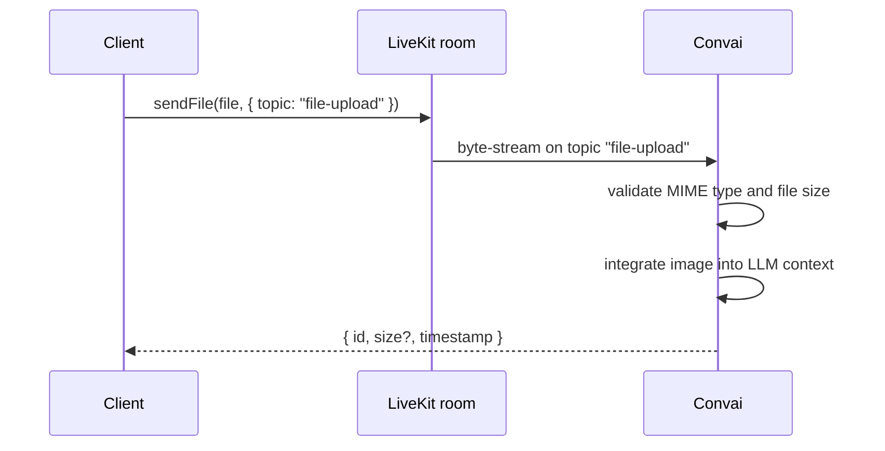

File uploads travel through the LiveKit byte-stream channel — not a separate HTTP endpoint — while your application has an active LiveKit session open. This page explains the transport mechanism, how the `"file-upload"` topic routes each stream to the correct server handler, how Convai processes the upload, and what the response object contains.

## Transport mechanism

The LiveKit SDK exposes a `sendFile` method on the local participant. Calling it opens a byte-stream from your client to the LiveKit room. Convai subscribes to that stream server-side and reads the bytes as they arrive.

The reason file upload uses the LiveKit byte-stream rather than a separate HTTP upload endpoint is that the image must reach the same session context that is already handling audio and AI responses. A separate HTTP request would have no reliable way to associate the image with the active session participant. The byte-stream carries the session context automatically because it originates from the same room connection.

Using a byte-stream rather than HTTP has two direct consequences for integrators. An active, connected LiveKit room is a hard prerequisite — there is no fallback path for uploading files. The LiveKit transport also handles chunking, flow control, and delivery, so your application does not need to implement custom retransmission logic.

## Topic routing

Every byte-stream in LiveKit carries a topic string that the receiving side uses to route the data. For file uploads the topic must be exactly `"file-upload"`. Byte-streams that arrive on any other topic are not processed by Convai — the image will not enter the LLM context. A single character difference in the topic string produces this failure, and no validation error is surfaced to the client to indicate it.

## Server processing flow

The following diagram shows the sequence from the moment `sendFile` is called to the resolved response.

Convai validates the incoming stream against the supported MIME type list and the 10 MB size limit. If validation passes, the image is integrated into the LLM context so that subsequent AI responses can reference the image content. The `sendFile` call then resolves with a response object.

## Response object

When the upload completes, `sendFile` resolves with an object that confirms the server received and registered the stream.

| Field | Type | Required | Description |
|---|---|---|---|
| `id` | `string` | Yes | Unique identifier for the byte-stream. Use this to confirm the server received the upload. |
| `size` | `number` | No | File size in bytes as received by the server. This field is optional and may be absent depending on the platform. |
| `timestamp` | `number` | Yes | Upload timestamp as a Unix millisecond value. |

The `id` field is the primary confirmation that Convai registered the upload. Log or store this value when diagnosing whether an image reached the server.

## Session requirements

Three conditions must hold before an upload can succeed.

**Active room connection.** The local participant must be in a connected LiveKit room. The `room.state` property must equal `'connected'` at the time `sendFile` is called. Attempting to send a file before the room is connected results in the call rejecting immediately.

**Data publish permission.** The LiveKit authentication token for the session must include data publish permissions. Without this grant, the LiveKit room rejects the byte-stream before Convai receives any bytes.

**LiveKit client SDK.** The LiveKit client SDK for your platform must be installed and initialized. The `sendFile` method is part of the LiveKit participant API — it is not a Convai-specific method.

## Next steps

Follow the step-by-step guide to send an image from a web application.


[Upload an image](upload-an-image.md)


For the full parameter and response contract, see the reference.


[File upload reference](file-upload-reference.md)

