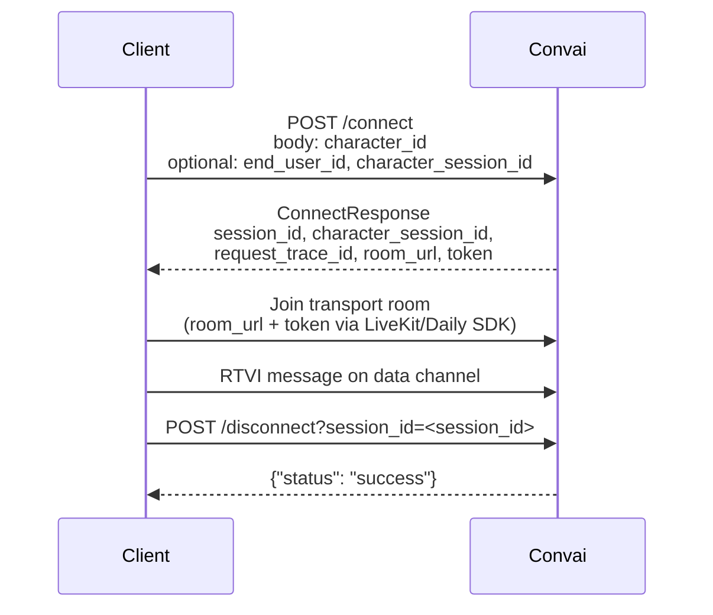

Each Realtime API session involves several identifiers that distinguish the session, the conversation, the character, and the end user. Convai generates most identifiers at connect time and returns them in the `POST /connect` response. Two identifiers — `character_id` and, when required, `end_user_id` — are provided by the caller in the request body.

## Identifier reference

| Identifier | Type | Returned by | Required on request? | Description |
|---|---|---|---|---|
| `session_id` | string (UUID) | `POST /connect` response | No | Unique session token for this connection. Use it as the `session_id` query parameter on `POST /disconnect` and when connecting to the `/chat` WebSocket endpoint. |
| `character_session_id` | string (UUID) | `POST /connect` response | No — provide to resume a prior conversation | Identifies the conversation thread. A new UUID is generated when the field is omitted. Pass the value from a previous session in the request body to resume that conversation from where it ended. |
| `character_id` | string (UUID) | Not returned | Yes — required in request body | Identifies the Convai character to connect to. Obtain the UUID from the Convai dashboard or the character management API. |
| `end_user_id` | string | `POST /connect` response (echoed) | Required when the character has Long Term Memory enabled; optional otherwise | Identifies the human interacting with the character. When present, Convai creates or retrieves a speaker record tied to this identifier. |
| `end_user_metadata` | object | `POST /connect` response (echoed) | No | Arbitrary key-value metadata for the end user. The `name` key, if present, must be a string. Ignored when `end_user_id` is not provided. |
| `request_trace_id` | string | `POST /connect` response | No | Server-assigned trace identifier for this specific `/connect` request. Values use the format `req_<hex>` (for example `req_a1b2c3d4e5f6a7b8c9d0e1f2a3b4c5d6`). Use it to correlate logs and telemetry events with the connection attempt. |

## How identifiers flow

The diagram below shows how identifiers move from the client request through the Convai response to subsequent API calls.



`session_id` is the lifecycle identifier — it starts the session and ends it. `character_session_id` is the conversation identifier — it carries the conversation history when you reconnect.

## end_user_id and Long Term Memory

When the character has Long Term Memory (LTM) enabled, omitting `end_user_id` in the `POST /connect` body causes the server to reject the request with HTTP 400:

```json
{
  "detail": "Missing end_user_id. end_user_id is required when the character has Long Term Memory enabled. Provide end_user_id or disable Long Term Memory."
}
```

Set `end_user_id` to a stable, unique identifier for the human interacting with the character — for example, a hashed user ID from your own system. Avoid including Personally Identifiable Information directly.

## Next steps


[Connect your first character](quick-start.md)



[HTTP error codes](error-codes.md)

