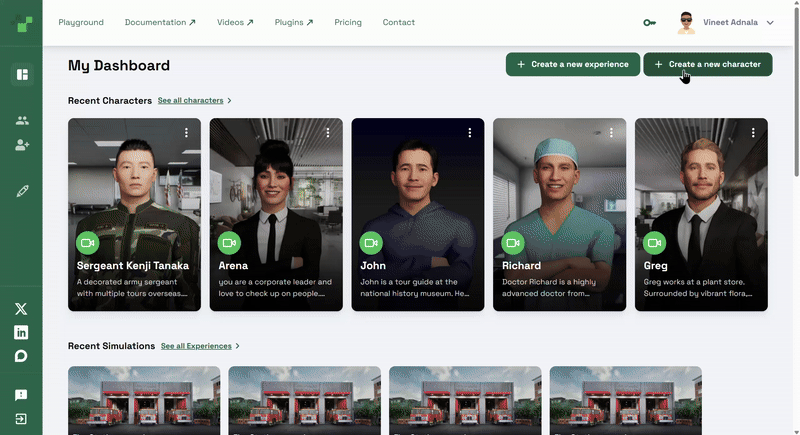

# Migrate Your Unreal Engine 5.5 Convai Assets to 5.6

## Introduction

With the release of Unreal Engine 5.6, Convai has updated its tools and plugins to ensure full compatibility and improved performance. If you have existing assets created in Unreal Engine 5.5, you will need to migrate them to the new version. This guide walks you through the migration process step-by-step, ensuring that your project and assets are updated without losing any critical data.

***

## Step-by-Step Migration Guide

### 1. Create a Backup of Your Project

Before making any changes:

* Duplicate your existing UE 5.5 project folder.
* Store it in a secure location for rollback safety.

### **2. Update Plugins and Components**

1. Launch **ConvaiAssetUploader.exe**.
2. In the opened CMD window, choose **Option 2: Update an existing Project**.

<figure><figcaption></figcaption></figure>

3. Follow the prompts to complete the plugin and related component updates.

### **3. Switch Project to Unreal Engine 5.6**

1. Navigate to your project’s `.uproject` file.
2. Right-click on it, select **Show More Options**, then click **Switch Unreal Engine Version**.
3. Choose **5.6** from the list.

<figure><figcaption></figcaption></figure>

### **4. Install Cross-Compile Toolchain (Linux Development)**

If you are targeting Linux builds, download and install the UE 5.6 cross-compile toolchain:\
[Linux Development Requirements for Unreal Engine 5.6](https://dev.epicgames.com/documentation/en-us/unreal-engine/linux-development-requirements-for-unreal-engine?application_version=5.6)

### **5. Clean Up the Project Folders**

Delete folders **except** the following:

* `Config`
* `Content`
* `ConvaiEssentials`
* `Plugins`
* `Source`
* `.uproject` file

### **6. Open the Project in Unreal Engine 5.6**

* Launch Unreal Engine 5.6.
* Open your project from the `.uproject` file.

### **7. Update Assets in the AssetUploader**

1. Run the **AssetUploader** editor utility.
2. Click **Update Asset** to complete the migration process.

## Conclusion

By following these steps, your Unreal Engine 5.5 Convai assets will be fully migrated to 5.6, with updated plugins and toolchain compatibility. This ensures optimal performance and access to the latest Convai and Unreal Engine features. Always keep a backup of your original project to safeguard against unexpected migration issues.
