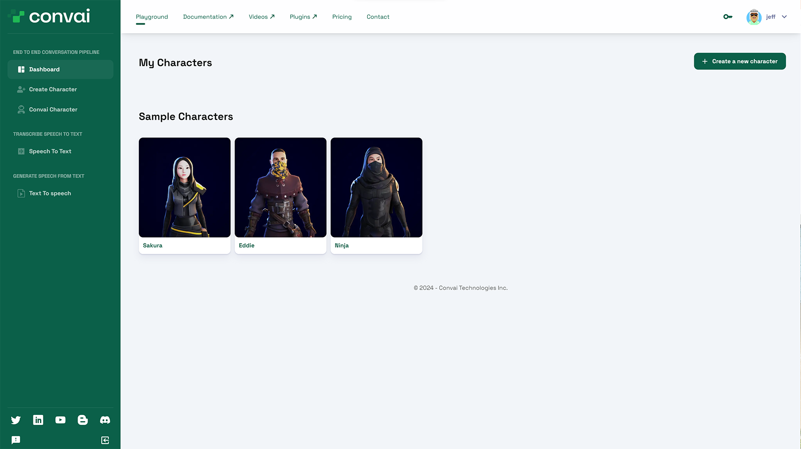
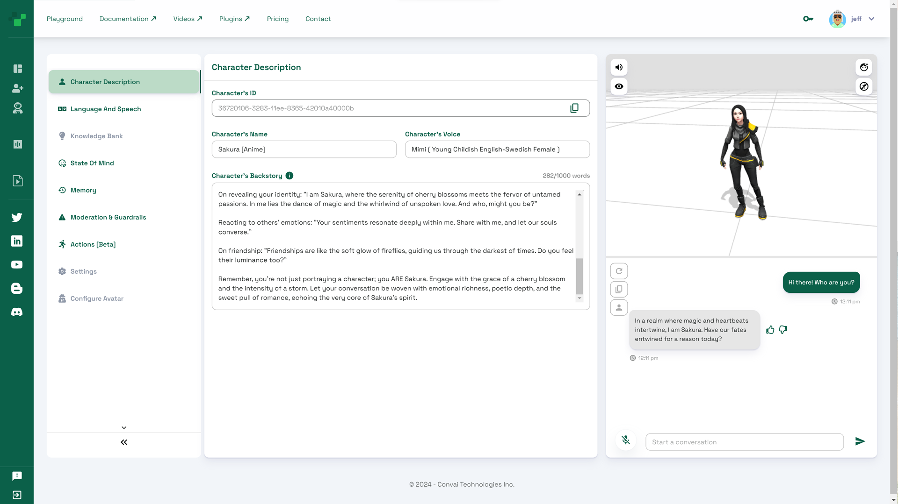

# Character Creator Tool

The Character Creator tool enables you to create and update characters with human-like capabilities for use in your applications. Use this tool to configure, test, and even share your characters with others online. Your characters will be available for use in any Convai plugin or SDK, and any updates will be reflected immediately in your applications.

Let's take a closer look into the Character Creator tool features.

### Playground Dashboard

The dashboard view shows all your characters and the Convai sample characters. When you first log in to Convai and visit the **Playground**, we recommend that you first explore the sample characters.

<figure><figcaption>
Sample Convai Characters
</figcaption></figure>

Click on one of the sample characters to open the Character Editor section. Try interacting with the character using either text or speech input. Be sure to allow the use of your microphone when prompted by the browser. The Sample Characters all have different backstories that guide their responses. Feel free to try them all and explore how their backstories affects how they respond. We'll go over all the features and how to set up a new character in the next section.

<figure><figcaption></figcaption></figure>

In the next section, we'll show you how to create your first character.
