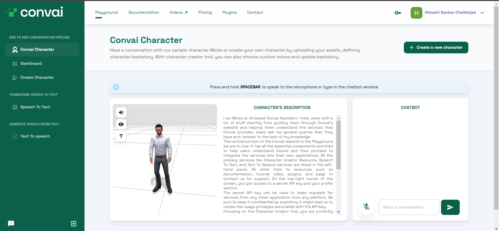

# Character Creator Tool

A comprehensive guide to creating your smart NPC / Digital Assistant for the application that you are building. You can create, test, and configure new characters online and continue until you are satisfied with them. You can then export them to any application with Convai custom plugins or libraries.

Let's get on with it.

### Sample Convai Character

When you log in to Convai and visit the **Playground**, you are greeted with a sample character from Convai, that you can interact with.

<figure><figcaption></figcaption></figure>

This is a sample character that you can speak with. This will give you a rough glimpse of what you can expect from the Convai characters. I am saying a "rough glimpse" because it is restricted in functionality while in reality, Convai characters can actually perform a lot of other tasks apart from responding intelligently to any user queries.

Feel free to converse with the character and ask any questions.

### Dashboard

The following section lists all the characters that you have created and also three more sample characters you can interact with.

<figure><figcaption></figcaption></figure>

The **Sample Characters** all have different backstories that guide the responses of the characters. Feel free to visit them, check out the back-stories, and converse with them to understand how this help design the character.

If you are logging in for the very first time, you might not see any character under the **My Characters** section. As you create new characters, you will be able to see them here, which you can open and update their details. All changes can be seen in effect immediately as we update the details.

### Create Character

This section helps you create your character.

<figure><figcaption></figcaption></figure>

There are a few steps to follow and things to keep in mind while creating your character. We will discuss these steps in the next section.
