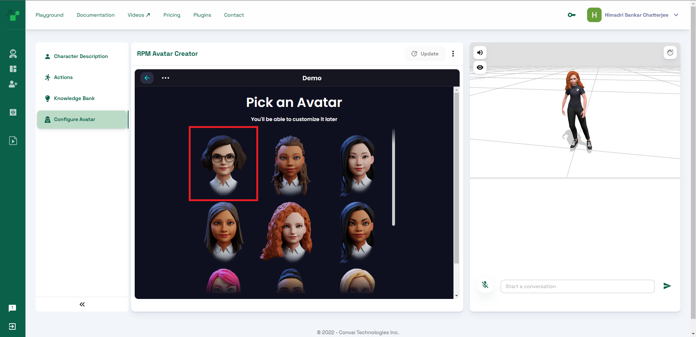

# Connect a ReadyPlayerMe 3D Avatar

When you create a new character, it loads with a default 3D ReadyPlayerMe avatar. You can easily configure and upload your own customized 3D avatar from ReadyPlayerMe (RPM) with a few simple steps.


We are currently working towards allowing users to upload their custom models directly. Stay tuned for more updates.


Follow these steps to create your custom RPM avatar for your character:

### Steps

1.  Open convai.com and visit the Dashboard section of the playground. You have to log in to access this page.\

    <figure><figcaption>
This is what your dashboard section will look like.
</figcaption></figure>
2. Click on the character that you wish to edit. This will open the character creator tool.
3.  You will notice that the page already has a 3D model that Convai randomly assigns when the character is first created. To add your own model, click on the **Configure Avatar** option from the left menu. This will open the **RPM Avatar Creator** section.\

    <figure><figcaption>
This is the RPM Avatar Creator section where you can create your own 3D avatar.
</figcaption></figure>
4. In the RPM Avatar Creator section, you can either sign in to RPM and access one of your existing characters, or you can create a completely new one. Here we will create one from scratch. As the character I have chosen is a female, I will select the **Feminine** option.
5.  You can now upload a photo to create an avatar from or you can continue without one. I will select the **Continue without a photo** option.\

    <figure><figcaption></figcaption></figure>
6.  Now select a facial structure to start with. We'll select the first one for our example. Click on **Next.**\

    <figure><figcaption></figcaption></figure>
7.  Now you can configure your avatar just the way you want. RPM provides a list of configurable options starting with minute facial structure and details, to hair style, to dress, and many more. All of these are available on the right-hand side of the **RPM Avatar Creator** section.\
    Once you are satisfied with the avatar, click on **NEXT** at the top right corner.\

    <figure><figcaption>
Try out all the options available for configuration of your model.
</figcaption></figure>
8.  You should now have your own custom RPM avatar. Once the processing completes, you will be able to see the avatar on the right-hand side of the screen.\

    <figure><figcaption></figcaption></figure>

Now, every time you open your character details page, your newly created avatar will appear.


We currently do not support editing an existing avatar. To make any change, you have to start from scratch. Or, you can log in with an RPM account to easily access and edit existing characters.

