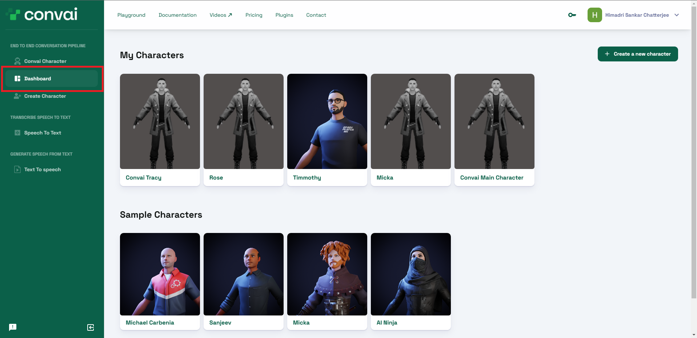

# Connect a ReadyPlayerMe 3D Avatar

Now that you have created your character, you will find that the character loads with a default 3D model. You can easily configure and upload your own customized 3D avatar from ReadyPlayerMe.


We are currently working towards allowing users to upload their custom models directly. Stay tuned for more updates.


Follow the given steps to create your custom RPM avatar for your character.

### Steps

1.  Open convai.com and visit the Dashboard section of the playground. You have to log in to be able to access this page.\

    <figure><figcaption>
This is what your dashboard section will look like.
</figcaption></figure>
2. Now select a character to add an RPM avatar to. I will go with the character I just created in the previous section. Click on the character and it will open up a page with all the character details.
3.  Now, you will notice that the page already has a 3D model that loads once you open the page. Convai randomly assigns a default model to every new character.\
    To add your own model, click on the **Configure Avatar** option at the very end of the available options. That will open the **RPM Avatar Creator** section.\

    <figure><figcaption>
This is the RPM Avatar Creator section where you can create your own 3D avatar.
</figcaption></figure>
4. As you can see from the section, you can either sign in to RPM and access one of your old characters, or you can create a completely new one. I am going to create one from scratch. As the character is a feminine character, I will select the **Feminine** option.
5.  You can now upload a photo to create an avatar from or you can continue without one. I will go with **Continue without a photo** option.\

    <figure><figcaption></figcaption></figure>
6.  Now select a facial structure to start with. I will just go with the first one. You can select from an wide variety of other options that RPM provide. Click on **Next.**\

    <figure><figcaption></figcaption></figure>
7.  Now you can configure your avatar just the way you want. RPM provides a list of configurable options starting with minute facial structure and details, to hair style, to dress, and many more. All of these are available on the right-hand side of the **RPM Avatar Creator** section.\
    Once, you are satisfied with the avatar, click on **NEXT** at the top right corner.\

    <figure><figcaption>
Try out all the options available for configuration of your model.
</figcaption></figure>
8.  Voila, you have your own custom RPM avatar. Once the processing completes, you will be able to see the avatar on the right-hand side of the screen where the default model used to be present.\

    <figure><figcaption></figcaption></figure>

Now, every time, you open the character to interact with, your newly created avatar will show up.


We currently do not support editing an existing avatar. To make any change, you have to start from scratch. Or, you can log in with an RPM account to easily access and edit existing characters.

