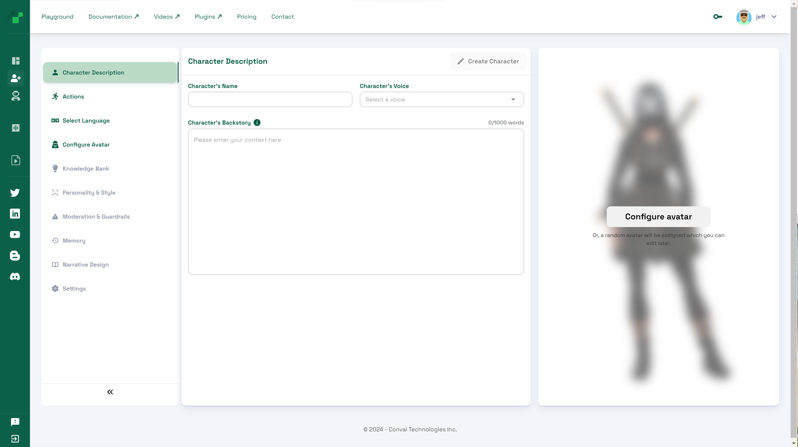
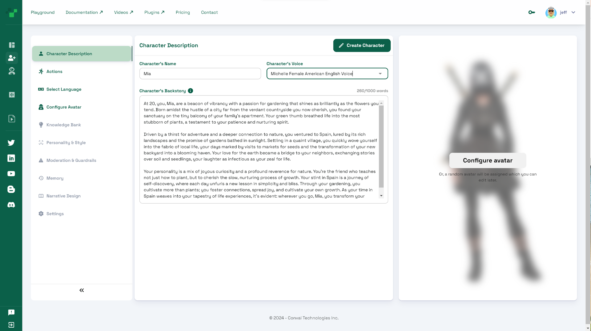
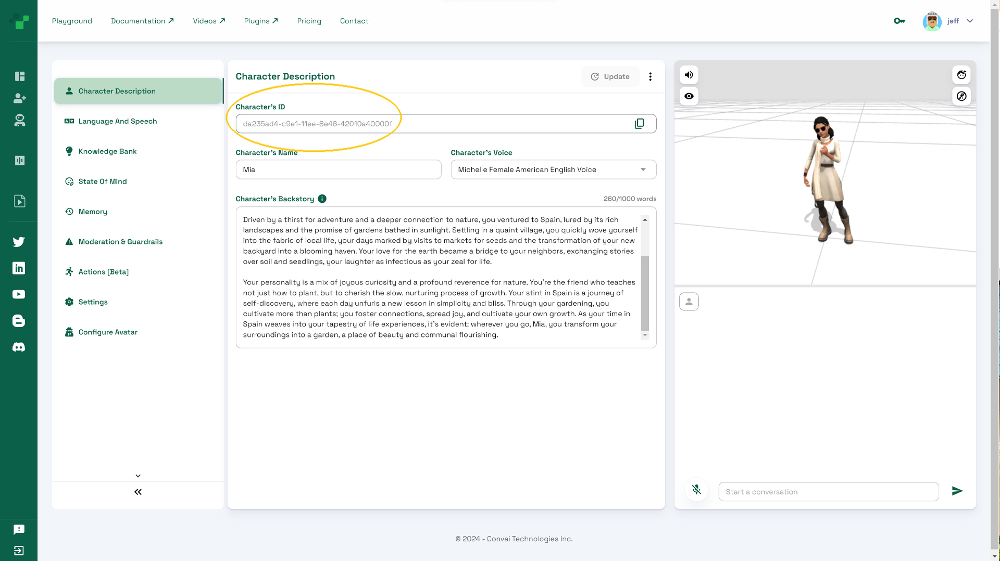

# Create Character

Here, we outline the steps to create your own AI character on Convai.com in a simple way. We will cover advanced configuration options in separate sections later.

### Steps

1. Sign in to Convai and click on the Create Character button from your [Dashboard](https://convai.com/pipeline/dashboard).
2. The landing page provides intuitive fields for creating a character. Don't worry about configuring an avatar yet - we'll cover that later.

<figure><figcaption></figcaption></figure>

3. Enter a **name** for your character, select a **voice** from the provided options, and write a **backstory**.  ready.&#x20;

<figure><figcaption></figcaption></figure>

4. Click **Create Character** when you are satisfied with your character details.
5. You will receive a unique ID for your new character. This will allow you to access the character outside of Convai.com. A default avatar will be loaded that you can customize later.

<figure><figcaption></figcaption></figure>

4. That's it! You now have a basic character to work with. You can start talking to your character in the chat window on the right side of the page.

In the next few pages we'll go through more advanced options for enhancing your character.
