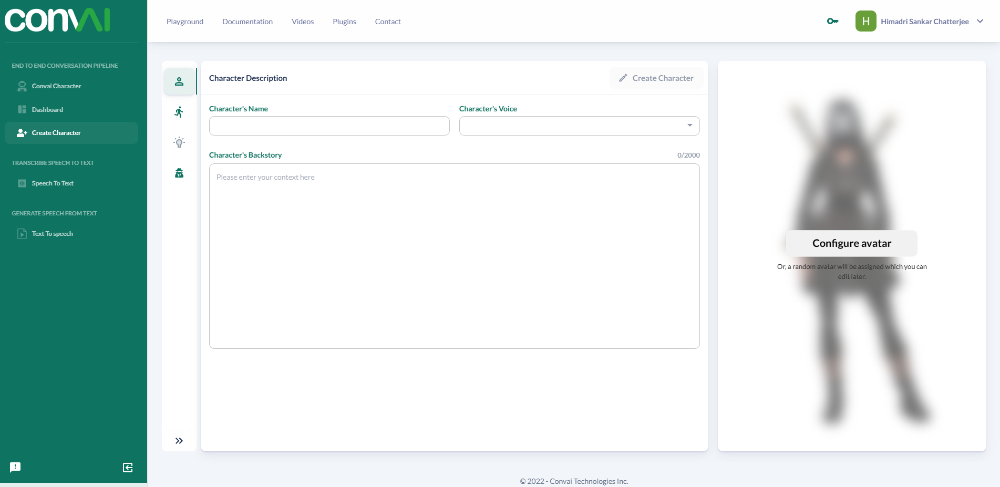
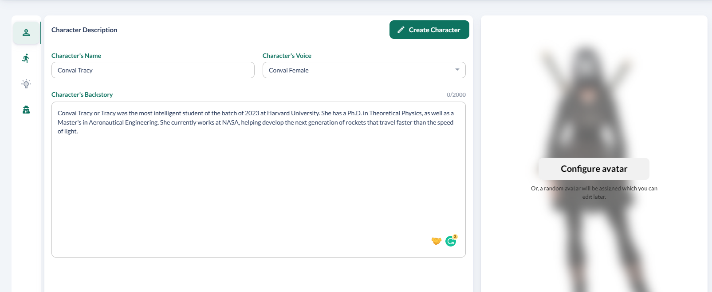
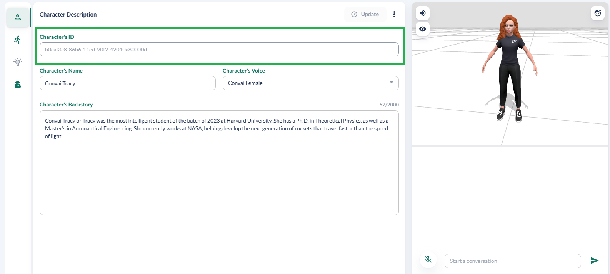

# Create Character

Here, we will list the steps to follow to create your own character in the most simple ways. We will dive into the advanced properties in different sections, which will be updated soon.

### Steps

1.  Visit the character creation page at [https://convai.com/pipeline/create-character](https://convai.com/pipeline/create-character)

    Make sure you are logged in, to access this page.
2.  The landing page is very intuitive, with the details you need to provide to create your character.

    <figure><figcaption></figcaption></figure>
3. You do not have to focus on configuring an avatar for now. We will get into that later.
4.  Enter a name for the character, select a voice for the character from the list and provide a backstory for the character. For reference, here is a sample of the details you need to provide.

    <figure><figcaption></figcaption></figure>
5. Next click on **Create Character**.
6.  When the new character is created, you will get a unique ID for the character. This will be used to interact with the character outside of the Convai website.

    A sample avatar will be loaded for you. You can safely ignore it for now. We will handle this in the Advanced section.

    <figure><figcaption></figcaption></figure>
7. That is it, you now have a simple character to work with. You can start asking it questions in the chatbot.
