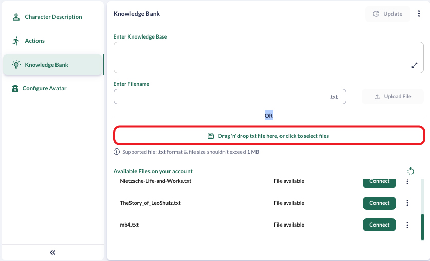
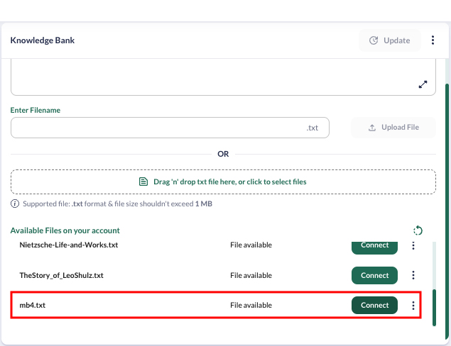

# Knowledge Bank

### Introduction

We know that language models are helpful for a variety of different tasks. But their capabilities are severely limited by the input length of these models. What this means for our character chatbot is that we now have access to a knowledge bank where you can store large amounts of text-based knowledge for your character.

### Overview

Let us look at the knowledge bank interface and then drill down into each element.

<figure><figcaption>
Knowledge Bank Dashboard
</figcaption></figure>

We have two main ways to add a knowledge bank:

1. Use the Text Box
2. Upload files (Limited Right now to 1MB)

Let us go through these and see how to use each of these ways.


Two things must be mentioned here:

1. Currently, we support a total file size of 1 MB. That means the total size of all the files an account uploads is limited to 1 MB.
2. Please separate your file names with an underscore when uploading them or creating a file using the text box.


### Text Box

### Using File Upload

Right now, we support only uploading text files as a knowledge bank. You can add information for your character as text files. You can upload files simply by clicking on the “Upload” button. You can click on the highlighted button to upload files from your computer.

<figure><figcaption>
Upload Files
</figcaption></figure>

Once you have uploaded the file, it will require some time before it is available for use (we currently have an upper limit of around 10 minutes for this). Once done, your file will appear under the “Available files on your account”, and the “Connect” button will become green like in the image above. You can then choose to associate the file with the current character.

Once connected, you can ask questions which would be only present in the knowledge bank and get the relevant information from your character.

### Using the Knowledge Bank

Using the knowledge bank is pretty simple; once you have uploaded the knowledge bank for your character, you can use the chat UI or the `/getResponse` API to ask about anything stored in the knowledge bank. You should receive accurate results.\
Let us look at an example. We have a file called "mb4.txt", which is a made-up story about a Moon Base and its commander, Samantha. We can be sure that it was not part of the training data for our models because this story was made up just for this tutorial. Let us see how the character chatbot responds when asked about our dashing commander Samantha without the correct document connected to this character.&#x20;

<figure><figcaption>
Without Connecting Relevant the File
</figcaption></figure>

That definitely does not look correct, it is just a generic response without any particulars. Moreover, there is no mention of the moon base at all. Let us use the UI to connect the relevant file.

<figure><figcaption>
Click to Connect
</figcaption></figure>

Once we have connected the file, you will get a pop-up when the connection is complete. Let us ask our character once again about Samantha and see if we get the correct answer.&#x20;


As soon as you connect the character, you should make sure to refresh the page if a chat is already underway. Otherwise, the model might get conflicting information from the chat history and knowledge bank, producing inconsistencies.


<figure><figcaption>
Conversation after connecting the Knowledge Bank
</figcaption></figure>

The correct information is present in the reply this time. It means our operation was successful.&#x20;

We hope this page gives you enough information about how to use the knowledge bank to start utilising it for your own purposes. Feel free to contact us at support@convai.com if you have any questions.&#x20;

## Knowledge Bank Best Practices

This guide is designed to help effectively utilize the Knowledge Bank to create engaging and informative conversational AI experiences.

### What is the Knowledge Bank?

The Convai Knowledge Bank is a powerful tool that allows you to provide your AI character with a wealth of information on various subjects. It uses a technique called RAG (Retrieval-Augmented Generation) to efficiently store and retrieve relevant information during conversations.

RAG works by automatically chunking the uploaded text, PDF, or other files into smaller segments based on the spaces between paragraphs. This enables the AI to quickly locate and access the most relevant information when responding to user queries.

### Best Practices for Optimal Efficiency

To ensure that your AI character can effectively understand and utilize the information in the Knowledge Bank, follow these best practices when preparing your files:

1. **Single File Format**: Upload your information as a single file, such as a text document or PDF.
2. **Paragraph Structure**: Each paragraph in the file should focus on a single subject and be approximately 5 lines long. This allows the AI to clearly understand the topic and context of the information.
3. **Q\&A Format**: Alternatively, you can structure your information in a question-and-answer format within the same paragraph. This helps the AI understand the topic and how to respond appropriately.

### Enhancing the AI Character Experience

To create a more engaging and believable AI character, it's crucial to ensure that the information in the Knowledge Bank aligns with the character's way of thinking and speaking. Consider the following tips:

* Use language and terminology that fits the character's background, personality, and domain expertise.
* Incorporate the character's unique perspective, opinions, and experiences when crafting the knowledge bank content.
* Maintain consistency in tone, style, and information throughout the knowledge bank to reinforce the character's identity.

By following these best practices and tips, you'll be able to create a rich and immersive conversational AI experience that brings your character to life.

Happy creating with the ConvAI Knowledge Bank!
