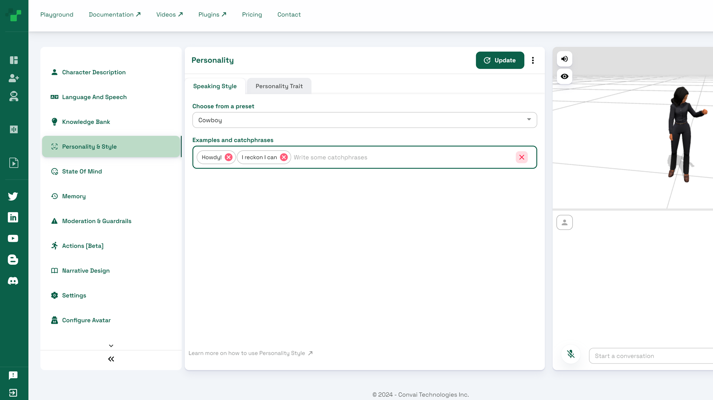
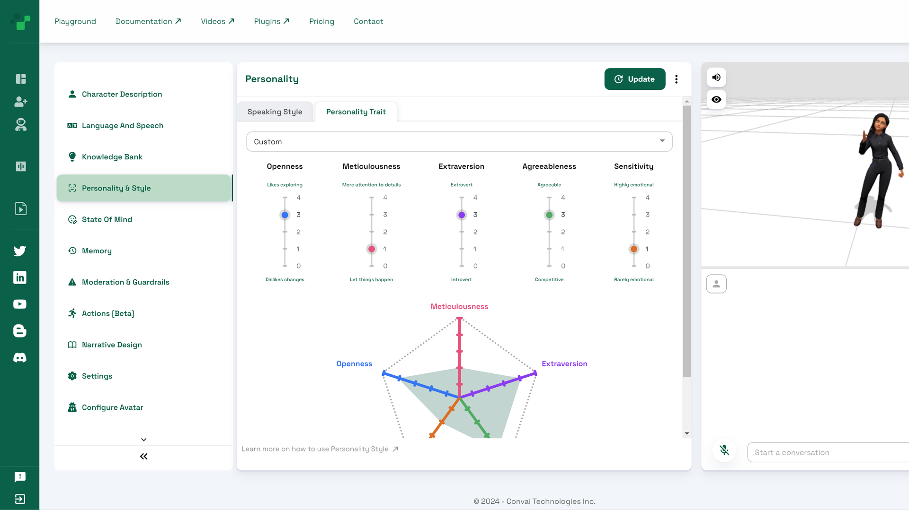

# Personality and Style

This section enables you to adjust the personality and style of your character. Personality and style settings affect how your character responds and the type of language it uses when speaking. Under the speaking style tab, you can choose from a number of preset styles including things like a cowboy, a pirate, or a jazz musician. You can add to these styles or create your own by adding examples and catchphrases in the field provided.

<figure><figcaption>
Choose from preset personalities and add catch-phrases
</figcaption></figure>

The personality trait tab in this section allows you to adjust five main personality traits to help you further shape how your character responds. Each trait, including openness, meticulousness, extroversion, agreeableness, and sensitivity can be adjusted from zero to four, with zero being the lowest setting and four the highest. You can try changing the settings to see how they affect the output from your character. There is also a drop-down list of some predefined personalities for you to explore.

<figure><figcaption></figcaption></figure>
