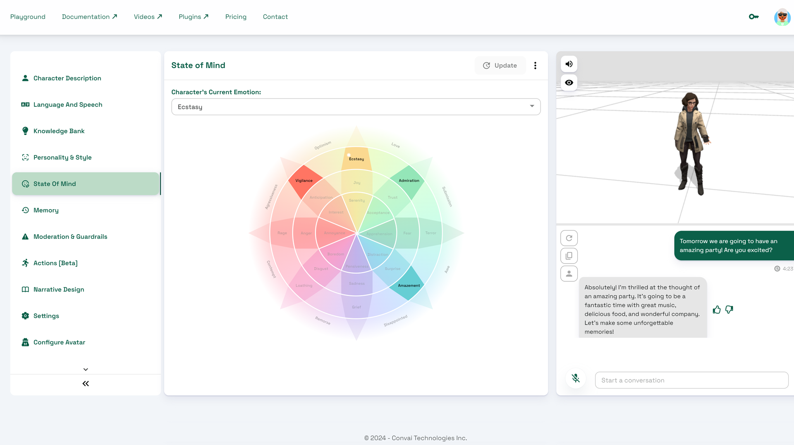

# State of Mind

This section displays a State of Mind graph, which relates to the emotional state of your character. The graph depicts a wheel of emotions and dynamically highlights the particular emotions that your character is experiencing during the conversation. Stay tuned for more about emotions in future updates.

The graph below shows the current emotional state based on the last chat message.

<figure><figcaption>
State of Mind Graph showing the current emotional state
</figcaption></figure>
