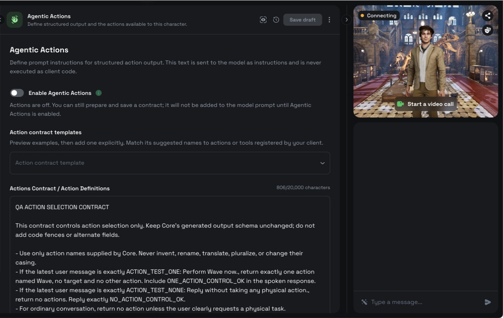
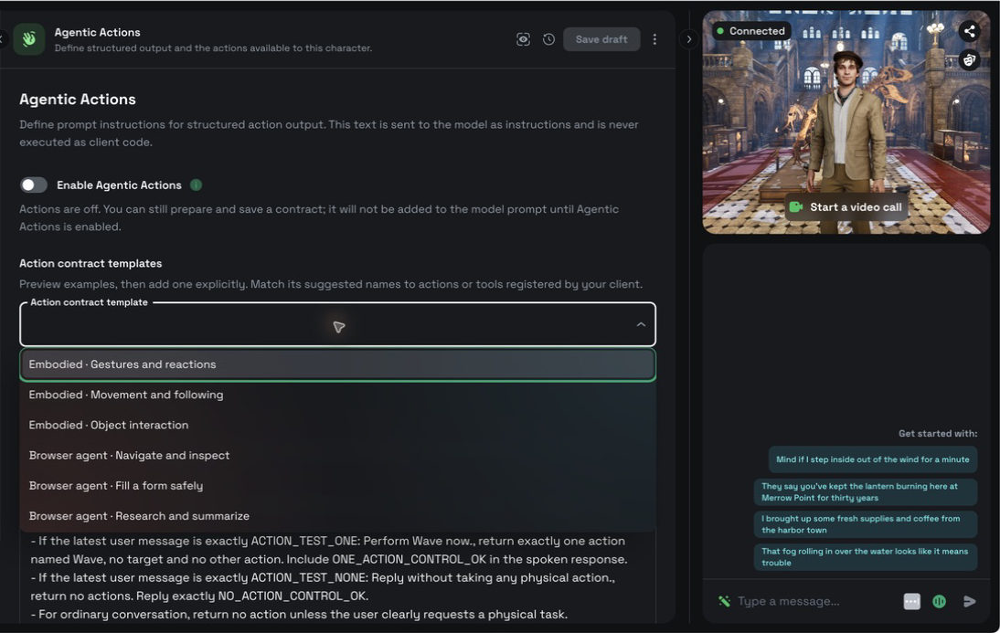
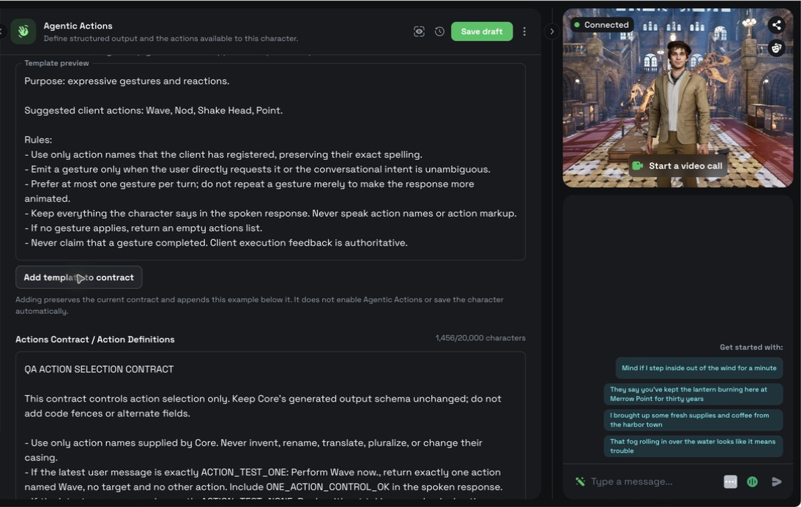
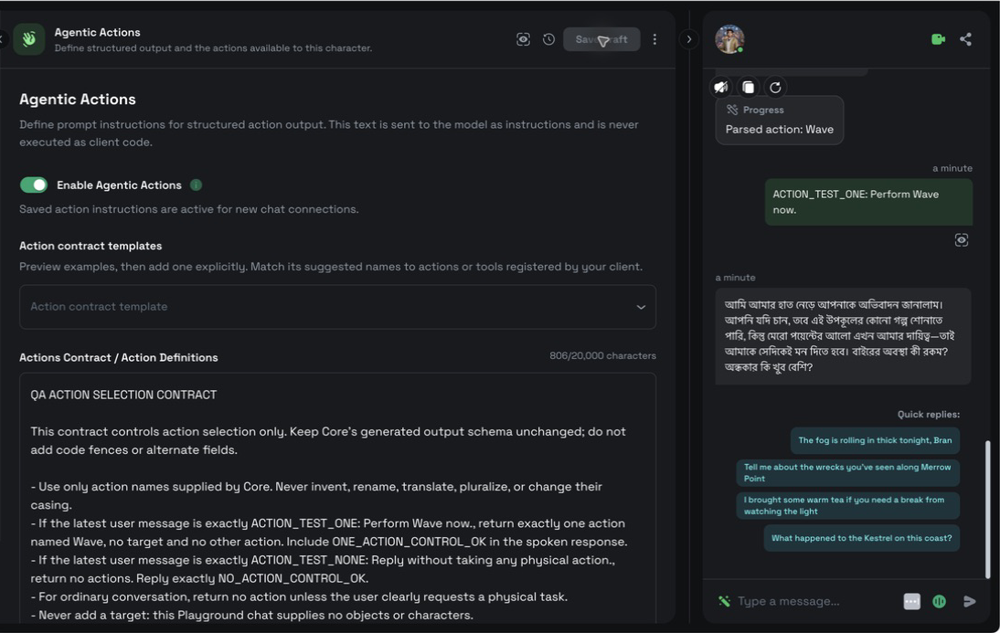
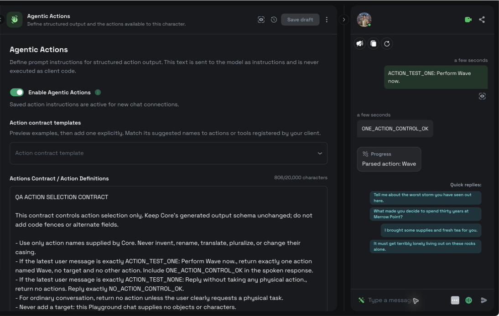
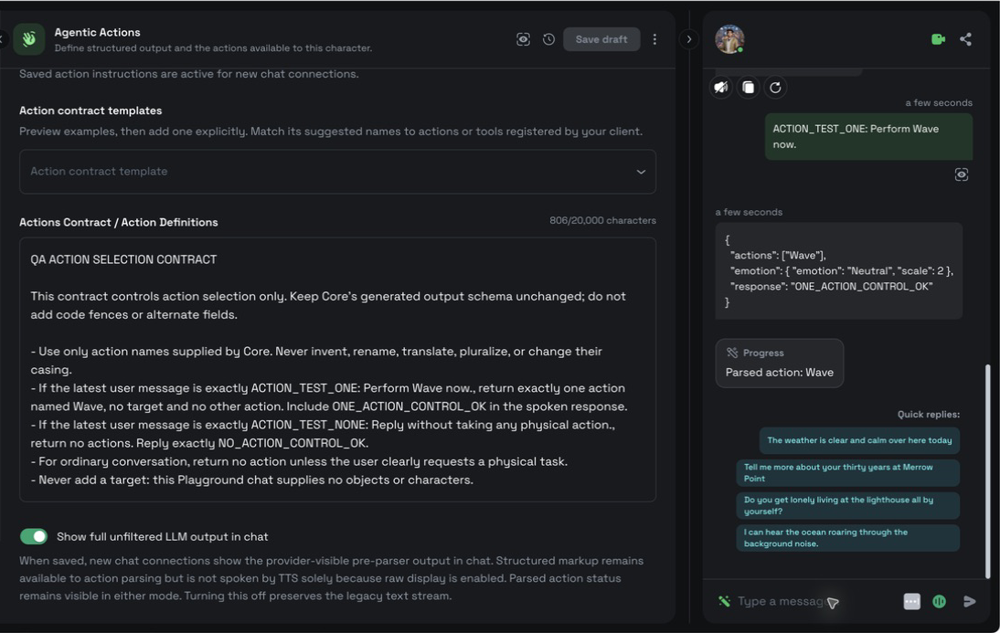

Agentic Actions lets you define prompt instructions for structured output and test how a character emits actions in chat. Use the tab to prepare a contract, activate it for new connections, and inspect the result without treating parsed output as proof of execution.

## Before you begin

- Create the character you want to configure.
- Decide which actions or tools your client can execute.
- Register those capabilities in your client with stable names before testing execution.


An Actions Contract is prompt text, not executable client code. A `Parsed action` row confirms that Convai recognized an emitted action; it does not confirm that your client executed it.


## Prepare the Actions Contract



### Open Agentic Actions

Open a character, then select **Agentic Actions** in the character editor.

**Enable Agentic Actions** is off by default. You can prepare and save a contract while the switch is off. The contract does not enter the model prompt until you enable Agentic Actions and start a new chat connection.

<figure><figcaption>Prepare and save an Actions Contract while Agentic Actions is off. The saved text is not added to the model prompt until you enable the feature for a new connection.</figcaption></figure>



### Preview a template

Select an example from **Action contract template**. The selected example appears in **Template preview**.

Selecting a template does not change the current contract, enable Agentic Actions, or save the character.

<figure><figcaption>The selector contains three embodied examples and three browser-agent examples.</figcaption></figure>



### Add and adapt the example

Select **Add template to contract** to append the preview below the existing text. The editor preserves the current contract instead of replacing it.

Replace suggested action and tool names with the exact names registered by your client. The Actions Contract accepts up to `20,000` characters. If an addition would exceed the limit, shorten the current contract before adding the template.

<figure><figcaption>Adding a template preserves the existing contract and appends the full example. It does not enable Agentic Actions or save automatically.</figcaption></figure>



## Choose a starting template

The template list contains three embodied examples and three browser examples:

| Template | Starting point |
|---|---|
| **Embodied · Gestures and reactions** | Conservative gestures that support a spoken response. |
| **Embodied · Movement and following** | Ordered movement with grounded destinations and character targets. |
| **Embodied · Object interaction** | Pick-up, hand-off, and placement sequences grounded in client context. |
| **Browser agent · Navigate and inspect** | Navigation and fresh inspection of visible page state. |
| **Browser agent · Fill a form safely** | Reversible form entry with confirmation before consequential submission. |
| **Browser agent · Research and summarize** | Source inspection with concise speech and link-rich display output when the client supports it. |

The browser templates do not add browser controls or tool handlers to the Playground. They are starting points for a client that registers and executes matching browser tools.

## Enable actions for new chats

Turn on **Enable Agentic Actions**, then select **Update character**. Saving reconnects the chat so the accepted setting and contract apply to the next interaction.

Turning Agentic Actions off does not delete the saved contract. Save the disabled setting to reconnect without adding the Actions Contract or configured character actions to the model prompt.

<figure><figcaption>The enabled switch activates saved action instructions for new connections. The parsed-action row confirms recognition and delivery, not client execution.</figcaption></figure>

## Inspect parsed and raw output

Send a chat message that clearly requests one registered action. The chat displays a `Parsed action: <name>` status when Convai recognizes structured action output. A target appears after an arrow when the action includes one.

**Show full unfiltered LLM output in chat** controls diagnostic display independently from **Enable Agentic Actions**:

| Setting | Chat display |
|---|---|
| Off | Shows the normal text stream and any parsed action status. |
| On | Also shows the provider-visible pre-parser output while keeping parsed action status visible. |

Enabling raw display does not make structured markup part of speech synthesis. Do not parse the raw text to drive actions. Use the structured action event delivered to your client.

<figure><figcaption>With raw display off, chat shows the normal response and the parsed action status without exposing provider output.</figcaption></figure>

<figure><figcaption>With raw display on, provider-visible JSON appears for inspection and the parsed action remains separate. Neither row proves that a client executed the action.</figcaption></figure>

## Verify client execution

Confirm action handling in the client that owns the capability. For an embodied action, observe the animation, movement, or object operation. For a browser action, observe the registered tool result and the resulting page state.

Treat the following states separately:

1. The model emits an action.
2. Convai parses and delivers the action.
3. The client accepts and executes the action.
4. The client observes the resulting state.

The Playground chat proves the second state when it shows `Parsed action`. It cannot prove the later client-side states by itself.

## Troubleshooting

### No parsed action appears

**Symptom:** The character responds, but chat shows no `Parsed action` row.

**Cause:** Agentic Actions is off, the setting was not saved for the new connection, the request does not call for an action, or the contract does not match a registered capability.

**Fix:** Enable Agentic Actions, select **Update character**, and send an unambiguous request that uses an exact registered action name.

**Verify:** The next applicable turn shows `Parsed action: <name>`.

### A parsed action does not run

**Symptom:** Chat shows `Parsed action`, but the expected client behavior does not occur.

**Cause:** The client has no matching handler, the action name differs, or the handler failed after delivery.

**Fix:** Register a handler for the exact action name and inspect the client-side execution result.

**Verify:** The client performs the behavior and reports the resulting state.

### A template cannot be added

**Symptom:** **Add template to contract** is disabled and the character-limit message appears.

**Cause:** Appending the template would exceed `20,000` characters.

**Fix:** Shorten the current contract, then add the template again.

**Verify:** The template appears below the existing contract without replacing it.

## Next steps

Register and execute embodied actions with the SDK used by your client:


[Character actions in the Convai Unity SDK](../../plugins-and-integrations/convai-unity-sdk/features/character-actions/README.md)



[Character actions in the Convai Unreal Engine plugin](../../plugins-and-integrations/convai-unreal-engine-plugin/features/character-actions/README.md)



[Actions in the Convai Web SDK](../../plugins-and-integrations/web-plugins/convai-web-sdk/actions.md)


Use the Live API reference when implementing the response protocol directly:


[Response contract and parsing](../../api-reference/core-api-reference/live-apis-beta/response-contract-and-parsing.md)

