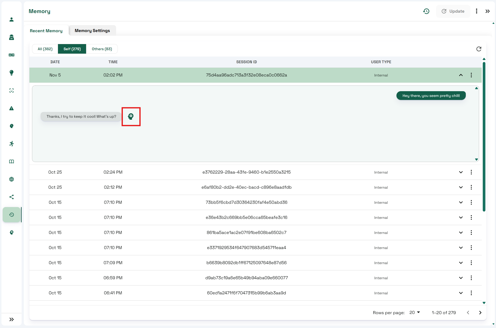

# Mindview


This feature is available only on the Professional Plan and above.


## **Introduction**

The **Mindview** section provides visibility into the **prompt** that was sent to the model to generate your character’s response.\
It’s a powerful tool for:

* Understanding how your character processes context.
* Improving your **Character Description**, **Knowledge Bank**, and **Language Settings**.
* Troubleshooting unexpected or inconsistent responses.

<figure><figcaption></figcaption></figure>

***

## **Accessing Mindview**

You can open the **Mindview** tab directly from the left navigation menu of the Convai Playground.

<figure><figcaption></figcaption></figure>

When first opening it, you’ll be asked to select a **conversation or interaction** from the **Memory** tab.\
Alternatively, you can start a new conversation — Mindview will automatically display the data for the **latest message**.

To access Mindview for a **previous interaction**:

1. Navigate to the **Memory** tab.
2. Expand the desired **session**.
3. Click the **Mindview icon** next to any message to open its corresponding prompt view.

<figure><figcaption></figcaption></figure>

***

## Understanding the Mindview Interface

Once opened, you’ll see a structured view of how the model interpreted and responded to an input.

<figure><figcaption></figcaption></figure>

### **Header Information**

At the top of the screen, the following details are displayed:

* **Session ID** – Identifies which session the interaction belongs to.
* **Model Name** – Shows the LLM used to generate the response.
* **User Query** – Displays the exact message or query that initiated this prompt.

### **Main Prompt Section**

This is the core of Mindview. It shows the **entire chain of messages** (System, Assistant, and User) that formed the complete prompt sent to the model.

Each section provides insight into how the model understands the character’s context and instructions before producing a response.

***

## What Influences the Main Prompt

The main prompt displayed in Mindview is dynamically constructed using multiple aspects of your character and session:

| Source                    | Description                                                                                                 |
| ------------------------- | ----------------------------------------------------------------------------------------------------------- |
| **Character Description** | Defines the character’s backstory and core context. Appears within `<back-story>` ... `</back-story>` tags. |
| **Language and Speech**   | Includes the allowed languages and relevant speech configuration.                                           |
| **Personality Traits**    | Controls the conversational tone, emotion, and formality level of the character.                            |
| **Narrative Design**      | Incorporates objectives or context from active Narrative Design sections into the user’s input.             |
| **Knowledge Bank**        | Adds relevant external knowledge to improve factual accuracy or domain-specific responses.                  |
| **Long-Term Memory**      | Injects persistent information learned across sessions, when applicable.                                    |

***

## Use Cases

* Debug and refine how your **character’s prompt** is constructed.
* Identify missing or conflicting information within the character setup.
* Validate that the right **Knowledge Bank**, **Personality Traits**, and **Narrative Design** data are being included in responses.

***

## Conclusion

The Mindview tab gives creators deep transparency into the inner workings of Convai’s character response generation.\
By analyzing prompts and understanding how context is layered, you can fine-tune your characters for **more consistent**, **accurate**, and **personality-aligned** interactions.
