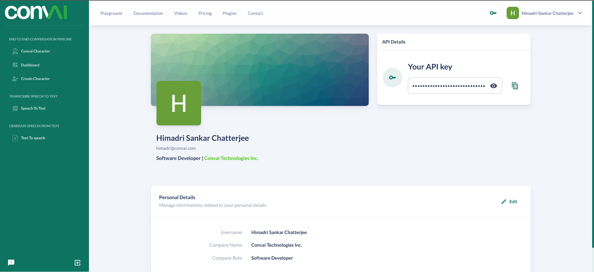

# Get Started


Note**:** In case, you are planning to extensively use our API for production, it's better to reach out to us at support@convai.com so that we can help you in increasing the efficiencies, tuned to your use case. We will provide complete support with everything.


## Get your unique API key

Your API requests are authenticated using API keys. Any request that doesn't include an API key will return an error.

As soon as you sign up to Convai, an API key is generated for you. You can always visit your profile section on convai.com and reveal your API key for use, which will be present at the top right section of the page. You can always generate new ones in case the other is compromised.

<figure><figcaption>
Get your API Key from the top right section of your profile page.
</figcaption></figure>
