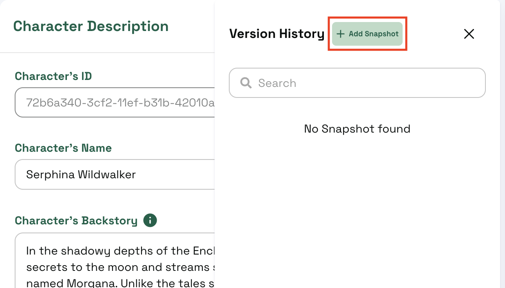
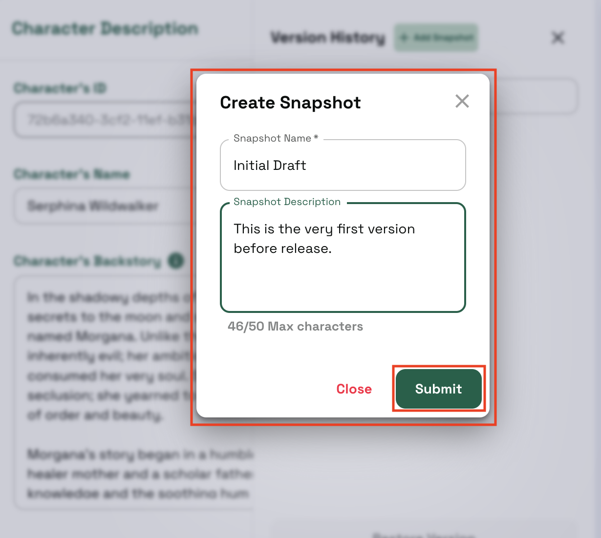
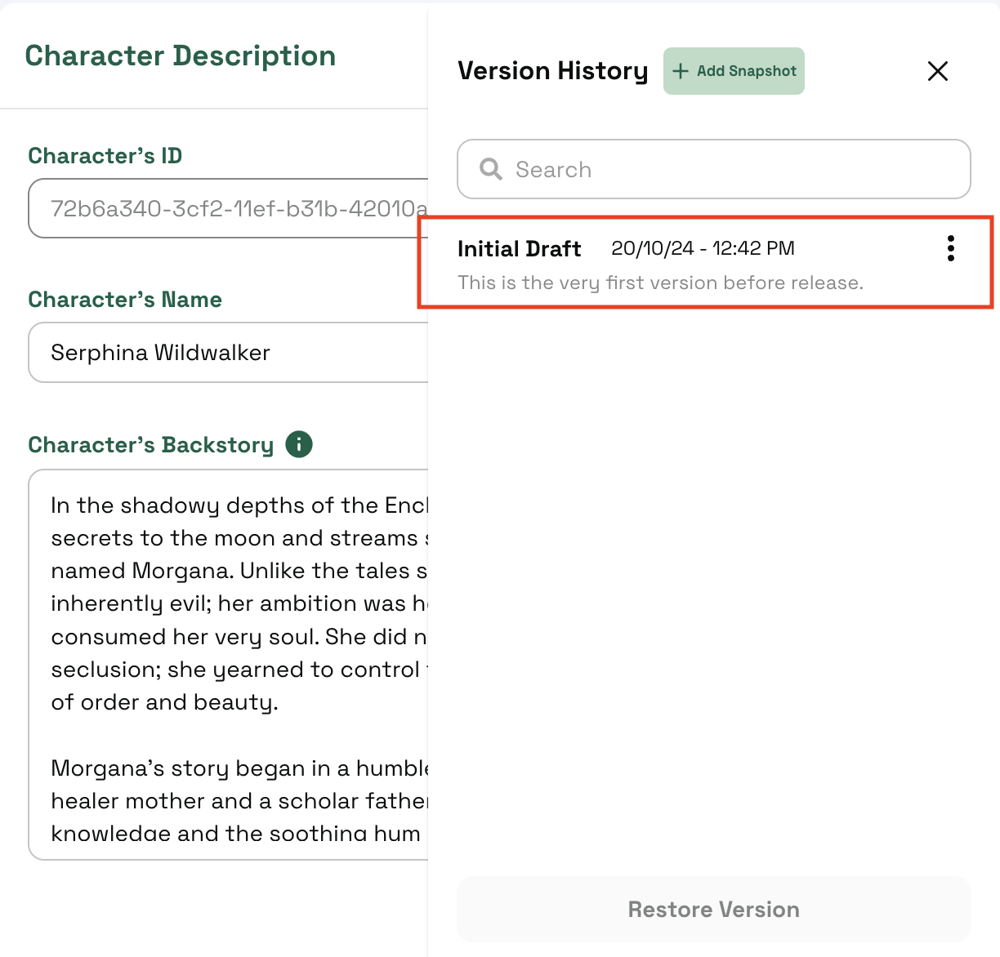
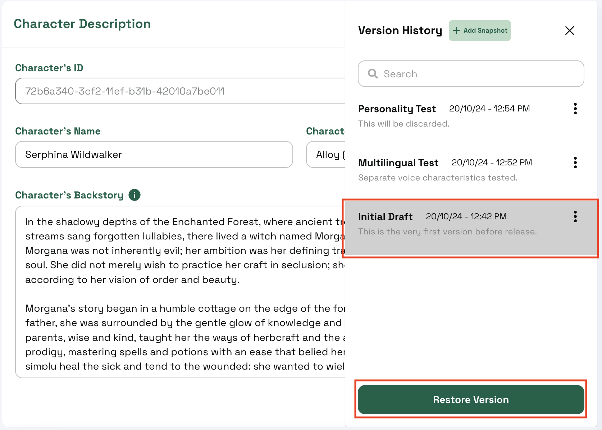
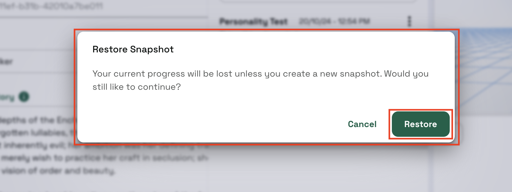
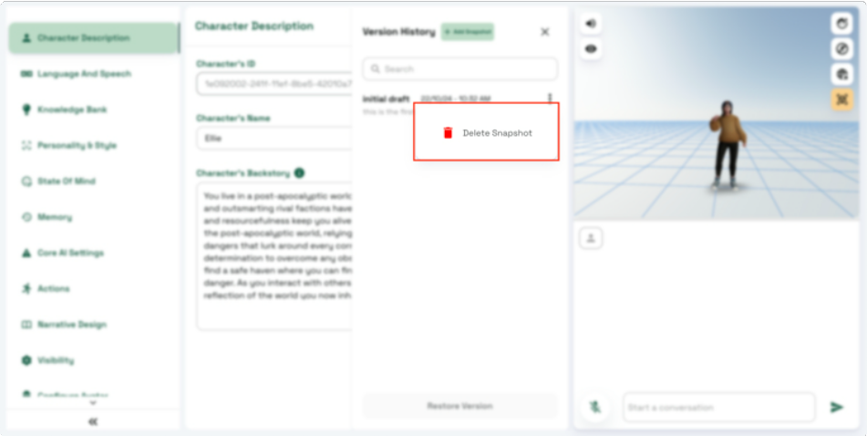

# Character Versioning

## Introduction

In this section, we look into Character Versioning, i.e., maintaining different states of the character. This enables the user to preserve a previous stable state before trying out more changes. You can now experiment without the fear of losing an older state of the character, and in case you want discard the current changes and return to a previous version, you now have the ability to restore the version and continue working from there. We conveniently call these saved states as **Snapshots** of the character.

We will go over the features and how to use them in this section.


The idea of **Snapshot** and **Version** has been used interchangeably in the text; however, they refer to the same idea: The state / contents that define the character at a specific point in time.


***

## Overview

The character versioning option is available at the top right-hand side in the character editor section beside the **Update** button

<figure><figcaption></figcaption></figure>

Once you click on it, you get to see the list of all your previous saved revisions ordered by date.

<figure><figcaption>
Character Versioning section. There is no snapshot here yet.
</figcaption></figure>

We will go over the steps of creating and maintaining snapshots from scratch in the next section

***

## Create a Version

Let us start with a character that we already have saved. The data that we see when we open the details related to a character denotes the **Current Snapshot** of the character. When you interact with the character, you are essentially referring to all the date in this **Current Snapshot** of the character.

1.  To create a new version, first open the **Character Versioning** section and click on the **+ Add Snapshot** sign at the top.\

    <figure><figcaption>
Let's create our very first snapshot.
</figcaption></figure>
2.  A pop-up appears asking you to give your snapshot a name and some description. Please note that a **Snapshot Name** is a required field to create a new version. Once you have filled the details, click on the **Submit** button.\

    <figure><figcaption>
We provide a name and a small description.
</figcaption></figure>
3.  Now, you can see the new version in the list of snapshots. Now what does this version actually represent?\
    This snapshot stores all the data related to the character at that point of time. Everything about the character ranging from character description, embodiment to knowledge bank files, narrative-design structure and other details.\

    <figure><figcaption>
The snapshot appears in the list
</figcaption></figure>

***

## Restoring a Version

Assuming you have gone ahead and worked on the character further, but you are unhappy with the results and want to go back and start from the previous version. This is where you have the ability to restore an old snapshot to the current state and work with them again. Here are the steps to follow:

1.  To restore a version, open the **Character Versioning** section and select the snapshot you want to restore back. You will see the **Restore Version** button below come to life.\

    <figure><figcaption>
We will be restoring the data from the very first snapshot.
</figcaption></figure>
2.  Once you click on the **Restore Version** button, a pop-up appears asking you if you want to save the current changes as a new snapshot or discard them. You have the option to store your current changes as some test version and refer back later on.\

    <figure><figcaption>
Let's directly restore the data in the snapshot to the Current Snapshot
</figcaption></figure>
3. For now, we are happy to discard the changes, so we will click on **Restore** button. This brings the data from the selected version to the **Current Snapshot** of the character.
4. To save the changes, you can always **Cancel** and go back to creating a new snapshot with your progress and the restoring it.

***

## Delete a Snapshot

You can also go ahead and delete a snapshot that you no longer require. To that you can click on the 3-dots by the corresponding snapshot in the list of Character Version and select **Delete Version**

<figure><figcaption>
Click on the 3-dots beside the snapshot to see all the options.
</figcaption></figure>

### Some important points to remember

At any given point you can interact with the **Current Snapshot** of the character. If you have any publicly available app that utilises the character, your users will only be able to interact with this current version.


We are currently working on a feature to help developers have separate deployed version than the **Current Snapshot**.


