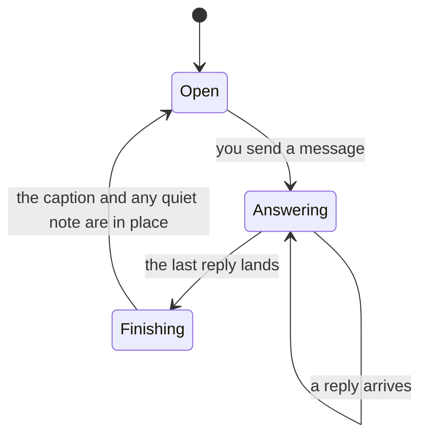

A chat experience room answers one message at a time, and it reports the result of each one under the message that prompted it. That report is where every wait, every count, and every "stayed quiet" line in the thread comes from. Knowing how a turn is measured tells you what the room is still waiting for, what it has given up on, and which characters chose to say nothing.

## One message at a time

A message and the replies it draws are one turn, and the room runs one turn at a time. A turn moves through three states, and the message box tells you which one you are in:

Sending a message locks the message box. The lock holds while the characters answer and for a moment after the last reply lands, then the box unlocks and takes the next message. You cannot type into the box while it is locked, and focus comes back to it the moment the turn is over.

The reason is that a reply belongs to the message that prompted it. Every reply, every count, and every note is filed under one of your messages, and the thread reads as a record of what each message produced. A second message accepted mid-turn would have replies to the first arriving underneath it.

## What the turn caption reports

The caption under your own message is built from two halves: what the turn asked for, and what came back. A middle dot separates them, and in a room of two or more characters the second half can carry up to three counts, separated by middle dots of their own.

A room opens on the default mode, whose label reads `Auto · room brief decides`. In a room of four characters left on it, a caption can read:

`Auto · room brief decides · 2 of 4 responded · 1 listening · 1 did not answer`

The first half names the mode the turn ran under. The counts that follow are these:

| Count | What it counts |
|---|---|
| `2 of 4 responded` | How many of the characters in the room when you sent the message have replied, out of how many were in it |
| `1 listening` | Characters that have not replied and that the room has not reported as failing to answer |
| `1 did not answer` | Characters the room reports as not answering, and that have not replied |

Only the counts that apply are printed. A turn everyone answered reads `Auto · room brief decides · 4 of 4 responded` and stops there. The first count is not the whole caption: the two that can follow it change what it means.

`listening` shifts meaning as the turn settles. While the room is still answering, a listening character is one still to answer. Once the turn is over, a listening character is one that chose to stay quiet, and where the room reports which characters those were, a note below the replies names them.

A caption describes the room as it stood when the message was sent, so seating or removing a character later leaves your earlier captions counting as they already did. See [Add or remove characters mid-conversation](add-or-remove-characters.md).

Those three counts belong to Auto alone. The other respond modes report in their own words: **Everyone must respond**, and a turn that tags two or more characters, count `replied` rather than `responded`, against the number the turn asked for; **Anyone may respond** names the characters that replied instead of counting them, and adds `⟨n⟩ passed` for the ones that did not. Every caption shape is set out in [Respond modes reference](respond-modes-reference.md).

A saved transcript reports less than a live room does: its captions carry the reply count alone. See [Review a past session](../sessions-and-transcripts/review-a-past-session.md).

## Why a character may say nothing

A character answers when it is addressed, and stays quiet otherwise. A room that receives a message addressed to nobody in particular can produce no replies at all.

When a character stays quiet, the room names it in a note under the replies, and the wording follows the mode the turn ran under. On Auto the note says the character stayed quiet as the brief asks, and invites you to tag it. On **Anyone may respond** the note says the character had nothing to add and passed. Under the three modes that require an answer from every character they address, the note is shorter and names the characters alone. [Respond modes reference](respond-modes-reference.md) gives each wording in full, and a note kept in a saved transcript is shorter still—see [Review a past session](../sessions-and-transcripts/review-a-past-session.md).

Where a quiet character is counted follows the mode as well:

| Mode the turn ran under | Where the quiet character is counted |
|---|---|
| Auto | Under `listening`, never under `did not answer`. The two are different outcomes: a character that had nothing to say is not one the room reports as failing to answer |
| **Anyone may respond** | Under `⟨n⟩ passed`. This caption carries no `listening` count and no `did not answer` count at all |


To get an answer out of a character named in a quiet note, send another message that tags it. A tagged character has to reply. See [Choose who replies](choose-who-replies.md).


## What a one-character room reports

A room holding one character has a caption of its own, whatever the respond mode is set to. It names the character rather than the mode, because there is nobody to route between. The caption opens `Sent to ⟨name⟩`, and what follows the name reports the turn:

| What follows the name | What it means |
|---|---|
| `replied` | The character has answered |
| `waiting` | The room is still answering this message |
| Nothing | The turn is over and no reply came |

A message sent while one character was seated keeps this caption afterwards, even once you have seated more.

## What the message box shows while the room is answering

The message box carries the wait in place of its usual prompt, and the wording moves on as the turn settles. While replies are still outstanding it reads `Waiting for 2 of 4…`, where the first number is how many characters are still to answer and the second how many the turn asked for. Once the last reply has arrived and the room is closing the turn, it reads `Finishing the turn…`. The box unlocks when the turn is over.

A message you have already started—typed text, or a file you have attached but not sent—hides the prompt, so the wait appears on a line under the box instead.

A turn is not the only thing that locks the box, and the box always says which reason applies. [You cannot send a message](../troubleshooting/composer-is-locked.md) reads each one and tells you what clears it.

## Related pages

The mode you pick decides most of what a caption reports, the message box tells you how far the turn has got, and a finished conversation keeps a shorter record of both.


[Choose who replies](choose-who-replies.md)



[Respond modes reference](respond-modes-reference.md)



[You cannot send a message](../troubleshooting/composer-is-locked.md)



[Review a past session](../sessions-and-transcripts/review-a-past-session.md)

