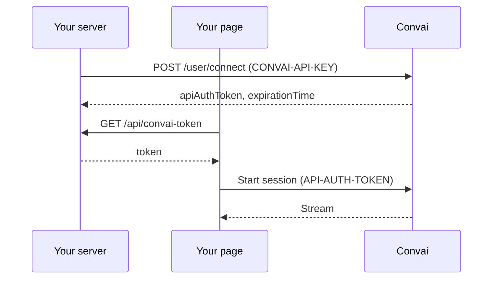

Authorize a Pixel Streaming embed with a short-lived Convai auth token instead of a domain allowlist. Use this page when you add `@convai/experience-embed` to a site that has a backend, or when you want to run an embed on `localhost`. At the end, your experience streams on any origin without a request to Convai.

## Prerequisites

- A published experience and its `expId`. See [Whitelisting & Publishing an Experience](whitelisting-and-publishing-an-experience.md).
- Your Convai API key from `<code class="expression">space.vars.dashboard_url</code>`.
- `@convai/experience-embed` version `0.7.0` or later.
- A server-side route you control, such as an Express route, a Next.js route handler, or a serverless function.

## How an auth token authorizes a session

Your server mints the token with your API key. The page fetches the token from your server and passes it to the embed as `authToken`. The embed sends the token as the `API-AUTH-TOKEN` header when it starts a session, so Convai authorizes the session by the token instead of the page's domain.



The token is checked only when a session starts. A stream keeps running after the token expires.

## Mint a token on your server

Send `POST https://api.convai.com/user/connect` with your API key in the `CONVAI-API-KEY` header. The response contains `apiAuthToken` and `expirationTime`. Each token is valid for 60 minutes.

`expirationTime` is in UTC but has no timezone suffix, for example `2026-10-01T10:15:00.123456`. Parse it as UTC. JavaScript's `Date.parse` reads a timestamp without a suffix as local time.

Minting is rate-limited per API key, and the limit depends on your plan. Cache one token on the server and reuse it until shortly before it expires, instead of minting one token per page view.


```javascript
// Keep CONVAI_API_KEY in your server environment. Never send it to the browser.
let cached = null; // { token, expiresAt }

// expirationTime is UTC without a "Z".
const parseUtc = (t) => Date.parse(/[zZ]|[+-]\d\d:?\d\d$/.test(t) ? t : `${t}Z`);

app.get("/api/convai-token", async (req, res) => {
  // Reuse the cached token until 5 minutes before it expires.
  if (!cached || cached.expiresAt - Date.now() < 5 * 60 * 1000) {
    const r = await fetch("https://api.convai.com/user/connect", {
      method: "POST",
      headers: {
        "CONVAI-API-KEY": process.env.CONVAI_API_KEY,
        "Content-Type": "application/json",
      },
      body: JSON.stringify({}),
    });
    if (!r.ok) return res.status(502).json({ error: "could not mint token" });
    const { apiAuthToken, expirationTime } = await r.json();
    cached = { token: apiAuthToken, expiresAt: parseUtc(expirationTime) };
  }
  res.json({ token: cached.token });
});
```



Mint tokens only on a server. Anyone who has your API key has full API access to your account, so never put the key in page code, a client bundle, or a public repository. Put your own login or rate limiting in front of the token route if the experience must not be public.


## Pass the token to the embed

Fetch the token before you create the embed, then pass it as `authToken`.



```tsx
import { useEffect, useRef, useState } from "react";
import {
  PixelStreamComponent,
  PixelStreamComponentHandles,
} from "@convai/experience-embed";

export function Experience() {
  const pixelStreamRef = useRef<PixelStreamComponentHandles>(null);
  const [token, setToken] = useState<string>();

  useEffect(() => {
    fetch("/api/convai-token")
      .then((r) => r.json())
      .then(({ token }) => setToken(token));
  }, []);

  return token ? (
    <PixelStreamComponent
      ref={pixelStreamRef}
      expId="your-experience-id"
      authToken={token}
    />
  ) : (
    <div>Loading…</div>
  );
}
```



```javascript
import { PixelStreamClient } from "@convai/experience-embed";

const { token } = await fetch("/api/convai-token").then((r) => r.json());

const pixelStream = new PixelStreamClient({
  container: document.getElementById("pixel-stream-container"),
  expId: "your-experience-id",
  authToken: token,
});
```



```html
<div id="pixel-stream-container" style="width: 100%; height: 600px;"></div>
<script src="https://unpkg.com/@convai/experience-embed/dist/core/convai-embed.umd.js"></script>
<script>
  fetch("/api/convai-token")
    .then((r) => r.json())
    .then(({ token }) => {
      window.pixelStream = new PixelStreamCore.PixelStreamClient({
        container: document.getElementById("pixel-stream-container"),
        expId: "your-experience-id",
        authToken: token,
      });
    });
</script>
```



Keep `authToken` stable for the life of a session. In React, a new `authToken` value starts a new session, in the same way as a new `expId` or `endUserId`. Fetch a fresh token when you start the next session, for example on the next page load.

Local development uses the same flow. Run your token route locally, and the embed streams on `http://localhost` without any allowlisting.

## Verify the session

Load the page and start the experience. In the browser's developer tools, the `viewPublishedExperience` request carries an `API-AUTH-TOKEN` header and returns HTTP `200`.


The experience streams on your page, including on an origin that is not on your account's allowlist, such as `http://localhost:3000`.


## Troubleshooting

### The embed reports an invalid or expired token

**Symptom:** The embed shows `This experience couldn't start: the Convai auth token is invalid or has expired.`

**Cause:** Convai rejected the token when the session started. The token expired or was mistyped.

**Fix:** Mint a new token on your server and remount the embed with it. Check that your server reuses a cached token only until shortly before `expirationTime`, parsed as UTC.

**Verify:** The `viewPublishedExperience` request returns HTTP `200` and the experience streams.

### The embed asks you to get your domain whitelisted

**Symptom:** The embed shows `Please contact convai to get <your origin> whitelisted!`

**Cause:** The embed started the session without a token, so Convai checked the page's domain against the allowlist. `authToken` was not passed, or it was an empty string.

**Fix:** Pass the token as `authToken`, and create the embed only after the token has loaded.

**Verify:** The `viewPublishedExperience` request carries an `API-AUTH-TOKEN` header.

### Your token route cannot mint a token

**Symptom:** `POST /user/connect` fails, and the response message is `Api key is invalid.` or `You've reached your request limit per minute`.

**Cause:** The API key in `CONVAI-API-KEY` is wrong, or the server mints more tokens per minute than your plan allows.

**Fix:** Check the API key in your server environment. Cache one token and reuse it until shortly before it expires, instead of minting one per page view.

**Verify:** `POST /user/connect` returns HTTP `200` with `apiAuthToken` and `expirationTime`.

## Next steps

The API reference lists `authToken` alongside the other props and options of the embed.


[API Reference](api-reference.md)

