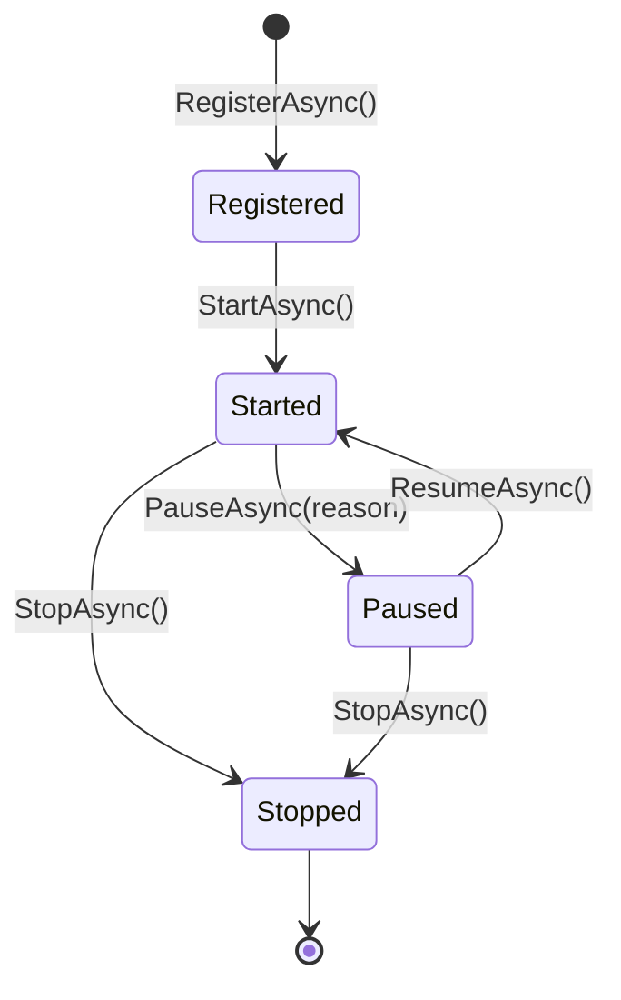

# Extending the SDK

### Adding Modules to the Convai Runtime

The Convai Unity SDK is built around a module system that gives optional features — lip sync, emotion, vision, narrative design — a defined place in the runtime lifecycle. You can add your own modules using the same system: they receive the same startup sequence, access the same services, and can share interfaces with other modules.

***

### Do You Need a Custom Module?

A custom module is the right tool when you need behavior that:

* **Participates in the SDK runtime lifecycle** — starts and stops with the SDK, not independently
* **Shares services with other SDK modules** — e.g., exposes an `IAudioAnalysisService` that the emotion module or your own code consumes
* **Reacts to SDK domain events** — character speech state, emotion changes, action triggers
* **Integrates hardware or platform systems** — haptic devices, biometric sensors, scoring engines

You **do not need a custom module** for:

* Reacting to SDK events in a MonoBehaviour — subscribe directly via `context.Events` from an `IInjectable` component, or use the public events on `ConvaiCharacter`
* Simple custom behavior on a character — add a MonoBehaviour to the character's GameObject
* Calling the Convai REST API from your own scripts — use `ConvaiManager.ActiveManager` directly

If in doubt, start with a `MonoBehaviour` and only escalate to `IConvaiModule` when you need lifecycle integration.

***

### What a Module Is

A module is a class that implements `IConvaiModule`. It:

* Has a stable `ModuleId` string (unique, lowercase, hyphen-separated by convention — e.g., `"my-company.haptic-feedback"`).
* Declares dependencies on other modules via `RequiredModules` and on runtime services via `RequiredServices`.
* Participates in the runtime lifecycle: **Register → Start → Pause ↔ Resume → Stop**.
* Can expose typed services to other modules via `IModuleContext.ProvideModuleService<T>()`.

The module system handles startup ordering automatically — modules are started in dependency order and stopped in reverse.

***

### Module Lifecycle



`RegisterAsync` runs for **all** modules before any `StartAsync` is called. Use `RegisterAsync` for setup that other modules depend on — in particular, registering services via `ProvideModuleService<T>()`.

***

### Quickstart: Minimal Working Module

Before reading the full interface contract, here is the shortest path to a working module — a MonoBehaviour that registers itself and subscribes to one SDK event:

```csharp
// MinimalModule.cs
using System;
using System.Collections.Generic;
using System.Threading;
using Convai.Domain.DomainEvents.Runtime;
using Convai.Runtime.Components;
using Convai.Runtime.Core.Modules;
using UnityEngine;

public class MinimalModule : MonoBehaviour, IConvaiModule
{
    public string ModuleId    => "my-project.minimal";
    public string DisplayName => "Minimal Module";

    public IReadOnlyList<string> RequiredModules  => Array.Empty<string>();
    public IReadOnlyList<Type>   RequiredServices => Array.Empty<Type>();
    public IReadOnlyList<Type>   ProvidedServices => Array.Empty<Type>();
    public bool IsActive { get; private set; }

    private IDisposable _sub;

    private void Awake() => ConvaiManager.ActiveManager?.RegisterModule(this);
    private void OnDestroy() => ConvaiManager.ActiveManager?.UnregisterModule(this);

    public System.Threading.Tasks.ValueTask RegisterAsync(IModuleContext ctx, CancellationToken ct = default)
        => System.Threading.Tasks.ValueTask.CompletedTask;

    public System.Threading.Tasks.ValueTask StartAsync(IModuleContext ctx, CancellationToken ct = default)
    {
        _sub = ctx.Events.Subscribe<CharacterSpeechStateChanged>(e =>
        {
            if (e.IsSpeaking) Debug.Log($"[MinimalModule] Character {e.CharacterId} started speaking.");
        });
        IsActive = true;
        return System.Threading.Tasks.ValueTask.CompletedTask;
    }

    public System.Threading.Tasks.ValueTask PauseAsync(RuntimePauseReason r, CancellationToken ct = default)
    { IsActive = false; return System.Threading.Tasks.ValueTask.CompletedTask; }

    public System.Threading.Tasks.ValueTask ResumeAsync(CancellationToken ct = default)
    { IsActive = true; return System.Threading.Tasks.ValueTask.CompletedTask; }

    public System.Threading.Tasks.ValueTask StopAsync(CancellationToken ct = default)
    { _sub?.Dispose(); IsActive = false; return System.Threading.Tasks.ValueTask.CompletedTask; }
}
```

Add this component to any GameObject in the scene. That is all that is required. The full interface contract and advanced patterns follow below.

***

### `IConvaiModule` — Full Contract

```csharp
public interface IConvaiModule
{
    string ModuleId    { get; }
    string DisplayName { get; }
    IReadOnlyList<string> RequiredModules  { get; }
    IReadOnlyList<Type>   RequiredServices { get; }
    IReadOnlyList<Type>   ProvidedServices { get; }
    bool IsActive { get; }

    ValueTask RegisterAsync(IModuleContext context, CancellationToken ct = default);
    ValueTask StartAsync(IModuleContext context, CancellationToken ct = default);
    ValueTask PauseAsync(RuntimePauseReason reason, CancellationToken ct = default);
    ValueTask ResumeAsync(CancellationToken ct = default);
    ValueTask StopAsync(CancellationToken ct = default);
}
```

#### Lifecycle Method Reference

| Method          | When Called                                        | What To Do                                                                       |
| --------------- | -------------------------------------------------- | -------------------------------------------------------------------------------- |
| `RegisterAsync` | During runtime build — before any `StartAsync`     | Register services via `context.ProvideModuleService<T>()`. Subscribe to events.  |
| `StartAsync`    | Runtime start — after all modules are registered   | Start active behaviors: begin processing, initialize hardware, start coroutines. |
| `PauseAsync`    | Runtime paused (app loses focus, deliberate pause) | Stop processing. Use `RuntimePauseReason` to distinguish why.                    |
| `ResumeAsync`   | Runtime resumed                                    | Restart processing paused in `PauseAsync`.                                       |
| `StopAsync`     | Runtime stopping or module removed                 | Clean up: unsubscribe, stop coroutines, release resources.                       |

***

### `IModuleContext` — Available Services

| Property      | Type                      | Availability | Description                                  |
| ------------- | ------------------------- | ------------ | -------------------------------------------- |
| `Runtime`     | `ConvaiRuntime`           | Always       | The runtime instance this module belongs to. |
| `Events`      | `IEventHub`               | Always       | Publish and subscribe to domain events.      |
| `Agents`      | `IAgentRegistry`          | Always       | Query registered characters and players.     |
| `Transport`   | `ITransportProvider`      | May be null  | Platform-specific communication layer.       |
| `Preferences` | `IRuntimePreferences`     | May be null  | Mutable runtime preferences.                 |
| `Logger`      | `ILogger`                 | May be null  | Logger for diagnostics.                      |
| `RoomAudio`   | `IConvaiRoomAudioService` | May be null  | Microphone and playback service.             |
| `Credentials` | `ICredentialProvider`     | May be null  | API key and server URL resolution.           |


Always null-check `Transport`, `Preferences`, `Logger`, `RoomAudio`, and `Credentials` before use. `Events` and `Agents` are guaranteed to be non-null. Accessing a null service throws a `NullReferenceException` that halts the module's lifecycle.


For the full list of subscribable domain events, see [Event System](/broken/pages/259936855790b149ada4b1e3d3ecbdb9281314b7).

***

### Implementing a Custom Module

#### Minimal Module: Event Subscriber

A module that subscribes to a domain event and triggers haptic feedback when a character speaks.

```csharp
// HapticFeedbackModule.cs
using System;
using System.Collections.Generic;
using System.Threading;
using System.Threading.Tasks;
using Convai.Domain.DomainEvents.Runtime;
using Convai.Domain.EventSystem;
using Convai.Domain.Logging;
using Convai.Runtime.Core.Modules;

public class HapticFeedbackModule : IConvaiModule
{
    public string ModuleId    => "my-company.haptic-feedback";
    public string DisplayName => "Haptic Feedback";

    public IReadOnlyList<string> RequiredModules  => Array.Empty<string>();
    public IReadOnlyList<Type>   RequiredServices => Array.Empty<Type>();
    public IReadOnlyList<Type>   ProvidedServices => Array.Empty<Type>();

    public bool IsActive { get; private set; }

    private ILogger      _logger;
    private IDisposable  _subscription;

    public ValueTask RegisterAsync(IModuleContext context, CancellationToken ct = default)
    {
        _logger = context.Logger;
        return ValueTask.CompletedTask;
    }

    public ValueTask StartAsync(IModuleContext context, CancellationToken ct = default)
    {
        _subscription = context.Events.Subscribe<CharacterSpeechStateChanged>(OnSpeechStateChanged);
        IsActive = true;
        _logger?.Debug("[HapticFeedbackModule] Started.", LogCategory.SDK);
        return ValueTask.CompletedTask;
    }

    public ValueTask PauseAsync(RuntimePauseReason reason, CancellationToken ct = default)
    {
        IsActive = false;
        return ValueTask.CompletedTask;
    }

    public ValueTask ResumeAsync(CancellationToken ct = default)
    {
        IsActive = true;
        return ValueTask.CompletedTask;
    }

    public ValueTask StopAsync(CancellationToken ct = default)
    {
        _subscription?.Dispose();
        IsActive = false;
        _logger?.Debug("[HapticFeedbackModule] Stopped.", LogCategory.SDK);
        return ValueTask.CompletedTask;
    }

    private void OnSpeechStateChanged(CharacterSpeechStateChanged e)
    {
        if (!IsActive || !e.IsSpeaking) return;
        HapticService.Pulse(HapticPattern.Soft);
    }
}
```

#### Module Sharing Services With Other Modules

A module declares its provided services in `ProvidedServices`, registers the instance in `RegisterAsync`, and consuming modules retrieve it via `TryGetModuleService<T>`.

```csharp
// AudioAnalysisModule.cs — provides IAudioAnalysisService
public class AudioAnalysisModule : IConvaiModule
{
    public string ModuleId    => "my-company.audio-analysis";
    public string DisplayName => "Audio Analysis";

    public IReadOnlyList<string> RequiredModules  => Array.Empty<string>();
    public IReadOnlyList<Type>   RequiredServices => Array.Empty<Type>();
    public IReadOnlyList<Type>   ProvidedServices => new[] { typeof(IAudioAnalysisService) };

    public bool IsActive { get; private set; }
    private AudioAnalysisService _service;

    public ValueTask RegisterAsync(IModuleContext context, CancellationToken ct = default)
    {
        _service = new AudioAnalysisService(context.RoomAudio);
        context.ProvideModuleService<IAudioAnalysisService>(_service); // Must be in RegisterAsync, not StartAsync.
        return ValueTask.CompletedTask;
    }

    public ValueTask StartAsync(IModuleContext context, CancellationToken ct = default)
    { IsActive = true; _service.Start(); return ValueTask.CompletedTask; }

    public ValueTask PauseAsync(RuntimePauseReason reason, CancellationToken ct = default)
    { IsActive = false; return ValueTask.CompletedTask; }

    public ValueTask ResumeAsync(CancellationToken ct = default)
    { IsActive = true; return ValueTask.CompletedTask; }

    public ValueTask StopAsync(CancellationToken ct = default)
    { IsActive = false; _service.Stop(); return ValueTask.CompletedTask; }
}
```

A consuming module:

```csharp
// VisualizerModule.cs — consumes IAudioAnalysisService
public class VisualizerModule : IConvaiModule
{
    public IReadOnlyList<Type> RequiredServices => new[] { typeof(IAudioAnalysisService) };
    // ... other interface members ...

    public ValueTask StartAsync(IModuleContext context, CancellationToken ct = default)
    {
        if (context.TryGetModuleService<IAudioAnalysisService>(out var analysis))
        {
            // analysis is guaranteed non-null here.
        }
        return ValueTask.CompletedTask;
    }
}
```


Always use `TryGetModuleService` — never assume the service is present. If `AudioAnalysisModule` is not registered, `TryGetModuleService` returns `false` without throwing, letting `VisualizerModule` degrade gracefully.


***

### Registering a Custom Module

#### MonoBehaviour Self-Registration (Recommended)

Attach the module as a component to any GameObject. It self-registers with `ConvaiManager` on `Awake`.

```csharp
// HapticFeedbackBridge.cs
using Convai.Runtime.Components;
using Convai.Runtime.Core.Modules;
using UnityEngine;

public class HapticFeedbackBridge : MonoBehaviour, IConvaiModule
{
    public string ModuleId    => "my-company.haptic-feedback";
    public string DisplayName => "Haptic Feedback";
    // ... implement remaining IConvaiModule members ...

    private void Awake()
    {
        // ConvaiManager.Awake() runs at execution order -1100.
        // This Awake() runs at default order 0 — ConvaiManager.ActiveManager is already set.
        ConvaiManager.ActiveManager?.RegisterModule(this);
    }

    private void OnDestroy()
    {
        ConvaiManager.ActiveManager?.UnregisterModule(this);
    }
}
```


After `Start()` completes on `ConvaiManager`, `ConvaiManager.ActiveManager.IsInitialized` returns `true`. At that point all registered modules have been discovered and the runtime has started.


#### `CreateRuntimeBuilder` Override

Use this when you prefer all customization in one place, or when the module is not a MonoBehaviour.

```csharp
// CustomRuntimeManager.cs
using Convai.Runtime.Components;
using Convai.Runtime.Core;

public class CustomRuntimeManager : ConvaiManager
{
    protected override ConvaiRuntimeBuilder CreateRuntimeBuilder()
    {
        ConvaiRuntimeBuilder builder = base.CreateRuntimeBuilder();
        builder.AddModule(new HapticFeedbackModule());
        builder.AddModule(new AudioAnalysisModule());
        return builder;
    }
}
```

***

### The Dependency Injection Pattern

Components on `ConvaiCharacter` or `ConvaiPlayer` GameObjects can receive SDK services automatically by implementing `IInjectable<TDependencies>`. The SDK injects dependencies after the character or player is registered with the runtime.

#### `IInjectable<TDependencies>`

```csharp
public interface IInjectable<TDependencies>
{
    int  InjectionOrder { get; }                     // Lower = injected first. Default 0.
    void InjectDependencies(TDependencies dependencies);
}
```

#### `IConvaiCharacterDependencies`

| Property            | Type                           | Availability |
| ------------------- | ------------------------------ | ------------ |
| `EventHub`          | `IEventHub`                    | Required     |
| `ConnectionService` | `IConvaiRoomConnectionService` | Required     |
| `AudioService`      | `IConvaiRoomAudioService`      | Required     |
| `AgentRegistry`     | `IAgentRegistry`               | Optional     |
| `Logger`            | `ILogger`                      | Optional     |

#### `IConvaiPlayerDependencies`

| Property                 | Type                            | Availability |
| ------------------------ | ------------------------------- | ------------ |
| `PlayerInputService`     | `IPlayerInputService`           | Optional     |
| `RuntimeSettingsService` | `IConvaiRuntimeSettingsService` | Optional     |
| `Logger`                 | `ILogger`                       | Optional     |

#### Writing an Injectable Component

```csharp
// CharacterHealthIndicator.cs
using Convai.Domain.DomainEvents.Runtime;
using Convai.Domain.EventSystem;
using Convai.Domain.Logging;
using Convai.Runtime.Core.DependencyInjection;
using UnityEngine;

public class CharacterHealthIndicator : MonoBehaviour,
    IInjectable<IConvaiCharacterDependencies>
{
    public int InjectionOrder => 0;

    private IEventHub _events;
    private ILogger   _logger;

    public void InjectDependencies(IConvaiCharacterDependencies dependencies)
    {
        _events = dependencies.EventHub;
        _logger = dependencies.Logger;
        _events.Subscribe<CharacterTurnCompleted>(OnTurnCompleted);
    }

    private void OnTurnCompleted(CharacterTurnCompleted e)
    {
        _logger?.Debug("[CharacterHealthIndicator] Turn completed.", LogCategory.Character);
        // Update health indicator UI here.
    }

    private void OnDestroy()
    {
        _events?.Unsubscribe<CharacterTurnCompleted>(OnTurnCompleted);
    }
}
```

Add this component to the same GameObject as `ConvaiCharacter`. The SDK calls `InjectDependencies` automatically during character registration.

***

### What Is Safe To Extend vs. What Is Internal

#### Safe Extension Points

| What                                  | How                                                                                                   |
| ------------------------------------- | ----------------------------------------------------------------------------------------------------- |
| Custom module behavior                | Implement `IConvaiModule` and register via `RegisterModule()` or `AddModule()`                        |
| Inter-module services                 | `ProvideModuleService<T>()` / `TryGetModuleService<T>()`                                              |
| Custom credentials                    | Override `CreateRuntimeBuilder()` and call `builder.UseConfig()`                                      |
| Custom identity                       | `SetEndUserIdentityProvider()` / `SetEndUserMetadataProvider()`, or builder                           |
| Custom persistence                    | Override `CreateRuntimeBuilder()` and call `builder.UsePersistence()`                                 |
| Character-level component integration | Implement `IInjectable<IConvaiCharacterDependencies>` on a MonoBehaviour in the character's hierarchy |
| Event subscriptions                   | `IEventHub.Subscribe<T>()` / `Unsubscribe<T>()`                                                       |
| Log routing                           | `ConvaiLogger.RegisterSink(ILogSink)`                                                                 |

#### Internal APIs — Do Not Override

| Area                                                   | Why                                                                                  |
| ------------------------------------------------------ | ------------------------------------------------------------------------------------ |
| `ConvaiRuntime` internals                              | Private by design; subject to change without notice                                  |
| Transport layer (`ITransportProvider` implementations) | Platform-specific; overriding breaks platform support                                |
| RTVI protocol handler (`RTVIHandler`)                  | Serialization format is tied to Convai's backend — any override desyncs the protocol |
| `ConvaiRoomManager` internals                          | Room coordinator internals are not extension points                                  |
| Module execution ordering beyond `RequiredModules`     | The topological sort is automatic; do not rely on registration order                 |


Do not reflect into internal types or bypass the builder to inject dependencies. SDK internals change between versions — code that bypasses the public API will break on upgrade with no warning.


***

### Usage Examples

#### Example 1: Biometric Correlation Module for Medical Simulation

Records character emotion data alongside biometric sensor readings for post-session analysis.

```csharp
using Convai.Domain.DomainEvents.Runtime;

public class BiometricCorrelationModule : IConvaiModule
{
    public string ModuleId    => "medsim.biometric-correlation";
    public string DisplayName => "Biometric Correlation";
    public IReadOnlyList<string> RequiredModules  => Array.Empty<string>();
    public IReadOnlyList<Type>   RequiredServices => Array.Empty<Type>();
    public IReadOnlyList<Type>   ProvidedServices => Array.Empty<Type>();
    public bool IsActive { get; private set; }

    private IDisposable    _emotionSubscription;
    private BiometricLogger _bioLogger;

    public ValueTask RegisterAsync(IModuleContext context, CancellationToken ct = default)
    {
        _bioLogger = BiometricLogger.Instance;
        return ValueTask.CompletedTask;
    }

    public ValueTask StartAsync(IModuleContext context, CancellationToken ct = default)
    {
        _emotionSubscription = context.Events.Subscribe<CharacterEmotionChanged>(OnEmotionChanged);
        IsActive = true;
        return ValueTask.CompletedTask;
    }

    public ValueTask PauseAsync(RuntimePauseReason reason, CancellationToken ct = default)
    { IsActive = false; return ValueTask.CompletedTask; }

    public ValueTask ResumeAsync(CancellationToken ct = default)
    { IsActive = true; return ValueTask.CompletedTask; }

    public ValueTask StopAsync(CancellationToken ct = default)
    {
        _emotionSubscription?.Dispose();
        IsActive = false;
        return ValueTask.CompletedTask;
    }

    private void OnEmotionChanged(CharacterEmotionChanged e)
    {
        if (!IsActive) return;
        _bioLogger.Record(timestamp: e.Timestamp, emotionLabel: e.Emotion, intensity: e.Intensity);
    }
}
```

#### Example 2: Assessment Scoring Module for Industrial Training

Tracks character-triggered actions against a scoring rubric and exposes the score service to other modules via `ProvideModuleService`.

```csharp
using Convai.Domain.DomainEvents.Runtime;

public class ScoringModule : IConvaiModule
{
    public string ModuleId    => "industrial.scoring";
    public string DisplayName => "Assessment Scoring";
    public IReadOnlyList<string> RequiredModules  => Array.Empty<string>();
    public IReadOnlyList<Type>   RequiredServices => Array.Empty<Type>();
    public IReadOnlyList<Type>   ProvidedServices => new[] { typeof(IAssessmentScoreService) };
    public bool IsActive { get; private set; }

    private AssessmentScoreService _scoreService;
    private IDisposable            _actionSubscription;

    public ValueTask RegisterAsync(IModuleContext context, CancellationToken ct = default)
    {
        _scoreService = new AssessmentScoreService();
        context.ProvideModuleService<IAssessmentScoreService>(_scoreService);
        return ValueTask.CompletedTask;
    }

    public ValueTask StartAsync(IModuleContext context, CancellationToken ct = default)
    {
        _actionSubscription = context.Events.Subscribe<CharacterActionReceived>(OnActionReceived);
        IsActive = true;
        return ValueTask.CompletedTask;
    }

    public ValueTask PauseAsync(RuntimePauseReason reason, CancellationToken ct = default)
    { IsActive = false; return ValueTask.CompletedTask; }

    public ValueTask ResumeAsync(CancellationToken ct = default)
    { IsActive = true; return ValueTask.CompletedTask; }

    public ValueTask StopAsync(CancellationToken ct = default)
    {
        _actionSubscription?.Dispose();
        IsActive = false;
        return ValueTask.CompletedTask;
    }

    private void OnActionReceived(CharacterActionReceived e)
    {
        if (!IsActive) return;
        foreach (var action in e.Actions)
            _scoreService.RecordAction(action.Name, action.Target, e.Timestamp);
    }
}
```

***

### Troubleshooting

| Symptom                                                      | Likely Cause                                                                            | Fix                                                                                                                    |
| ------------------------------------------------------------ | --------------------------------------------------------------------------------------- | ---------------------------------------------------------------------------------------------------------------------- |
| Module's `StartAsync` never called                           | `RegisterAsync` threw an unhandled exception; the runtime halts module startup silently | Wrap `RegisterAsync` body in a try-catch and log explicitly.                                                           |
| `TryGetModuleService<T>` returns `false` unexpectedly        | `ProvideModuleService<T>` was called in `StartAsync` instead of `RegisterAsync`         | Move `ProvideModuleService<T>` to `RegisterAsync` — services must be registered before any module's `StartAsync` runs. |
| Module starts but misses early events                        | Subscribed in `RegisterAsync` but event fires during startup before `StartAsync`        | Move subscriptions to `StartAsync`, or guard with `IsActive` check in the handler.                                     |
| `RequiredModules` entry causes startup error                 | Listed module ID not registered before runtime build                                    | Verify the module ID string matches exactly — IDs are case-sensitive.                                                  |
| `InjectDependencies` never called on `IInjectable` component | Component is not on a GameObject in the `ConvaiCharacter` hierarchy                     | `IInjectable<IConvaiCharacterDependencies>` only works on GameObjects that are children of a character.                |
| `ConvaiManager.ActiveManager` is null in `Awake`             | Manager's `Awake` has not yet run at execution order −1100                              | Register modules in `Start()` or use `ConvaiManager.ActiveManager?.RegisterModule(this)` with null-safety.             |

***

### Next Steps

With your module integrated, consider reviewing [Performance and Optimization](/broken/pages/58b5300f31c2e35a83ef2903117834510ba33209) to configure logging inside your module via `ConvaiLogger` and tune retry behavior for any network calls your module makes. For the full set of domain events you can subscribe to, see [Event System](/broken/pages/259936855790b149ada4b1e3d3ecbdb9281314b7).
