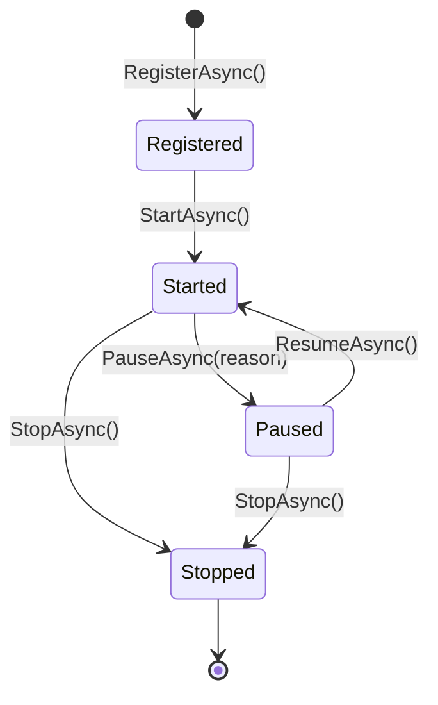

The Convai Unity SDK is built around a module system that gives optional features — lip sync, emotion, vision, narrative design — a defined place in the runtime lifecycle. You can add your own modules using the same system: they receive the same startup sequence, access the same services, and can share interfaces with other modules.

## Do you need a custom module?

A custom module is the right tool when you need behavior that:

* **Participates in the SDK runtime lifecycle** — starts and stops with the SDK, not independently
* **Shares services with other SDK modules** — e.g., exposes an `IAudioAnalysisService` that the emotion module or your own code consumes
* **Reacts to SDK domain events** — character speech state, emotion changes, action triggers
* **Integrates hardware or platform systems** — haptic devices, biometric sensors, scoring engines

You do not need a custom module for:

* Reacting to SDK events in a MonoBehaviour — subscribe directly via `context.Events` from an `IInjectable` component, or use the public events on `ConvaiCharacter`
* Simple custom behavior on a character — add a MonoBehaviour to the character's GameObject
* Calling the Convai REST API from your own scripts — use `ConvaiManager.ActiveManager` directly

If in doubt, start with a `MonoBehaviour` and only escalate to `IConvaiModule` when you need lifecycle integration.

## What a module is

A module is a class that implements `IConvaiModule`. It:

* Has a stable `ModuleId` string (unique, lowercase, hyphen-separated by convention — e.g., `"my-company.haptic-feedback"`).
* Declares dependencies on other modules via `RequiredModules` and on runtime services via `RequiredServices`.
* Participates in the runtime lifecycle: **Register → Start → Pause ↔ Resume → Stop**.
* Can expose typed services to other modules via `IModuleContext.ProvideModuleService<T>()`.

The module system handles startup ordering automatically — modules are started in dependency order and stopped in reverse.

## Module lifecycle

The lifecycle has five states. `RegisterAsync` runs for all modules before any `StartAsync` call, giving every module a guaranteed window to register services before any module begins active processing.

For the full lifecycle method contract and implementation examples, see [Implement a custom module](implement-a-custom-module.md).

## Safe extension points and internal APIs

Use only the public extension points listed below. Internal types and platform-specific layers change without notice.

### Safe extension points

| What | How |
| ------------------------------------- | ----------------------------------------------------------------------------------------------------- |
| Custom module behavior | Implement `IConvaiModule` and register via `RegisterModule()` or `AddModule()` |
| Inter-module services | `ProvideModuleService<T>()` / `TryGetModuleService<T>()` |
| Custom credentials | Override `CreateRuntimeBuilder()` and call `builder.UseConfig()` |
| Custom identity | `SetEndUserIdentityProvider()` / `SetEndUserMetadataProvider()`, or builder |
| Custom persistence | Override `CreateRuntimeBuilder()` and call `builder.UsePersistence()` |
| Character-level component integration | Implement `IInjectable<IConvaiCharacterDependencies>` on a MonoBehaviour in the character's hierarchy |
| Event subscriptions | `IEventHub.Subscribe<T>()` / `Unsubscribe<T>()` |
| Log routing | `ConvaiLogger.RegisterSink(ILogSink)` |

### Internal APIs — do not override

| Area | Why |
| ------------------------------------------------------ | ------------------------------------------------------------------------------------ |
| `ConvaiRuntime` internals | Private by design; subject to change without notice |
| Transport layer (`ITransportProvider` implementations) | Platform-specific; overriding breaks platform support |
| RTVI protocol handler (`RTVIHandler`) | Serialization format is tied to Convai's backend — any override desyncs the protocol |
| `ConvaiRoomManager` internals | Room coordinator internals are not extension points |
| Module execution ordering beyond `RequiredModules` | The topological sort is automatic; do not rely on registration order |


Do not reflect into internal types or bypass the builder to inject dependencies. SDK internals change between versions — code that bypasses the public API will break on upgrade with no warning.


## Next steps


[Implement a custom module](implement-a-custom-module.md)



[Event System](../core-concepts/event-system.md)

