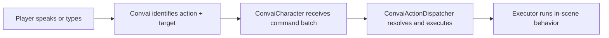

# Character Actions

## Make Your Characters Act, Not Just Talk

The Convai Actions system lets NPC characters respond to player requests by performing physical behaviors in your scene. When a trainee says "retrieve the fire extinguisher," the character navigates to it. When a student says "point at the diagram," the character turns and faces it. The backend identifies what to do and who to target; Unity executes the behavior through a simple, extensible pipeline.

***

## How the Pipeline Works

Every action request travels through four stages:

The Convai backend selects the action name and optional target from the affordances you registered at connect time. Unity resolves that target to a scene `GameObject` and runs the bound executor component.

***

## Four Concepts to Know Before You Start

| Concept                | What It Means                                                                                                                                                                             |
| ---------------------- | ----------------------------------------------------------------------------------------------------------------------------------------------------------------------------------------- |
| **Action affordances** | Which action names the backend is allowed to request. Authored in `ConvaiActionConfigSource` or overridden at connect time.                                                               |
| **Action targets**     | Which objects and characters the backend is allowed to reference. Also authored in `ConvaiActionConfigSource`.                                                                            |
| **Action events**      | The ordered command batch the backend returns for a turn. Exposed via `ConvaiCharacter.OnActionsReceived`.                                                                                |
| **Local execution**    | Optional Unity-side execution through `ConvaiActionDispatcher` and `IConvaiActionExecutor`. You can receive raw action events without the dispatcher if you want to handle them yourself. |

***

## Components Required on an Action-Enabled NPC

| Component                       | Required            | Purpose                                                         |
| ------------------------------- | ------------------- | --------------------------------------------------------------- |
| `ConvaiCharacter`               | Always              | Receives action command batches from Convai                     |
| `ConvaiActionConfigSource`      | Yes                 | Authors connect-time affordances (actions, objects, characters) |
| `ConvaiActionDispatcher`        | Optional            | Executes received batches automatically through bound executors |
| One or more executor components | If using dispatcher | Performs the actual in-scene behavior                           |


`ConvaiActionDispatcher` is optional. If you want to handle action batches in your own gameplay code, subscribe to `ConvaiCharacter.OnActionsReceived` directly and skip the dispatcher entirely.


***

## Built-In vs. Sample Executors

Two executors ship with the core SDK runtime and are always available:

| Executor                     | Behavior                                                                                  |
| ---------------------------- | ----------------------------------------------------------------------------------------- |
| `LookAtTargetActionExecutor` | Smoothly rotates the NPC to face a target over a configurable duration                    |
| `UnityEventActionExecutor`   | Fires a `UnityEvent` — connects any action to Inspector-wired callbacks without scripting |

Four additional executors ship as samples and **require importing the sample pack** via Package Manager:

| Executor                        | Behavior                                                                 |
| ------------------------------- | ------------------------------------------------------------------------ |
| `TransformMoveToActionExecutor` | Instantly snaps the NPC to the target position — prototype use only      |
| `NavMeshMoveToActionExecutor`   | Drives a `NavMeshAgent` to the target using pathfinding                  |
| `AnimatorTriggerActionExecutor` | Maps action names to Animator triggers via a configurable binding list   |
| `PickUpActionExecutor`          | Compound: navigate to target → trigger animation → attach object to hand |


`TransformMoveToActionExecutor` teleports the character instantly with no animation or pathfinding. Use it only for rapid prototyping. Replace it with `NavMeshMoveToActionExecutor` or a custom executor before shipping.


***

## In This Section

<table data-view="cards"><thead><tr><th></th><th data-hidden data-card-target data-type="content-ref"></th></tr></thead><tbody><tr><td><strong>Quick Start</strong> Add a working Move To action to your NPC in minutes — no scripting required.</td><td><a href="/broken/pages/3311ed2e1c0e0985321cf7b429ff40662da64465">Broken link</a></td></tr><tr><td><strong>Configuring Actions</strong> Full reference for ConvaiActionConfigSource — action definitions, targets, and connect-time overrides.</td><td><a href="/broken/pages/f9a397c39ee399143f6d3d43ff9f1c7a5c0de0d0">Broken link</a></td></tr><tr><td><strong>Action Executors</strong> Reference for all six built-in and sample executor components with Inspector field tables.</td><td><a href="/broken/pages/7440d20ffde11c3780e97d58f5a4f14ce6000fe8">Broken link</a></td></tr><tr><td><strong>Dispatcher &#x26; Batch Policies</strong> Configure how ConvaiActionDispatcher handles concurrent batches and step failures.</td><td><a href="/broken/pages/2d3a7e8b784c555804d782a3e46cdde89e0d4ba2">Broken link</a></td></tr><tr><td><strong>Writing Custom Executors</strong> Implement IConvaiActionExecutor to create project-specific behaviors for any action.</td><td><a href="/broken/pages/e6169781293680a3ad8f2dd1359108b1eed7f87d">Broken link</a></td></tr><tr><td><strong>Attention &#x26; Reference Grounding</strong> Keep Convai's target resolution aligned with what the player is focused on at runtime.</td><td><a href="/broken/pages/cbf0680be3992f8562879d9f75bac700e74a6e46">Broken link</a></td></tr><tr><td><strong>Scripting Reference</strong> Complete public API for all action system types, events, enums, and components.</td><td><a href="/broken/pages/c0a9b7850202d56afb596a265ee5d25de71c2b04">Broken link</a></td></tr><tr><td><strong>Usage Examples</strong> Four progressive scenarios from no-code Inspector setup to scripted batch injection.</td><td><a href="/broken/pages/e36aa2009cf062d1236ff92077b089fe57b1c856">Broken link</a></td></tr><tr><td><strong>Debugging &#x26; Troubleshooting</strong> Diagnose action pipeline issues with ConvaiActionDebugProbe and a symptom/cause/fix reference.</td><td><a href="/broken/pages/8aad18e2ac05ade4be90aa0b4f3398557e34692e">Broken link</a></td></tr></tbody></table>

***

## Next Steps

Start with the [Quick Start](/broken/pages/3311ed2e1c0e0985321cf7b429ff40662da64465) to get a Move To action working in your scene without writing any code. Once your first action runs end-to-end, read [Configuring Actions](/broken/pages/f9a397c39ee399143f6d3d43ff9f1c7a5c0de0d0) for the full `ConvaiActionConfigSource` reference, then [Action Executors](/broken/pages/7440d20ffde11c3780e97d58f5a4f14ce6000fe8) to choose or build the right executor for your project's movement and interaction systems.
