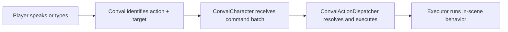

The Convai character actions system lets NPC characters respond to player requests by performing physical behaviors in your scene. When a trainee says "retrieve the fire extinguisher," the character navigates to it. When a student says "point at the diagram," the character turns and faces it. The backend identifies what to do and who to target; Unity executes the behavior through a simple, extensible pipeline.

## How the action pipeline works

Every action request travels through four stages:

The Convai backend selects the action name and optional target from the affordances you registered at connect time. Unity resolves that target to a scene `GameObject` and runs the bound executor component.

## Key concepts

| Concept | What it means |
| --- | --- |
| **Action affordances** | Which action names the backend is allowed to request. Authored in `ConvaiActionConfigSource` or overridden at connect time. |
| **Action targets** | Which objects and characters the backend is allowed to reference. Also authored in `ConvaiActionConfigSource`. |
| **Action events** | The ordered command batch the backend returns for a turn. Exposed via `ConvaiCharacter.OnActionsReceived`. |
| **Local execution** | Optional Unity-side execution through `ConvaiActionDispatcher` and `IConvaiActionExecutor`. You can receive raw action events without the dispatcher if you want to handle them yourself. |

## Required components

| Component | Required | Purpose |
| --- | --- | --- |
| `ConvaiCharacter` | Always | Receives action command batches from Convai |
| `ConvaiActionConfigSource` | Yes | Authors connect-time affordances (actions, objects, characters) |
| `ConvaiActionDispatcher` | Optional | Executes received batches automatically through bound executors |
| One or more executor components | If using dispatcher | Performs the actual in-scene behavior |


`ConvaiActionDispatcher` is optional. If you want to handle action batches in your own gameplay code, subscribe to `ConvaiCharacter.OnActionsReceived` directly and skip the dispatcher entirely.


## Executors

Six executor components ship with the Convai SDK:

| Executor | Behavior |
| --- | --- |
| `LookAtTargetActionExecutor` | Smoothly rotates the NPC to face a target over a configurable duration |
| `UnityEventActionExecutor` | Fires a `UnityEvent` — connects any action to Inspector-wired callbacks without scripting |
| `TransformMoveToActionExecutor` | Instantly snaps the NPC to the target position — prototype use only |
| `NavMeshMoveToActionExecutor` | Drives a `NavMeshAgent` to the target using pathfinding |
| `AnimatorTriggerActionExecutor` | Maps action names to Animator triggers via a configurable binding list |
| `PickUpActionExecutor` | Compound: navigate to target → trigger animation → attach object to hand |


`TransformMoveToActionExecutor` teleports the character instantly with no animation or pathfinding. Use it only for rapid prototyping. Replace it with `NavMeshMoveToActionExecutor` or a custom executor before shipping to players.


## Next steps

To get a working action set up in your scene, start with the quick-start guide. Once your first action runs end-to-end, read the configuration reference to understand the full `ConvaiActionConfigSource` options, then choose or build the right executor for your project.


[Character actions quick start](quick-start.md)



[Configure character actions](configuring-actions.md)



[Action executors](action-executors.md)

