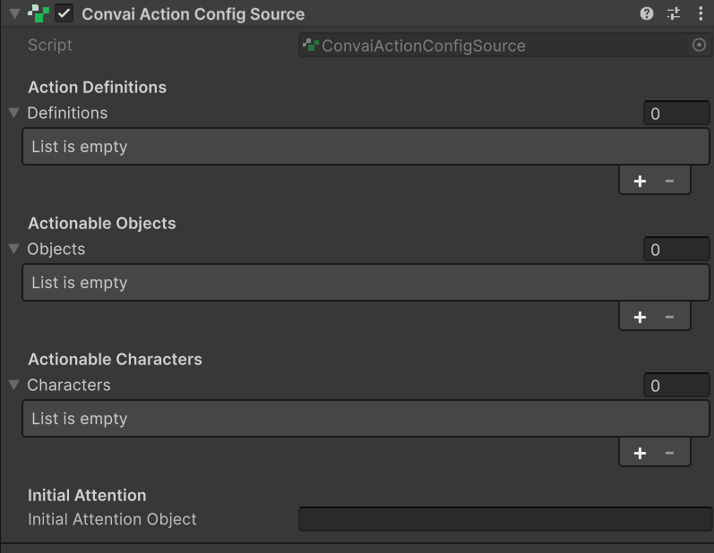
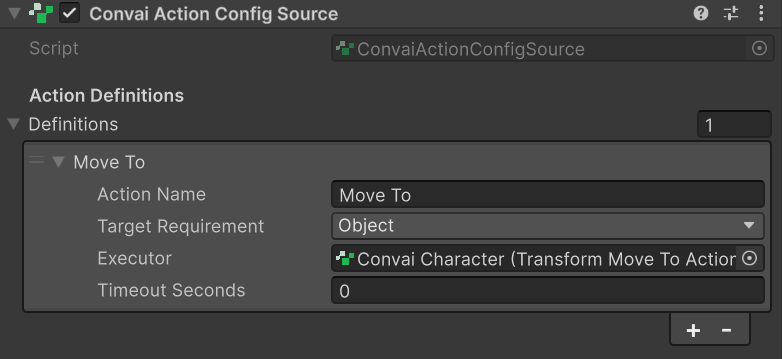
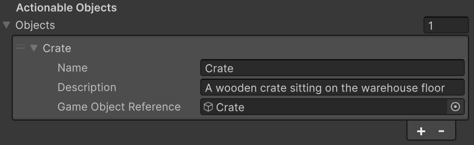
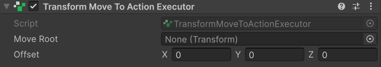
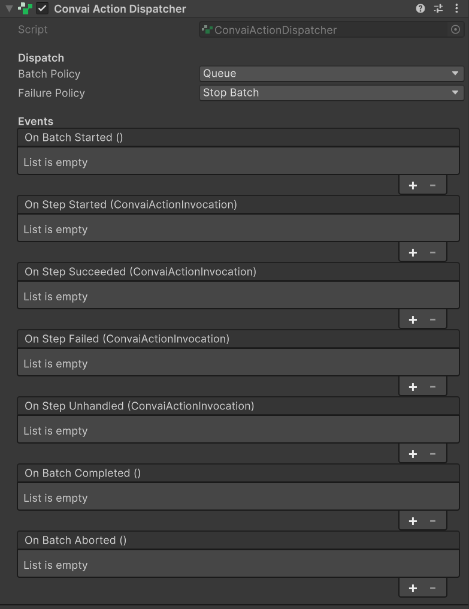

This guide walks you through connecting a "Move To" action so your NPC navigates to a scene object when the player asks. By the end, your character responds to natural language requests like "go to the crate" by physically moving to it in the scene — no code required.

## Prerequisites

Before starting, verify:

* [ ] A `ConvaiCharacter` component is already on your NPC's `GameObject`
* [ ] Your scene has at least one target object the NPC should be able to reach

## Configure the action pipeline



### Add ConvaiActionConfigSource

Select your NPC's `GameObject`. In the Inspector, click **Add Component** and search for **Convai Action Config Source** (`Convai/Convai Action Config Source`).

You should see four new sections in the Inspector: **Action Definitions**, **Actionable Objects**, **Actionable Characters**, and **Initial Attention**.

<figure><figcaption><p>ConvaiActionConfigSource added to the NPC — the four sections are now available to configure which actions, objects, and characters the backend can reference at runtime.</p></figcaption></figure>



### Define the Move To action

In the **Action Definitions** list, click the **+** button to add an entry, then fill in the three fields:

| Field | Value |
| --- | --- |
| **Action Name** | `Move To` |
| **Target Requirement** | `Object` |
| **Executor** | *(leave empty for now — you'll assign it in the next step)* |

Leave **Timeout Seconds** at `0` (no timeout).

<figure><figcaption><p>Move To action definition — Action Name matches the command string Convai sends; Target Requirement Object tells the dispatcher to resolve a scene object target before calling the executor.</p></figcaption></figure>



### Register a target object

In the **Actionable Objects** list, click **+** and fill in:

| Field | Value |
| --- | --- |
| **Name** | `Crate` |
| **Description** | A wooden storage crate near the left workbench |
| **GameObject Reference** | Drag your target object here |

The **Description** is sent to Convai and helps the backend resolve vague references like "that box" or "the thing by the bench." Write it as a natural sentence that places the object in context.

<figure><figcaption><p>Crate registered as an Actionable Object — the Description is sent to Convai and used for natural-language reference resolution; the GameObject Reference stays local and is never transmitted.</p></figcaption></figure>



### Add TransformMoveToActionExecutor

On the same NPC `GameObject`, click **Add Component** and search for **Transform Move To Action Executor** (`Convai/Samples/Transform Move To Action Executor`).

Go back to the **Action Definitions** entry you created in the previous step. Drag the `TransformMoveToActionExecutor` component into the **Executor** field.

<figure><figcaption><p>TransformMoveToActionExecutor assigned as the Move To executor — this completes the action-to-behavior binding that the dispatcher uses when Convai selects the Move To action.</p></figcaption></figure>


`TransformMoveToActionExecutor` is for prototyping only. It teleports the character instantly with no animation or pathfinding. Replace it with `NavMeshMoveToActionExecutor` or a custom executor before shipping to players.




### Add ConvaiActionDispatcher

On the same NPC `GameObject`, click **Add Component** and search for **Convai Action Dispatcher** (`Convai/Convai Action Dispatcher`).

Leave **Batch Policy** at `Queue` and **Failure Policy** at `Stop Batch` — these are the correct defaults for most scenarios.

<figure><figcaption><p>ConvaiActionDispatcher added — Queue batch policy and Stop Batch failure policy are the correct defaults for most scenarios and require no further configuration for this quick start.</p></figcaption></figure>



## Verify the setup

Your NPC's `GameObject` should now have these four components:

```
ConvaiCharacter
ConvaiActionConfigSource   ← action definitions + target objects
ConvaiActionDispatcher     ← receives and executes batches
TransformMoveToActionExecutor  ← performs the move behavior
```

<figure><figcaption><p>TODO: Replace with screenshot showing the four action-pipeline components on the NPC GameObject.</p></figcaption></figure>

Enter Play Mode and say "go to the crate" or "move to the crate." Your NPC should teleport to the crate's position.

If you added `ConvaiActionDebugProbe` (optional — see [Debug character actions](debugging-and-troubleshooting.md)), you should also see this in the Console:

```
[ConvaiActionDebugProbe] Step succeeded #1: cmd='Move To crate', def='Move To', target=Object:Crate
```

If the NPC does not move, check [Debug character actions](debugging-and-troubleshooting.md) for the diagnostic checklist.

## Runtime behavior

**Action names are case-insensitive.** `Move To`, `move to`, and `MOVE TO` all match the same definition. Spaces are preserved — `Move To` and `MoveTO` do not match.

**Configuration is sent once at session start.** If you add, rename, or remove actions or targets while in Play Mode, end the session and reconnect for the changes to take effect.

## Next steps


[Action executors](action-executors.md)



[Write a custom action executor](writing-custom-executors.md)



[Configure character actions](configuring-actions.md)

