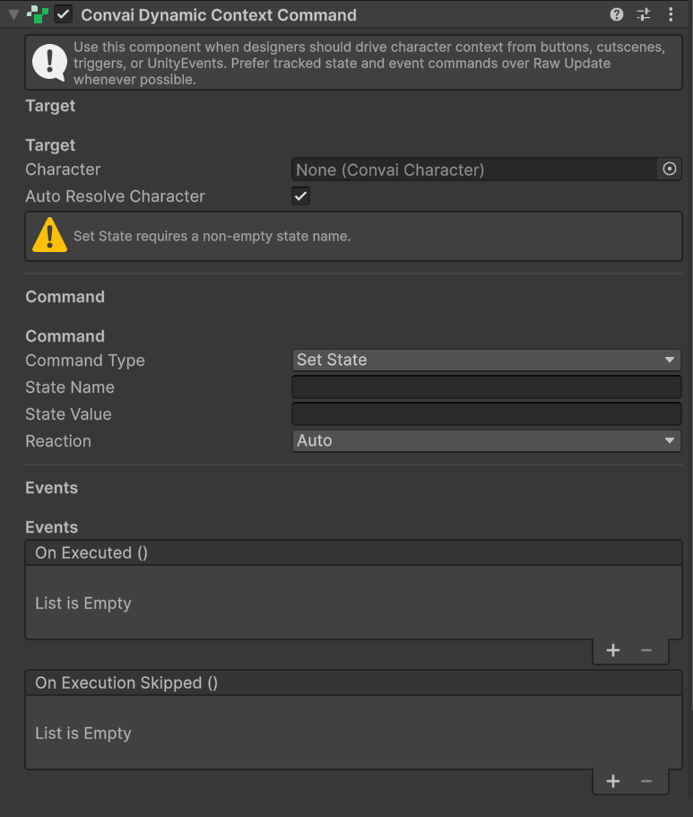
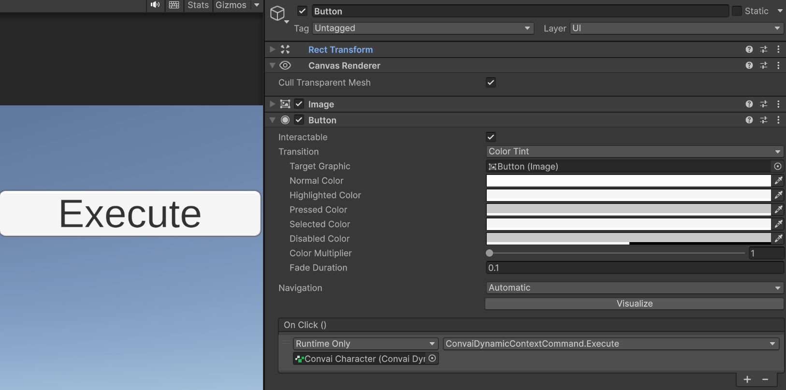

This guide walks you through the minimum setup to verify that your Convai character acknowledges live in-scene conditions. You will add the `ConvaiDynamicContextCommand` component, configure a `SetState` command, wire it to a UI button, and confirm the character references the state you sent.

## Prerequisites

Before starting, verify:

* [ ] A `ConvaiCharacter` is in the scene and responds to speech in Play Mode



### Add the command component

Select the NPC's GameObject in the Hierarchy. In the Inspector, click **Add Component** and search for **Convai Dynamic Context Command**, or navigate to **Convai → Dynamic Context → Convai Dynamic Context Command**.

The component appears with three sections: **Target**, **Command**, and **Events**.

<figure><figcaption>
ConvaiDynamicContextCommand added to the NPC — three sections appear: Target resolves the character, Command defines the context operation, and Events exposes execution callbacks.
</figcaption></figure>



### Verify character resolution

In the **Target** section, confirm that **Auto Resolve Character** is enabled (the default). The component finds the `ConvaiCharacter` on the same GameObject automatically.

If `ConvaiCharacter` is on a different GameObject, disable **Auto Resolve Character** and drag the correct `ConvaiCharacter` into the **Character** field.



### Configure the command

In the **Command** section:

* Set **Command Type** to **Set State**
* Set **State Name** to `Location`
* Set **State Value** to `Fire Exit Corridor`
* Leave **Reaction Mode** at **Auto** (the default)

The component is now configured to set a tracked state named `Location` to `Fire Exit Corridor` whenever `Execute()` is called.



### Wire the trigger

In the **Events** section of a UI Button in your scene (create a temporary one if needed), locate **On Click ()**.

Click **+** to add a listener, drag the NPC's GameObject into the object field, and select **ConvaiDynamicContextCommand → Execute ()** from the function dropdown.

<figure><figcaption>
Execute() wired to the button's On Click event — pressing the button at runtime delivers the configured context update to Convai and triggers the character's reaction according to the configured Reaction Mode.
</figcaption></figure>



### Test in Play Mode

Enter Play Mode and start a conversation with the character. Click the button you wired in the previous step, then ask the character where you are.

The character should reference the location — for example: _"You're at the Fire Exit Corridor. Make sure you know the evacuation procedure before proceeding."_

If the character does not respond with location awareness, open the Unity Console and check for a `[ConvaiDynamicContextCommand]` warning. See [Troubleshoot dynamic context](troubleshoot-dynamic-context.md) for a full diagnosis checklist.




Your character is now context-aware. The `Location` state is tracked locally and delivered to Convai when the conversation is active. Any future `SetState` call for the same name updates the value and notifies the character automatically.


## Test without custom code

The SDK includes a pre-built test UI for exploring the full Dynamic Context system without writing any integration code.

**Prefab path:** Packages/<code class="expression">space.vars.sdk_package_id</code>/Prefabs/SampleDynamicContextUI.prefab

Drop it into your scene, assign your `ConvaiCharacter`, enter Play Mode, and use the **Set State** button to send known values. If the character responds correctly through the Sample UI but not through your own integration, the issue is in your code — not in the Dynamic Context system itself.

## Next steps


[Command component reference](command-component-reference.md)



[Dynamic context scripting API](dynamic-context-scripting-api.md)



[Dynamic context usage examples](dynamic-context-usage-examples.md)

