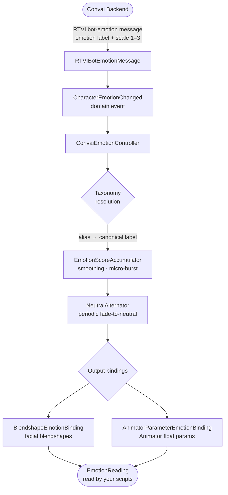

# Emotion

### Giving Convai Characters Emotionally Responsive Faces

The Emotion system translates the Convai AI's internal emotional state into live facial animation — driving blendshapes, Animator parameters, or both simultaneously. Every time the backend decides the character feels joy, anger, surprise, or any other state, the Emotion system receives that signal, smooths it into a natural arc, and writes the result to your character's face in real time. The result is a character that reads as emotionally present rather than expressionless.

### How It Works

The backend sends a short emotion label (for example `"happy"`) and an intensity on a 1–3 scale. The **taxonomy** resolves that label to its canonical form (`"joy"`), normalises the intensity to a 0–1 score, and hands it to the **score accumulator**, which applies exponential smoothing and an optional micro-expression burst. The **neutral alternator** periodically blends the expression back toward neutral to prevent a frozen face during long turns. Finally, the smoothed scores are written to blendshapes and Animator parameters through configurable **output bindings**.

### Prerequisites


Before adding the Emotion system to a character, ensure your character mesh has facial blendshapes, or your Animator Controller has float parameters you want to drive from emotion. The pipeline runs without these, but no visual output occurs until at least one output binding is configured.


### What Goes Where

| Component                   | Where to place it                                                    | Notes                                                                                        |
| --------------------------- | -------------------------------------------------------------------- | -------------------------------------------------------------------------------------------- |
| `ConvaiEmotionController`   | On the **NPC's root GameObject**, alongside the Embodiment component | One per character                                                                            |
| `ConvaiEmotionProfile`      | Anywhere in your `Assets/` folder as a ScriptableObject asset        | Shared across multiple NPC prefabs if needed                                                 |
| `EmotionTaxonomyAsset`      | Anywhere in your `Assets/` folder                                    | Optional — omit to use the built-in Plutchik set                                             |
| `ConvaiCharacterEventRelay` | On any GameObject in the scene                                       | Auto-resolves `ConvaiCharacter` on the same GameObject; drag a different character if needed |

### Core Components and Their Roles

| Concept                     | What It Is                                                                                                                                                                                           |
| --------------------------- | ---------------------------------------------------------------------------------------------------------------------------------------------------------------------------------------------------- |
| `ConvaiEmotionController`   | The MonoBehaviour that owns the entire pipeline for one NPC. Add one per character.                                                                                                                  |
| `ConvaiEmotionProfile`      | A ScriptableObject asset that holds every tunable parameter: smoothing, micro-burst, neutral alternation, and output slot definitions.                                                               |
| `EmotionTaxonomyAsset`      | A ScriptableObject that defines the emotion vocabulary — canonical labels, server aliases, and mouth influence hints. The built-in default is Plutchik's eight primary emotions plus neutral.        |
| Output bindings             | `BlendshapeEmotionBinding` and `AnimatorParameterEmotionBinding` map each canonical emotion label to mesh blendshape names or Animator float parameters.                                             |
| `EmotionReading`            | An immutable snapshot of the current emotional state: dominant label, dominant score, all scores, and mouth influence hint for LipSync. Available every frame via `ConvaiEmotionController.Current`. |
| Micro-burst                 | A short overshoot applied when a new emotion arrives, giving expressions a punchy entry before settling to their sustained level.                                                                    |
| Neutral alternation         | A timer that periodically fades the active expression toward neutral and back, preventing the character's face from locking into a single pose during long turns.                                    |
| `ConvaiCharacterEventRelay` | An Inspector-friendly component that exposes emotion change callbacks as Unity Events — no code required.                                                                                            |

<table data-view="cards"><thead><tr><th></th><th></th></tr></thead><tbody><tr><td><strong>Quick Start</strong> Attach the Emotion Controller, assign the bundled profile, and get your NPC reacting emotionally to conversation — no custom assets required.</td><td><a href="/broken/pages/dcb9f60b5af0c88a93cb966d58899e4b95a3fc03">quick-start.md</a></td></tr><tr><td><strong>Emotion Profile</strong> Configure smoothing speed, micro-expression bursts, neutral alternation, and output bindings in one portable asset.</td><td><a href="/broken/pages/d19e43062eacfe709f0b0225457564feb2332569">emotion-profile.md</a></td></tr><tr><td><strong>Output Bindings</strong> Map smoothed emotion scores to facial blendshapes and Animator float parameters, with per-slot weight and LipSync control.</td><td><a href="/broken/pages/330204161f1fbb689260cb715b10b95303efaf1f">output-bindings.md</a></td></tr><tr><td><strong>Emotion Taxonomy</strong> Understand the built-in Plutchik vocabulary, how server aliases are resolved, and how to author a custom taxonomy.</td><td><a href="/broken/pages/b65c6849070f3091e2131e50e16336a1b75c652b">emotion-taxonomy.md</a></td></tr><tr><td><strong>Scripting API</strong> Read live emotion state, inject overrides, lock expressions, and react to emotion events — from Inspector relays to typed C# subscriptions.</td><td><a href="/broken/pages/4816763fbf7651ee4b1ffec383a35fbfe9fa01ea">scripting-api.md</a></td></tr><tr><td><strong>Usage Examples</strong> Complete scenarios covering hazard triggers, locked greetings, distress branching, analytics logging, and Editor debugging.</td><td><a href="/broken/pages/c79c126fa1a71405e4349cd7c0f0b88c8846dd03">usage-examples.md</a></td></tr><tr><td><strong>Troubleshooting &#x26; Diagnostics</strong> Step-by-step fixes for the most common problems — from expressions that will not move to LipSync conflicts and production build gotchas.</td><td><a href="/broken/pages/4276dad9c7205562e6033b54dd774ba58f6ef481">troubleshooting-and-diagnostics.md</a></td></tr></tbody></table>

### Conclusion

The Emotion system gives Convai characters a believable emotional presence — server-driven, smoothed, and fully configurable without writing code for the common case. Start with Quick Start to get a character reacting live, then use the deeper configuration pages to tune the behavior for your specific rig and scenario.


[Broken link](/broken/pages/dcb9f60b5af0c88a93cb966d58899e4b95a3fc03)

