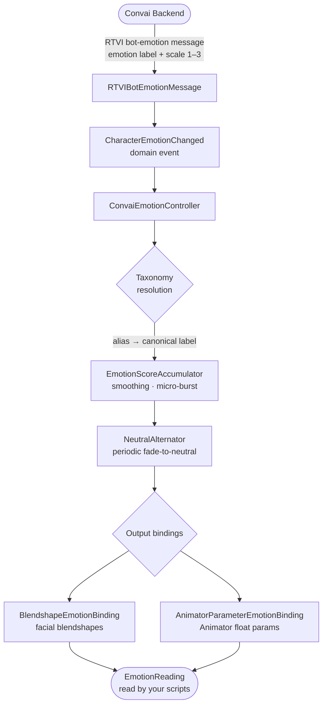

The Convai emotion system translates server emotion signals into live facial animation through a four-stage pipeline. This page explains how each stage works, what the required components do, and where to place them in your scene.

## How the emotion pipeline works

Every emotion signal travels through four stages:

The backend sends a short emotion label (for example `"happy"`) and an intensity on a 1–3 scale. The **taxonomy** resolves that label to its canonical form (`"joy"`), normalises the intensity to a 0–1 score, and hands it to the **score accumulator**, which applies exponential smoothing and an optional micro-expression burst. The **neutral alternator** periodically blends the expression back toward neutral to prevent a frozen face during long turns. The smoothed scores are then written to blendshapes and Animator parameters through configurable **output bindings**.

## Key concepts

| Concept | What it is |
| --- | --- |
| `ConvaiEmotionController` | The MonoBehaviour that owns the entire pipeline for one NPC. Add one per character. |
| `ConvaiEmotionProfile` | A ScriptableObject asset that holds every tunable parameter: smoothing, micro-burst, neutral alternation, and output slot definitions. |
| `EmotionTaxonomyAsset` | A ScriptableObject that defines the emotion vocabulary — canonical labels, server aliases, and mouth influence hints. The built-in default is Plutchik's nine emotions including neutral. |
| Output bindings | `BlendshapeEmotionBinding` and `AnimatorParameterEmotionBinding` map each canonical emotion label to mesh blendshape names or Animator float parameters. |
| `EmotionReading` | An immutable snapshot of the current emotional state: dominant label, dominant score, all scores, and mouth influence hint for LipSync. Available every frame via `ConvaiEmotionController.Current`. |
| Micro-burst | A short overshoot applied when a new emotion arrives, giving expressions a punchy entry before settling to their sustained level. |
| Neutral alternation | A timer that periodically fades the active expression toward neutral and back, preventing the character's face from locking into a single pose during long turns. |
| `ConvaiCharacterEventRelay` | An Inspector-friendly component that exposes emotion change callbacks as Unity Events — no code required. |

## Component placement

| Component | Where to place it | Notes |
| --- | --- | --- |
| `ConvaiEmotionController` | On the NPC's root GameObject, alongside the Embodiment component | One per character |
| `ConvaiEmotionProfile` | Anywhere in your `Assets/` folder as a ScriptableObject asset | Shared across multiple NPC prefabs if needed |
| `EmotionTaxonomyAsset` | Anywhere in your `Assets/` folder | Optional — omit to use the built-in Plutchik set |
| `ConvaiCharacterEventRelay` | On any GameObject in the scene | Auto-resolves `ConvaiCharacter` on the same GameObject; drag a different character if needed |

## Next steps


[Emotion quick start](quick-start.md)



[Emotion profile](emotion-profile.md)



[Emotion scripting API](scripting-api.md)

