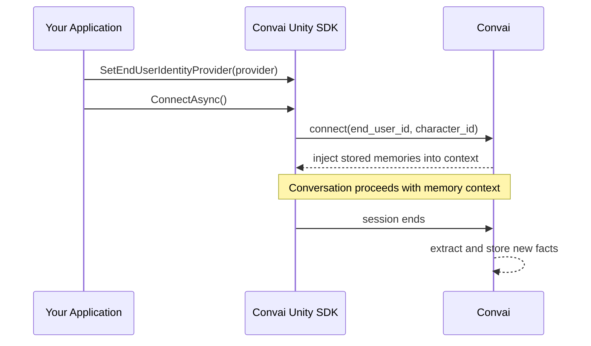

# Long-Term Memory

## Persistent Memory Across Sessions

Long-Term Memory (LTM) lets Convai characters retain facts about individual users between separate conversation sessions. A safety instructor remembers that a trainee passed module 3 last week. A medical training guide recalls that a user prefers detailed explanations. A corporate onboarding assistant knows which policies an employee has already reviewed.

The system works by associating each user with a stable identifier. When a session begins, Convai retrieves stored facts for that user–character pair and injects them into the character's context automatically. After the session ends, new facts are extracted and saved. No integration code is required for the default experience — enable LTM on the dashboard, and the SDK handles the rest.


LTM requires a stable end-user identifier for each session. The SDK provides `DeviceEndUserIdProvider` as a zero-config default. For applications with user authentication, replace it with a custom provider that returns your account IDs.


***

## In This Section

<table data-view="cards"><thead><tr><th></th><th data-hidden data-card-target data-type="content-ref"></th></tr></thead><tbody><tr><td><strong>Quick Start</strong> Enable LTM for a character and verify cross-session recall in the Unity Editor in three steps.</td><td><a href="/broken/pages/2e3f9fc339fc49abf2b1f39767a477f35e19491a">Broken link</a></td></tr><tr><td><strong>End-User Identity</strong> Understand how the SDK identifies users and how to supply your own authentication-backed ID.</td><td><a href="/broken/pages/c79bc735ff2d5f169ccdde72d0b5586b6eb21699">Broken link</a></td></tr><tr><td><strong>Enabling Memory on Characters</strong> Toggle LTM on or off per character via the Convai dashboard or the scripting API.</td><td><a href="/broken/pages/9631b3a6a24e1eeb47ba3375d6839284f0b6afbb">Broken link</a></td></tr><tr><td><strong>Memory Management API</strong> Programmatically list, add, retrieve, and delete memory records for a user–character pair.</td><td><a href="/broken/pages/55f4306ccc67fedad53cac7d9733a8e56b2454ca">Broken link</a></td></tr><tr><td><strong>End-User Management</strong> Browse and manage end-user records from the editor or via the <code>EndUsersService</code> scripting API.</td><td><a href="/broken/pages/31a9dc470b473879dc11d5402d3c98c67e11ca59">Broken link</a></td></tr><tr><td><strong>Usage Examples</strong> Four complete patterns: zero-config persistence, authenticated identity, memory seeding, and reset.</td><td><a href="/broken/pages/25d3d1c56f3f246419a717c339cd5820fc20e354">Broken link</a></td></tr><tr><td><strong>Scripting API Reference</strong> Complete method signatures, parameters, return types, and data models for all LTM APIs.</td><td><a href="/broken/pages/61fd833d267d8d51afce9fcf0fc884ffd7802d45">Broken link</a></td></tr><tr><td><strong>Troubleshooting &#x26; Diagnostics</strong> Diagnose why memories aren't persisting and resolve Memory Management API HTTP errors.</td><td><a href="/broken/pages/6c1a4451efe4321dc935e851c7b92be79099d02c">Broken link</a></td></tr></tbody></table>

***

## How It Works

The diagram above shows the full LTM flow. The SDK sends the `end_user_id` on every connection. Convai resolves it to an internal speaker record, loads relevant memories, and automatically extracts new facts when the session ends.

## Next Steps

Start with the Quick Start to get memory working in your scene, then read End-User Identity to understand how the SDK tracks users before integrating with your authentication system.


[Broken link](/broken/pages/2e3f9fc339fc49abf2b1f39767a477f35e19491a)

