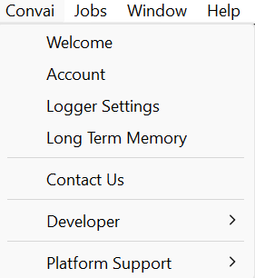
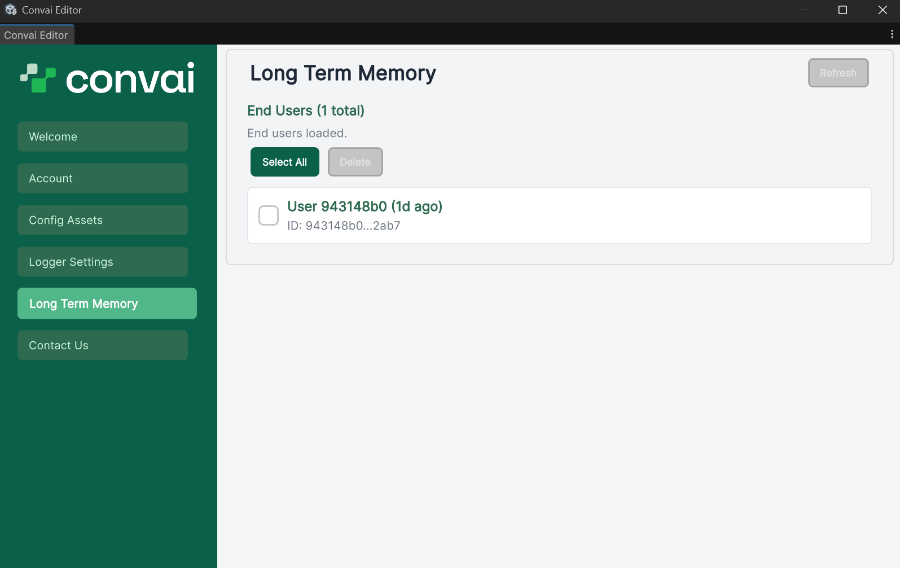

The Convai Unity SDK tracks every user who connects with a memory-enabled character as an **end-user record**. Each record stores the user's stable identifier, last activity timestamps, and any metadata you sent during connection. You can browse and delete these records from the Unity editor or manage them programmatically with `client.EndUsers`.


**Beta API.** Method signatures are stable but may change in future SDK updates. Pin your SDK version in production and review the changelog before upgrading.


***



Access the panel from the Unity menu bar: **Convai → Long Term Memory**.

The panel shows all end-user records associated with your API key. It loads records in batches of 200, with cursor-based pagination fetching additional pages automatically for large sets.

**Available actions:**

| Action | How |
|---|---|
| Refresh the list | Click **Refresh** |
| Select individual records | Click a record row |
| Select or deselect all | Click **Select All** / **Unselect All** |
| Delete selected records | Click **Delete** |

<figure><figcaption><p>End-user management panel listing user records.</p></figcaption></figure>

Deleting an end-user record from the editor removes **the record and all memory records for that user across every character**. This cannot be undone. A confirmation dialog appears before deletion proceeds.

<figure><figcaption><p>End-user records with name and session count.</p></figcaption></figure>



Access end-user operations through `client.EndUsers` on a `ConvaiRestClient` instance.

```csharp
using var client = new ConvaiRestClient(ConvaiSettings.Instance.ApiKey);
```

See each method below for full examples.



***

## `EndUserDetails` fields

Each end-user record is represented by `EndUserDetails`:

| Property | Type | Description |
|---|---|---|
| `EndUserId` | `string` | The stable identifier sent by the SDK on connection |
| `LastActiveTs` | `string` | ISO 8601 timestamp of the last session |
| `LastLtmUsageTs` | `string` | ISO 8601 timestamp of the last LTM interaction |
| `Metadata` | `Dictionary<string, object>` | Key–value data sent by `IEndUserMetadataProvider` |
| `DisplayName` | `string` | **Computed property** — reads `Metadata["name"]` if present and non-empty; otherwise `"User {EndUserId[..8]}"`, optionally suffixed with relative last-active time (e.g., `"User a1b2c3d4 (3d ago)"`) |
| `ShortId` | `string` | **Computed property** — truncated form of `EndUserId` for compact display (e.g., `"a1b2c3d4...ef01"`) |

`DisplayName` and `ShortId` are C# computed properties, not stored fields. They are not present in the JSON API response.

***

## Scripting API

### List end users

Retrieve all end-user records with cursor-based pagination. The default limit is 50 records per page.

```csharp
using Convai.RestAPI;
using Convai.RestAPI.Internal;
using System.Collections.Generic;
using UnityEngine;

public class EndUserLister : MonoBehaviour
{
    [ContextMenu("List All End Users")]
    private async void ListAllEndUsers()
    {
        using var client = new ConvaiRestClient(ConvaiSettings.Instance.ApiKey);

        string cursor = null;
        bool hasMore = true;
        var allUsers = new List<EndUserDetails>();

        while (hasMore)
        {
            var response = await client.EndUsers.ListAsync(limit: 50, cursor: cursor);

            if (response.EndUsers != null)
                allUsers.AddRange(response.EndUsers);

            hasMore = response.HasMore;
            cursor = response.NextCursor;

            if (!hasMore || string.IsNullOrEmpty(cursor))
                break;
        }

        Debug.Log($"Total end users: {allUsers.Count}");
        foreach (var user in allUsers)
            Debug.Log($"  {user.EndUserId} — last active: {user.LastActiveTs}");
    }
}
```

**`EndUsersListResponse` fields:**

| Property | Type | Description |
|---|---|---|
| `EndUsers` | `List<EndUserDetails>` | Records on this page |
| `TotalCount` | `int` | Total number of end-user records |
| `NextCursor` | `string` | Cursor token for the next page; `null` when no further pages exist |
| `HasMore` | `bool` | Whether additional pages exist |

You can also filter by activity date using `activeAfter` and `activeBefore` (ISO 8601 strings):

```csharp
var response = await client.EndUsers.ListAsync(
    limit: 50,
    activeAfter: "2025-01-01T00:00:00Z",
    activeBefore: "2025-06-01T00:00:00Z");
```

***

### Get a single end user

Retrieve details for one specific user by their `endUserId`.

```csharp
var user = await client.EndUsers.GetAsync("target-end-user-id");
Debug.Log($"Last active: {user.LastActiveTs}");
Debug.Log($"Display name: {user.DisplayName}");
```

***

### Update user metadata

Update one or more metadata keys for a user. The patch operation preserves keys you do not include — it does not replace the entire metadata object.

```csharp
var patch = new Dictionary<string, object>
{
    { "name", "Jordan Kim" },
    { "department", "Facilities Management" }
};

var updated = await client.EndUsers.UpdateMetadataAsync("target-end-user-id", patch);
Debug.Log($"Updated metadata for {updated.EndUserId}.");
```

***

### Delete an end user


`DeleteAsync` removes the end-user record **and all memory records for that user across all characters**. Unlike `MemoryService.DeleteAllAsync`, which is scoped to one character, this operation removes the user globally. This cannot be undone.


```csharp
var result = await client.EndUsers.DeleteAsync("target-end-user-id");

if (result.Deleted)
    Debug.Log($"End user {result.EndUserId} deleted.");
else
    Debug.LogWarning("Deletion returned false — user may not have existed.");
```

***

## `DeleteAllAsync` vs. `DeleteAsync`

| Operation | Scope | What is removed |
|---|---|---|
| `client.Memory.DeleteAllAsync(characterId, endUserId)` | One user + one character | All memory records for that user–character pair |
| `client.EndUsers.DeleteAsync(endUserId)` | One user + all characters | The user record and all memories across every character |

Use `DeleteAllAsync` when you want to reset a user's memory for a specific character while keeping their records for other characters intact. Use `EndUsers.DeleteAsync` when you need to fully remove a user from the system.

***

## Next steps


[Memory management API](memory-management-api.md)



[Long-term memory scripting reference](long-term-memory-scripting-reference.md)

