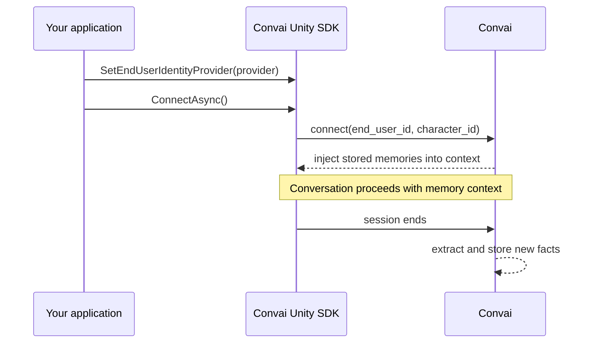

Long-term memory (LTM) gives Convai characters a persistent, per-user knowledge store that survives across separate conversation sessions. A safety instructor remembers that a trainee passed module 3 last week. A corporate onboarding assistant knows which policies an employee has already reviewed. A medical training guide recalls that a user prefers detailed explanations over summaries. This page explains the underlying mechanism — what LTM stores, how it scopes memory per user, and when facts flow in and out of a session.

## Session lifecycle

Every LTM session moves through four stages:



**Connect:** The SDK sends the `end_user_id` and `character_id` to Convai at session start. Convai resolves the pair to a stored memory set and injects any existing facts into the character's context before the first response is generated.

**Conversation:** The character responds with awareness of the injected facts — it does not need to be told the user's name, role, or history because that context is already present. New information shared during the conversation is not stored in real time; it is held in the session buffer.

**Session end:** When the session closes, Convai processes the conversation transcript and extracts meaningful facts (names, roles, preferences, completed tasks, stated history) as natural-language `MemoryRecord` entries. These are stored under the `end_user_id + character_id` key.

**Next connect:** On the following session, the new facts are available and injected alongside any previously stored ones.

## Memory scoping

Every memory record is scoped to exactly one user–character pair.

```
end_user_id  +  character_id  →  set of MemoryRecord entries
```

Facts stored for user `A` on character `X` are never visible to user `B` or to character `Y`. If your application uses multiple characters, each character builds its own independent memory set for each user. There is no cross-character memory sharing.

The `end_user_id` is the stable string identifier supplied by your `IEndUserIdentityProvider` (or by the default `DeviceEndUserIdProvider`). If the identifier changes between sessions — for example, because `PlayerPrefs` was cleared — Convai treats the new value as a new user. No memories from the previous identifier carry over.

## Memory records

Each stored fact is a `MemoryRecord` with a natural-language `Memory` string and an auto-assigned `Id`.

Example `Memory` values:
- `"The user's name is Jordan."`
- `"Jordan completed confined-space entry certification on 2025-03-12."`
- `"Jordan prefers step-by-step explanations over summaries."`

Facts are written in third person by Convai. The character uses them as background context, not as a script to recite verbatim.

## Deduplication

When a new session produces a fact that is semantically equivalent to an existing memory, Convai updates the existing `MemoryRecord` rather than creating a duplicate. For example, if a user corrects their name from `"Jordan"` to `"Jordan Kim"`, the existing name record is updated in place. The `Event` field on `MemoryAddResult` returns `"update"` for deduplicated writes and `"add"` for new records.

## What LTM does not do

Understanding the limits of LTM prevents incorrect assumptions:

- **LTM does not enable real-time lookup.** Memory injection happens at connect time, not on demand during a conversation. The character cannot query the memory store mid-session.
- **LTM does not guarantee every spoken detail is stored.** Convai extracts facts it judges as meaningful and persistent. Brief, incidental remarks may not be retained.
- **LTM does not share memory across characters.** Each character has an independent memory set per user.
- **LTM is not enabled by default.** Memory is disabled (`MemorySettings.IsEnabled = false`) until you explicitly enable it on the Convai dashboard or via the scripting API.

## Next steps


[Long-term memory quick start](quick-start.md)



[End-user identity](end-user-identity.md)

