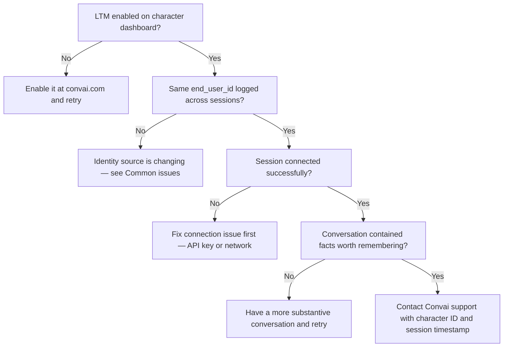

Most LTM issues fall into three categories: memories not persisting between sessions, the wrong user receiving memories, and API calls failing with HTTP errors. Work through the diagnostic flow below before consulting the reference tables.

***

## First-line investigation

Before checking anything else, run through these three steps in order:

**1. Confirm memory is enabled for the character**

Sign in at [convai.com](https://convai.com), open the character, and verify the **Memory** tab shows **Long-Term Memory: On**. Memory is disabled by default — this is the single most common reason LTM appears not to work.

**2. Verify the end-user ID is stable across sessions**

Add the diagnostic script below to your scene. Run Play Mode, stop, then run again. The logged ID must be identical both times.

```csharp
using Convai.Runtime.Identity;
using UnityEngine;

public class EndUserIdDebug : MonoBehaviour
{
    private void Start()
    {
        var provider = new DeviceEndUserIdProvider();
        string id = provider.GetEndUserId();
        Debug.Log($"[LTM] end_user_id this session: {id}");
    }
}
```

If the ID changes between sessions, memories cannot accumulate — the server treats each new ID as a new user.

**3. Confirm the session connected successfully**

Check the Console for Convai startup messages. A failed connection (invalid API key, network error) prevents all LTM operations regardless of stored data.

***

## Decision flow

Use this flow when memory isn't persisting:



***

## Common issues

| Symptom | Likely cause | Fix |
| --- | --- | --- |
| Character never references previous sessions | LTM not enabled on character | Enable it in the character's Memory tab at [convai.com](https://convai.com) |
| Memory works in editor, not in build | `DeviceEndUserIdProvider` returns different values in editor vs. build | Expected behavior — editor uses `PlayerPrefs` GUID; build uses device ID. Ensure the build's device ID is stable. For cross-context consistency, implement a custom `IEndUserIdentityProvider`. |
| Memory lost after reinstall | `PlayerPrefs` cleared on reinstall | Use a server-assigned account ID via a custom provider. Device-based and GUID-based IDs do not survive reinstalls. |
| Different users on the same device share memories | Multiple users sharing one device | Each user must receive a unique `end_user_id`. If `DeviceEndUserIdProvider` is in use, the device-scoped GUID is shared. Implement a custom provider that returns a per-user account ID. |
| Custom provider not taking effect | Provider registered after `ConnectAsync` | Register in `Awake()`, before `ConvaiRoomManager.Start()` completes. If `ConvaiCharacter` has **Auto Connect** enabled, `Start()` may be too late. |
| Memory facts look wrong or outdated | Stale records from testing | Use `client.Memory.DeleteAllAsync` to clear test data before starting a fresh evaluation. |
| `GetEndUserId()` returns empty string | Custom provider returning null or whitespace | The SDK normalizes null/whitespace to `null` before sending, resulting in anonymous sessions. Ensure your provider always returns a non-empty value. |

***

## Runtime diagnostics

### List all memories for a user

Use this script to confirm what the server has stored. Run it from the Inspector via right-click → **List Memories**.

```csharp
using Convai.RestAPI;
using Convai.RestAPI.Internal;
using Convai.Runtime.Identity;
using UnityEngine;

public class MemoryDiagnostic : MonoBehaviour
{
    [SerializeField] private string _characterId;

    [ContextMenu("List Memories")]
    private async void ListMemories()
    {
        var provider = new DeviceEndUserIdProvider();
        string endUserId = provider.GetEndUserId();

        Debug.Log($"[LTM] Querying memories for end_user_id: {endUserId}");

        using var client = new ConvaiRestClient(ConvaiSettings.Instance.ApiKey);

        int page = 1;
        bool hasMore = true;

        while (hasMore)
        {
            var response = await client.Memory.ListAsync(_characterId, endUserId, page);

            Debug.Log($"[LTM] Page {page} — {response.Memories.Count} records (total: {response.TotalCount})");

            foreach (MemoryRecord record in response.Memories)
                Debug.Log($"  [{record.Id}] {record.Memory}");

            hasMore = response.HasMore;
            page++;
        }

        if (page == 1)
            Debug.Log("[LTM] No memory records found for this user–character pair.");
    }
}
```

### Check memory enable state

Confirm programmatically whether LTM is currently enabled for a character.

```csharp
[ContextMenu("Check Memory Enabled")]
private async void CheckMemoryEnabled()
{
    using var client = new ConvaiRestClient(ConvaiSettings.Instance.ApiKey);

    bool isEnabled = await client.Characters.GetMemoryEnabledAsync(_characterId);
    Debug.Log($"[LTM] Memory enabled for character '{_characterId}': {isEnabled}");
}
```

***

## API error codes

All Memory Management API errors throw `ConvaiRestException`. The `StatusCode` property maps to the causes below.

| HTTP status | Cause | Fix |
| --- | --- | --- |
| `400 Bad Request` | Missing required parameter (`character_id`, `end_user_id`, or `memories`) | Verify all required arguments are non-null and non-empty before calling |
| `401 Unauthorized` | Invalid or missing API key | Reconfigure your API key at **Convai → Account** or **Edit → Project Settings → Convai SDK** |
| `403 Forbidden` | The character does not belong to the account that owns the API key | Verify the character ID belongs to the account associated with your API key |
| `404 Not Found` | Invalid character ID, end-user ID, or memory ID | Double-check IDs against the Convai dashboard. If querying by `memoryId`, verify it from a prior `ListAsync` call. |
| `429 Too Many Requests` | Rate limit exceeded | Implement exponential backoff. Example: retry after `2^attempt` seconds with a `CancellationToken` to abort after a maximum number of retries. |
| `500 Internal Server Error` | Transient server error | Retry the request after a short delay. If errors persist, check the Convai status page and contact support with your character ID and timestamp. |

### Exponential backoff pattern

```csharp
using System;
using System.Threading;
using System.Threading.Tasks;
using Convai.RestAPI;

public static class MemoryRetryHelper
{
    public static async Task<T> WithRetry<T>(
        Func<Task<T>> operation,
        int maxAttempts = 3,
        CancellationToken cancellationToken = default)
    {
        for (int attempt = 0; attempt < maxAttempts; attempt++)
        {
            try
            {
                return await operation();
            }
            catch (ConvaiRestException ex) when (ex.StatusCode == 429 || ex.StatusCode == 500)
            {
                if (attempt == maxAttempts - 1) throw;

                int delayMs = (int)Math.Pow(2, attempt) * 1000;
                await Task.Delay(delayMs, cancellationToken);
            }
        }

        throw new InvalidOperationException("Unreachable.");
    }
}
```

***

## Next steps


[Long-term memory scripting reference](long-term-memory-scripting-reference.md)



[Configure memory for a character](configure-memory-for-a-character.md)

