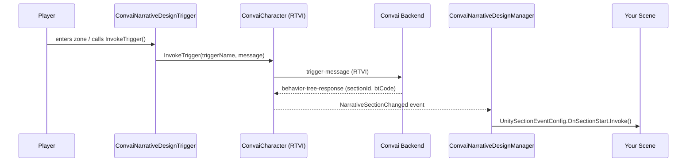

# Narrative Design

## What Is Narrative Design?

Narrative Design gives your Convai AI character a structured story to follow. You author a graph of **sections** (story beats) and **triggers** (the edges between them) in the Convai dashboard. At runtime, the SDK listens for the server's section-change signals and fires the Unity Events you configure — no polling, no manual state machines.

The character's behaviour, knowledge, and conversational goals automatically adapt to the active section, so the same character can play a neutral receptionist in the opening section and a strict examiner in an assessment section, all within a single session.

## How It Works at Runtime

When the player activates a trigger, the SDK sends a named signal to the Convai backend. The backend advances the story graph and responds with a `behavior-tree-response` message that carries the new section ID and any associated behaviour-tree data. The SDK translates this message into a `NarrativeSectionChanged` domain event and delivers it to `ConvaiNarrativeDesignManager`, which fires the per-section Unity Events you wired in the Inspector.

## The Three Building Blocks

<table><thead><tr><th width="267.6666259765625">Component</th><th width="240">Where it lives</th><th>What it does</th></tr></thead><tbody><tr><td><code>ConvaiNarrativeDesignManager</code></td><td>On the character GameObject</td><td>Listens for section changes, fires per-section <code>OnSectionStart</code> / <code>OnSectionEnd</code> Unity Events, manages template keys</td></tr><tr><td><code>ConvaiNarrativeDesignTrigger</code></td><td>On any world GameObject</td><td>Sends a named trigger to the character when activated (collision, proximity, timer, or manual)</td></tr><tr><td><code>IConvaiNarrativeDesign</code></td><td>Accessed via <code>convaiCharacter.NarrativeDesign</code></td><td>Character-scoped C# API for code-driven trigger invocation, template key control, and async data fetching</td></tr></tbody></table>

You can use any combination of the three. Most projects need all of them; simple linear narratives may only need the Manager and one or two Triggers.

## Key Concepts

| Term                       | Definition                                                                                                                                                                 |
| -------------------------- | -------------------------------------------------------------------------------------------------------------------------------------------------------------------------- |
| **Section**                | A named story beat defined in the Convai dashboard. The character's objectives and behaviour adapt to the active section.                                                  |
| **Trigger**                | A named edge in the story graph. Sending a trigger advances the graph from one section to the next.                                                                        |
| **Template Key**           | A runtime key-value pair (e.g., `PlayerName = "Alex"`) that fills placeholders in the dashboard's narrative objectives.                                                    |
| **Orphaned Section**       | A section that was deleted from the dashboard after it was synced locally. Its Unity Events are preserved but will never fire until the section is restored and re-synced. |
| **Behavior Tree Response** | The server message that carries the new `SectionId` plus optional `BehaviorTreeCode` and `BehaviorTreeConstants` used by advanced integrations.                            |

## Prerequisites


Before using Narrative Design in your project, ensure:

* The Convai Unity SDK is imported and a `ConvaiCharacter` component exists in your scene.
* You have authored a narrative graph in the [Convai dashboard](https://convai.com) with at least one section and one trigger.
* Your character's ID is set on the `ConvaiCharacter` component — the SDK cannot fetch or react to sections without it.


## What Goes Where

Understanding which component belongs on which GameObject avoids the most common setup mistakes.

| Component                      | Where to place it                                                      | Typical count per scene        |
| ------------------------------ | ---------------------------------------------------------------------- | ------------------------------ |
| `ConvaiNarrativeDesignManager` | On the **character's** GameObject, alongside `ConvaiCharacter`         | One per character              |
| `ConvaiNarrativeDesignTrigger` | On **any world GameObject** — a doorway, an exhibit, a UI event target | One per graph transition point |
| `IConvaiNarrativeDesign`       | Not placed — accessed via `convaiCharacter.NarrativeDesign` in code    | N/A                            |

## In This Section

<table data-view="cards"><thead><tr><th></th><th></th></tr></thead><tbody><tr><td><strong>Quick Start</strong></td><td>Get a character responding to section changes in minutes with no code required.</td></tr><tr><td><strong>Setting Up the Narrative Design Manager</strong></td><td>Add, sync, and configure the Manager component — the listening post for section transitions.</td></tr><tr><td><strong>Setting Up Narrative Design Triggers</strong></td><td>Place world triggers with collision, proximity, timer, or manual activation.</td></tr><tr><td><strong>Template Keys: Dynamic Narrative Variables</strong></td><td>Inject runtime values into the character's narrative objectives from the Inspector or code.</td></tr><tr><td><strong>Scripting Narrative Design</strong></td><td>Full C# API reference for IConvaiNarrativeDesign, NarrativeDesignFetcher, and programmatic control.</td></tr><tr><td><strong>Usage Examples</strong></td><td>Four worked examples at increasing complexity — from a simple welcome sequence to an adaptive multi-section scenario.</td></tr><tr><td><strong>Troubleshooting &#x26; Diagnostics</strong></td><td>Diagnose every TriggerStatus state, common misconfigurations, and fetch failures.</td></tr></tbody></table>

## Conclusion

Narrative Design gives your Convai characters a structured, reactive story without any custom state machine code. The three components — Manager, Trigger, and the `IConvaiNarrativeDesign` interface — cover everything from a single-button kiosk to a fully adaptive multi-step scenario. Start with the Quick Start to get a working setup in minutes, then explore the deeper configuration guides as your needs grow.
