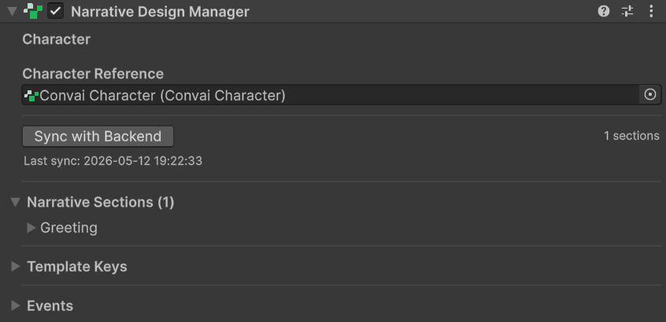
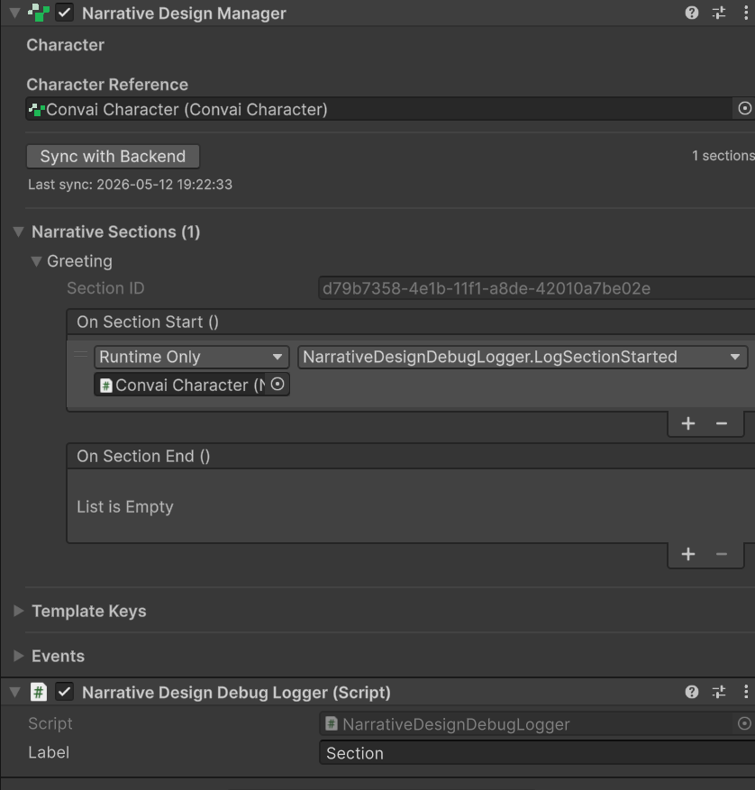
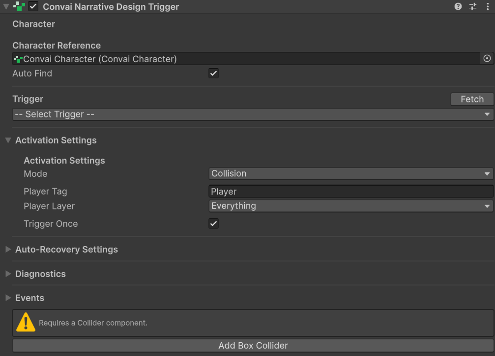
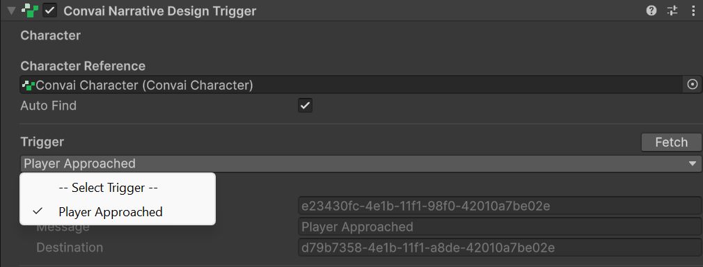
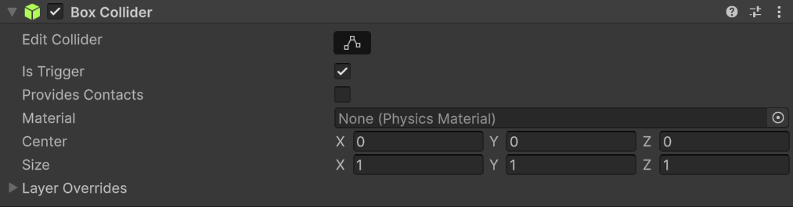

This guide walks you through the fastest path to a working Narrative Design setup. By the end, a character reacts to a section change when the player walks through a trigger zone — entirely through the Inspector, no code required.

## Prerequisites

Before starting, verify:

* [ ] A `ConvaiCharacter` is in the scene with its Character ID set in the Inspector
* [ ] At least one section and one trigger are defined for that character on the [Convai dashboard](https://convai.com)



### Add the Narrative Design Manager

Select the GameObject that has your `ConvaiCharacter` component. In the Inspector, click **Add Component** and search for **Narrative Design Manager** (path: **Convai > Narrative Design Manager**).

The Manager auto-detects the `ConvaiCharacter` on the same GameObject. If your character is on a different GameObject, drag it into the **Character** field.

<figure><figcaption><p>ConvaiNarrativeDesignManager on the character's GameObject.</p></figcaption></figure>



### Sync sections from the dashboard

In the Manager's Inspector, click **Sync with Backend**. The SDK fetches your narrative sections and populates the **Narrative Sections** list. Each entry shows the section's name from the dashboard.

If the list stays empty, confirm that the character ID is set on `ConvaiCharacter` and that your API key is valid — see [Configure the API key](../../getting-started/configure-api-key.md). The **Last Fetch Error** field shows the specific error if something went wrong.

<figure><figcaption><p>Narrative Sections list after a successful sync.</p></figcaption></figure>



### Wire a section event

Expand the first section entry in the **Narrative Sections** list. You will see two Unity Events: **On Section Start** and **On Section End**.

Click **+** on **On Section Start**, drag any GameObject into the object field, and choose a method to call. The easiest option for testing is the `NarrativeDesignDebugLogger` helper below — add it to any GameObject, drag that GameObject into the listener field, and select `NarrativeDesignDebugLogger.LogSectionStarted`.

<details>

<summary>NarrativeDesignDebugLogger.cs</summary>

```csharp
using UnityEngine;

public class NarrativeDesignDebugLogger : MonoBehaviour
{
    [SerializeField] private string _label = "Section";

    /// Wire to a UnitySectionEventConfig.OnSectionStart Unity Event.
    public void LogSectionStarted()
    {
        Debug.Log($"[NarrativeDesign] {_label} started.", this);
    }

    /// Wire to ConvaiNarrativeDesignManager.OnAnySectionChanged Unity Event.
    /// Receives the new section ID as a string.
    public void LogSectionChanged(string sectionId)
    {
        Debug.Log($"[NarrativeDesign] Section changed → {sectionId}", this);
    }
}
```

</details>

<figure><figcaption><p>On Section Start wired to NarrativeDesignDebugLogger.</p></figcaption></figure>



### Add the Narrative Design Trigger

Create a new empty GameObject in your scene and position it where the player will walk. Click **Add Component** and search for **Convai Narrative Design Trigger** (path: **Convai > Convai Narrative Design Trigger**).

Drag your `ConvaiCharacter` into the **Character** field, or leave it blank to let **Auto Find Character** locate it automatically.

<figure><figcaption><p>ConvaiNarrativeDesignTrigger on a world-space trigger GameObject.</p></figcaption></figure>



### Fetch and select a trigger

In the Trigger component's Inspector, click **Fetch** to load the named triggers from the dashboard. A dropdown appears — select the trigger that should advance the graph to your first section.

<figure><figcaption><p>Trigger dropdown populated from the Convai dashboard.</p></figcaption></figure>



### Add a collider

The default activation mode is **Collision**, which uses Unity's `OnTriggerEnter`. On the same trigger GameObject, click **Add Component > Box Collider**. In the Box Collider's settings, enable **Is Trigger**.

Size the collider to cover the zone where you want the trigger to fire. In the Scene view, the green wireframe box shows the detection area.

<figure><figcaption><p>Box Collider with Is Trigger enabled.</p></figcaption></figure>



### Press Play and walk through


**Player setup checklist — verify all three before pressing Play:**

- **Tag:** the player GameObject's tag must be set to `Player`. The Trigger component matches by tag to identify the player.
- **Collider:** the player must have a Collider component. Without it, `OnTriggerEnter` will never fire.
- **Rigidbody:** either the trigger zone or the player must have a `Rigidbody`. Add it to the player — if you add it to the trigger zone, you must repeat that for every trigger object in the scene.

Missing any of these is the most common reason the trigger appears to do nothing in Play Mode.


Enter Play Mode and move the player through the collider zone.


The section ID appears in the Console when the player enters the zone. The character's next response reflects the new section's objectives.




## What just happened

Walking through the collider zone activated the full Narrative Design pipeline:

The `ConvaiNarrativeDesignTrigger` detected the player via `OnTriggerEnter` and called `InvokeTrigger()` with the trigger name you selected. The SDK queued the trigger until the character's real-time session was open, then sent a `trigger-message` over the RTVI connection to Convai. Convai advanced the narrative graph along the matching edge and responded with a `behavior-tree-response` containing the new section ID. `ConvaiNarrativeDesignManager` matched that section ID against its local list and fired `OnSectionStart` on the matching entry.

For a full explanation of this pipeline, see [How narrative design works](how-narrative-design-works.md).

## Next steps


[Configure the narrative design manager](setting-up-the-narrative-design-manager.md)



[Configure narrative design triggers](setting-up-narrative-design-triggers.md)



[Configure narrative template keys](template-keys-dynamic-narrative-variables.md)

