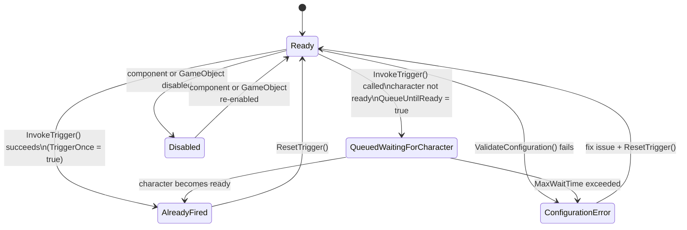

# Setting Up Narrative Design Triggers

## The ConvaiNarrativeDesignTrigger Component

`ConvaiNarrativeDesignTrigger` sends a named signal to the Convai backend that advances the story graph from one section to the next. It is a world-space component: place it on any GameObject — a doorway, an exhibit, a UI button's event target — and choose how it should activate.


A "narrative trigger" is not the same as a Unity Physics trigger, even though one activation mode uses `OnTriggerEnter`. The trigger sends a named signal to the Convai backend. The activation mode controls _when_ that signal is sent.


## Adding the Component



**Create or select a GameObject**

For zone-based activation (Collision, Proximity, TimeBased), create an empty GameObject and position it in the scene where you want the trigger zone. For Manual activation, you can place the component anywhere.



**Add the component**

Click **Add Component** and navigate to **Convai > Convai Narrative Design Trigger**.

<figure><figcaption></figcaption></figure>



**Assign the character**

Drag your `ConvaiCharacter` into the **Character** field. If you leave it blank, **Auto Find Character** searches the parent hierarchy and then the `ConvaiManager`'s character list automatically. If more than one character is in the scene, assign the target explicitly.



**Fetch and select a trigger**

Click **Fetch** in the **Trigger Selection** section. The SDK calls `NarrativeDesignFetcher.FetchTriggersAsync` and populates the dropdown with all triggers defined for this character on the dashboard.

Select the trigger you want this component to send. The **Trigger Name**, **Trigger ID**, and **Destination Section** fields populate automatically.

<figure><figcaption></figcaption></figure>



**Choose an activation mode**

Select one of the four activation modes (described below) and configure its settings.



## Activation Modes

<figure><figcaption></figcaption></figure>

### Collision

The default mode. The trigger fires when a tagged player GameObject enters the collider attached to the same GameObject.

**Requirements:**

* A `Collider` component on the same GameObject with **Is Trigger** enabled.
* Either the trigger GameObject or the player GameObject must have a `Rigidbody` for Unity physics to generate the `OnTriggerEnter` callback.

**Detection settings:**

| Field            | Default    | Description                                                     |
| ---------------- | ---------- | --------------------------------------------------------------- |
| **Player Tag**   | `"Player"` | Only GameObjects with this tag are recognized as the player.    |
| **Player Layer** | All layers | Layer mask to further filter which objects count as the player. |


If **Is Trigger** is not enabled on the collider, or if neither the trigger object nor the player has a `Rigidbody`, `OnTriggerEnter` will never fire. Enable **Validate On Start** to catch this automatically when the scene runs.


### Proximity

The trigger fires when the player's distance from the component's `Transform` falls within **Proximity Radius**. The check runs every frame in `Update`.

A green sphere is drawn in the Scene view (visible when the GameObject is selected) showing the detection radius. You can resize it by editing the **Proximity Radius** field directly.

| Field                | Default    | Description                                                            |
| -------------------- | ---------- | ---------------------------------------------------------------------- |
| **Proximity Radius** | `3`        | Detection radius in world units.                                       |
| **Player Tag**       | `"Player"` | Tag used to identify the player.                                       |
| **Auto Find Player** | `true`     | Searches the scene for a tagged player GameObject if none is assigned. |

This mode does not require a collider.

### TimeBased

The trigger fires after the player has been inside the collider zone for a set duration. If the player exits before the delay elapses, the countdown is cancelled and restarts the next time the player enters.

**Requirements:** same collider setup as Collision mode.

| Field          | Default    | Description                                                          |
| -------------- | ---------- | -------------------------------------------------------------------- |
| **Time Delay** | `0`        | Seconds the player must remain in the zone before the trigger fires. |
| **Player Tag** | `"Player"` | Tag used to identify the player.                                     |

### Manual

The trigger does nothing automatically. Call `InvokeTrigger()` or `TryInvokeTrigger()` from your own code or a Unity Event to fire it.

Use this mode when the activation condition is controlled entirely by your game logic — for example, a UI button, a quest completion callback, or a scored interaction.

```csharp
// Fire the trigger from code
narrativeTrigger.InvokeTrigger();

// Fire only if it hasn't already fired (respects TriggerOnce)
narrativeTrigger.TryInvokeTrigger();
```

## Auto-Recovery Settings

These settings make the trigger resilient to common runtime conditions where the character or player may not be ready immediately.

<figure><figcaption></figcaption></figure>

| Field                   | Default | Description                                                                                                                                                          |
| ----------------------- | ------- | -------------------------------------------------------------------------------------------------------------------------------------------------------------------- |
| **Auto Find Character** | `true`  | Searches the parent hierarchy, then `ConvaiManager.Characters`. Assigns automatically if only one character exists; logs a warning if multiple characters are found. |
| **Auto Find Player**    | `true`  | Searches by Player Tag, then by common name list, then via `Camera.main.parent`.                                                                                     |
| **Queue Until Ready**   | `true`  | If the character is not yet in an active conversation, the trigger is queued and fires automatically when the connection is established.                             |
| **Max Wait Time**       | `30`    | Maximum seconds to wait for the character to become ready. Set to `0` for no timeout.                                                                                |
| **Reset On Scene Load** | `true`  | Calls `ResetTrigger()` whenever a scene is loaded, so the trigger can fire again in reloaded scenes.                                                                 |


"Character ready" means `ConvaiCharacter.IsInConversation` is `true` — the real-time session is open. Triggers sent before the session opens are held in a queue and delivered automatically once the connection is established. You do not need to check `IsInConversation` manually before calling `InvokeTrigger()`.



Setting **Max Wait Time** to `0` in a production build where the session may never connect creates an indefinite coroutine. Always set a reasonable timeout unless you have explicit control over session lifetime.


## Trigger Once and Re-firing

**Trigger Once** (default `true`) prevents the trigger from firing more than once. After the first successful invocation, `HasTriggered` becomes `true`, `CurrentStatus` becomes `AlreadyFired`, and all subsequent calls return `false`.

To allow the trigger to fire again, call `ResetTrigger()`:

```csharp
narrativeTrigger.ResetTrigger();
```

`ResetTrigger()` also cancels any queued trigger that is waiting for the character to become ready.

If you want the trigger to fire on every activation, disable **Trigger Once** in the Inspector.

## Events Reference

| Event                | Signature            | When it fires                                                                           |
| -------------------- | -------------------- | --------------------------------------------------------------------------------------- |
| `OnTriggerActivated` | `UnityEvent`         | The trigger was successfully sent to the backend.                                       |
| `OnPlayerEnterZone`  | `UnityEvent`         | The player entered the collider or proximity zone (before the trigger fires).           |
| `OnPlayerExitZone`   | `UnityEvent`         | The player exited the collider or proximity zone.                                       |
| `OnTriggerFailed`    | `UnityEvent<string>` | The trigger could not fire. The string argument contains the error message.             |
| `OnTriggerQueued`    | `UnityEvent`         | The trigger was accepted but deferred because the character is not yet in conversation. |

## Trigger Status

The `CurrentStatus` property tracks the trigger's state at all times:



See Troubleshooting & Diagnostics for a full resolution guide for each status.

## Inspector Reference

### Character Reference Header

| Field                   | Default | Description                                                                               |
| ----------------------- | ------- | ----------------------------------------------------------------------------------------- |
| **Character**           | None    | The target `ConvaiCharacter`. Auto-found if blank and **Auto Find Character** is enabled. |
| **Auto Find Character** | `true`  | Searches hierarchy and ConvaiManager if Character field is empty.                         |

### Trigger Selection Header

| Field               | Default | Description                                                                                            |
| ------------------- | ------- | ------------------------------------------------------------------------------------------------------ |
| **Trigger ID**      | Empty   | Read-only after selection. Unique identifier from the dashboard.                                       |
| **Trigger Name**    | Empty   | Display name of the selected trigger.                                                                  |
| **Trigger Message** | Empty   | Optional message payload sent with the trigger. Can be set programmatically via `SetTriggerMessage()`. |

### Activation Settings Header

| Field                | Default     | Description                                                                    |
| -------------------- | ----------- | ------------------------------------------------------------------------------ |
| **Activation Mode**  | `Collision` | How the trigger activates: `Collision`, `Proximity`, `Manual`, or `TimeBased`. |
| **Proximity Radius** | `3`         | Detection radius for Proximity mode.                                           |
| **Time Delay**       | `0`         | Countdown seconds for TimeBased mode.                                          |
| **Trigger Once**     | `true`      | If enabled, fires only once until `ResetTrigger()` is called.                  |
| **Player Layer**     | All         | Layer mask for player detection.                                               |
| **Player Tag**       | `"Player"`  | Tag used to identify the player GameObject.                                    |

### Auto-Recovery Settings Header

| Field                   | Default | Description                                                 |
| ----------------------- | ------- | ----------------------------------------------------------- |
| **Auto Find Player**    | `true`  | Searches the scene for a tagged player if none is detected. |
| **Queue Until Ready**   | `true`  | Defers the trigger until the character's session is open.   |
| **Max Wait Time**       | `30`    | Timeout in seconds for the queue. `0` = no timeout.         |
| **Reset On Scene Load** | `true`  | Resets `HasTriggered` on scene load.                        |

### Diagnostics Header

| Field                  | Default | Description                                                  |
| ---------------------- | ------- | ------------------------------------------------------------ |
| **Enable Diagnostics** | `false` | Logs detailed state transitions to the Console.              |
| **Validate On Start**  | `true`  | Runs `ValidateConfiguration()` at Start and logs any issues. |

## Conclusion

`ConvaiNarrativeDesignTrigger` gives you four activation modes — Collision, Proximity, TimeBased, and Manual — covering every placement scenario from simple walk-through zones to UI-driven code flows. The built-in queue system, configurable timeout, and per-trigger events make it straightforward to handle edge cases without writing custom state management. Continue to [Template Keys: Dynamic Narrative Variables](../../../unity-plugin-beta-overview/features/narrative-design/template-keys-dynamic-narrative-variables.md) to learn how to inject runtime values such as the player's name or scenario parameters into the character's objectives.
