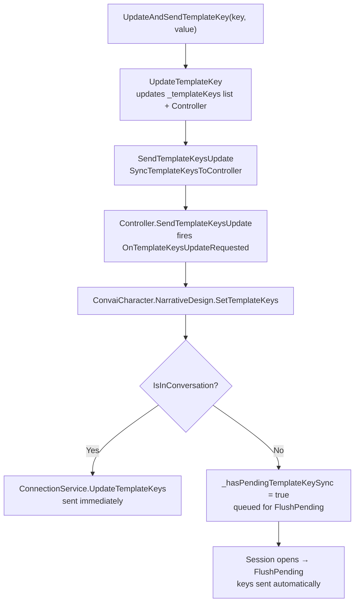

# Template Keys: Dynamic Narrative Variables

## Injecting Runtime Values into Narrative Objectives

Template keys are runtime key-value pairs that fill placeholders in your character's narrative objectives. You define placeholders in the [Convai dashboard](https://convai.com) using curly-brace syntax — for example, `{PlayerName}` or `{CurrentTask}` — and the SDK sends the actual values from Unity at runtime, so the character can reference them naturally in conversation.

This lets a single narrative graph serve many sessions with different participants, scenarios, or dynamic state — without editing the narrative design each time.

## Defining Keys in the Inspector

Open `ConvaiNarrativeDesignManager` in the Inspector and expand the **Template Keys** foldout.

Click **+** to add an entry. Each entry has two fields:

| Field     | Description                                                                                                                     |
| --------- | ------------------------------------------------------------------------------------------------------------------------------- |
| **Key**   | The placeholder name, exactly as written in the narrative design section objective (case-sensitive, without the double braces). |
| **Value** | The initial value. You can override this at runtime from code.                                                                  |

<figure><figcaption></figcaption></figure>

Keys defined in the Inspector are synced to the internal controller on `Awake` and sent to the Convai backend automatically when the session opens.


The keys are not sent at edit time. They queue locally and are flushed to the backend the moment the character's real-time session becomes active. You do not need to call anything manually to ensure delivery.


In Play Mode, the Inspector shows a **Send to Server** button that immediately calls `SendTemplateKeysUpdate()`. This is useful for testing value changes mid-session without writing code.

## Updating Keys at Runtime

Use any of the following methods on `ConvaiNarrativeDesignManager` to update keys from code:

**Update a single key:**

```csharp
narrativeManager.UpdateTemplateKey("PlayerName", "Alex");
```

**Update and send immediately (one call):**

```csharp
narrativeManager.UpdateAndSendTemplateKey("ScenarioPhase", "Handwashing");
```

Use `UpdateAndSendTemplateKey` when a key change should take effect on the character's very next response.

**Update multiple keys at once:**

```csharp
narrativeManager.UpdateTemplateKeys(new Dictionary<string, string>
{
    { "PlayerName", "Alex" },
    { "Department",  "Facilities" },
    { "CompletedSteps", "3" }
});
narrativeManager.SendTemplateKeysUpdate();
```

**Read the current key dictionary:**

```csharp
Dictionary<string, string> current = narrativeManager.GetTemplateKeys();
```

## How Keys Are Sent



If the character disconnects and reconnects, the SDK calls `MarkPendingReplayAfterDisconnect` internally so the latest key values are re-sent on the next connection. You never need to re-send keys manually after a reconnect.

## Key Naming Rules

| Rule                                                          | Example                                                          |
| ------------------------------------------------------------- | ---------------------------------------------------------------- |
| Must match the dashboard placeholder exactly (case-sensitive) | Dashboard: `{playerName}` → Key: `playerName` (not `PlayerName`) |
| No leading or trailing whitespace                             | `"PlayerName"` ✓ — `" PlayerName"` ✗                             |
| No empty key string                                           | `""` is silently ignored                                         |
| Values can be empty strings                                   | Key `"OptionalField"` with value `""` is valid                   |

**Good key names:**

| Key                    | Value example |
| ---------------------- | ------------- |
| `PlayerName`           | `"Maria"`     |
| `ScenarioLevel`        | `"Advanced"`  |
| `CompletedCheckpoints` | `"4"`         |
| `SessionStartTime`     | `"09:15"`     |

**Problematic key names:**

| Key             | Problem                                                                                          |
| --------------- | ------------------------------------------------------------------------------------------------ |
| `player name`   | Space in name — will not match `{player name}` placeholders if the dashboard uses `{playerName}` |
| `"PlayerName "` | Trailing space — silent mismatch                                                                 |
| `""`            | Empty — ignored                                                                                  |


Template key values are sent as plain strings over the network and may appear in the character's dialogue. Do not include passwords, personal identification numbers, API secrets, or any other sensitive data in template key values.


## Setting Keys Directly on the Character

If you are working without a `ConvaiNarrativeDesignManager`, you can set template keys directly through the character API:

```csharp
ConvaiCharacter character = GetComponent<ConvaiCharacter>();

// Single key
character.NarrativeDesign.SetTemplateKey("PlayerName", "Alex");

// Multiple keys
character.NarrativeDesign.SetTemplateKeys(new Dictionary<string, string>
{
    { "PlayerName", "Alex" },
    { "Department", "Engineering" }
});
```

The character API and the Manager API both converge on the same `ConnectionService.UpdateTemplateKeys` call internally. You can use either path in the same project, but avoid calling both paths for the same key in the same frame, as this may send redundant updates.

## Conclusion

Template keys bridge the gap between static dashboard narrative objectives and live runtime data — player names, difficulty levels, session parameters — without any changes to the graph itself. Keys set before the session opens are held and flushed automatically; keys set mid-session take effect on the character's very next response. For programmatic control beyond what the Inspector offers — dynamic character switching, async data fetching, or subscribing to section events in code — continue to Scripting Narrative Design.
