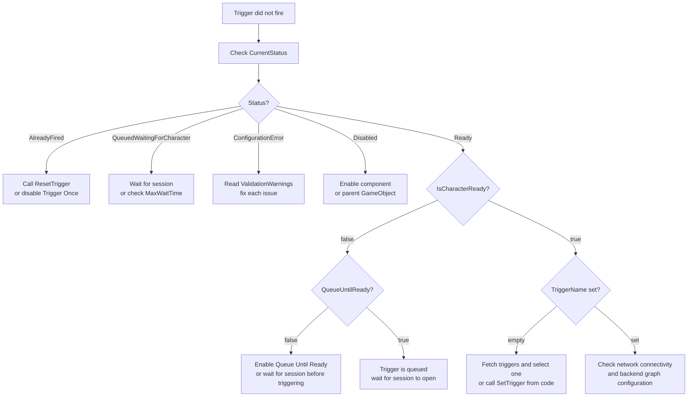

Most Narrative Design problems fall into one of three categories: the trigger is not firing, the section events are not responding, or a backend fetch is failing. This page covers all three, starting with the built-in status system on `ConvaiNarrativeDesignTrigger` and working through the most common Inspector misconfigurations.

## First-line investigation

When something is not working, run through this checklist before diving into specific symptoms. Most issues resolve at step 2 or 3.



### Check CurrentStatus on the trigger

Select the `ConvaiNarrativeDesignTrigger` GameObject in the Inspector. **Current Status** is visible at the top of the component. Any value other than `Ready` tells you immediately what the trigger is waiting for — see the TriggerStatus reference table below for the resolution.



### Enable diagnostics and reproduce the problem

In the Trigger component, enable **Enable Diagnostics**. Press Play and repeat the action that should fire the trigger. Every state transition — zone enter/exit, queue start, character-ready detection, trigger send — is logged to the Console. Read the log sequence from top to bottom to identify where the chain breaks.

```csharp
// Or enable from code
trigger.SetDiagnosticsEnabled(true);
```



### Verify character ID and API key

Open **Edit > Project Settings > Convai SDK** and confirm the API key is present. Select your character's GameObject and confirm the **Character ID** field on `ConvaiCharacter` is not empty. If either is missing, fetch operations and session connections will fail silently from the trigger's perspective.



### Dump full trigger state

Call `PrintDiagnostics()` from a test script, or press the **Invoke** / **Reset** buttons visible on the component in Play Mode. The dump shows every field at once, making it easy to spot mismatches:

```csharp
trigger.PrintDiagnostics();
```



### Run ValidateConfiguration

```csharp
if (!trigger.ValidateConfiguration())
{
    foreach (string warning in trigger.ValidationWarnings)
        Debug.LogWarning($"Trigger validation: {warning}");
}
```

Or enable **Validate On Start** in the Inspector so this runs automatically at the start of every Play session.



## TriggerStatus reference

`ConvaiNarrativeDesignTrigger.CurrentStatus` reports the trigger's current state at all times. Use it to understand why a trigger is not firing.

| Status | Cause | Resolution |
|---|---|---|
| `Ready` | Normal — waiting for the activation condition. | No action needed. |
| `AlreadyFired` | `TriggerOnce` is enabled and the trigger has fired. | Call `ResetTrigger()` to re-arm it, or disable **Trigger Once** in the Inspector. |
| `QueuedWaitingForCharacter` | The trigger was accepted but the character is not yet in an active conversation. | Wait for the session to open. The trigger fires automatically. Call `CancelQueuedTrigger()` to abort the queue. |
| `ConfigurationError` | `ValidateConfiguration()` detected one or more issues. | Read `ValidationWarnings` (see Validate configuration programmatically) and fix each issue. |
| `Disabled` | The component or its parent GameObject is disabled. | Enable the component or GameObject. |

## Common issues

| Symptom | Likely cause | Fix |
|---|---|---|
| Sections list empty after **Sync with Backend** | API key missing or invalid | **Edit > Project Settings > Convai SDK** — verify the key; check **Last Fetch Error** on the Manager |
| Sections list empty after **Sync with Backend** | Character ID not set | Set **Character ID** on the `ConvaiCharacter` component |
| `OnTriggerActivated` fires but section never changes | Trigger name does not exactly match the dashboard edge (case-sensitive) | Click **Fetch** on the Trigger, re-select the correct trigger from the dropdown |
| `OnSectionStart` never fires despite section changing | Local section ID out of sync with dashboard | Click **Sync with Backend** on the Manager; if still broken, call `ClearAllSectionConfigs()` and re-sync |
| `OnPlayerEnterZone` never fires (Collision mode) | **Is Trigger** disabled on the Collider | Enable **Is Trigger** on the Collider component |
| `OnPlayerEnterZone` never fires (Collision mode) | No `Rigidbody` on either object | Add a `Rigidbody` to the trigger GameObject or the player |
| `OnPlayerEnterZone` never fires (Collision mode) | Player GameObject tag is not set to `Player` | Set the tag to `Player` in the Inspector |
| Wrong objects activate the trigger | **Player Layer** mask set to `Nothing` (0) | Set **Player Layer** to the layer your player is on |
| Player tag not recognized | Tag not defined in Unity's Tag Manager | Add the tag in **Edit > Project Settings > Tags and Layers** |
| "Multiple ConvaiCharacters found" warning | `Auto Find Character` can't resolve ambiguity | Assign the target character explicitly in the **Character** field |
| Section shows **orphaned** badge | Section deleted from dashboard after local sync | If intentional: remove entry manually. If accidental: restore on dashboard, click **Sync with Backend** |
| Template key has no effect on character dialogue | Key name case mismatch with dashboard placeholder | Compare key exactly: `{playerName}` on dashboard → key `playerName`, not `PlayerName` |

## Enable diagnostics

`ConvaiNarrativeDesignTrigger` has a built-in diagnostic logger. Enable it from the Inspector or from code:

```csharp
trigger.SetDiagnosticsEnabled(true);
```

With diagnostics enabled, every state transition — zone enter/exit, queue start, character-ready detection, trigger send — is logged to the Console via `ConvaiLogger.Debug`.

To dump the full current state of a trigger to the Console at any time:

```csharp
trigger.PrintDiagnostics();
```

`PrintDiagnostics()` logs:

```
[ConvaiNarrativeDesignTrigger] === DIAGNOSTICS ===
  GameObject: TriggerZone_Checkpoint1
  Status: QueuedWaitingForCharacter
  Has Triggered: False
  Trigger Once: True
  Trigger Name: 'CheckpointReached'
  Trigger ID: 'a1b2c3d4-...'
  Activation Mode: Collision
  Character Assigned: SafetyInstructor
  Character Ready: False
  Player In Zone: True
  Player Transform: PlayerController
  Queued For Ready: True
  Last Error: None
  Validation Warnings: 0
===========================
```

In Play Mode, the Inspector also shows an **Invoke** button (fires `InvokeTrigger()`) and a **Reset** button (fires `ResetTrigger()`) directly from the Inspector without needing to write any code.

## Validate configuration programmatically

```csharp
bool valid = trigger.ValidateConfiguration();

if (!valid)
{
    foreach (string warning in trigger.ValidationWarnings)
        Debug.LogWarning($"Trigger validation: {warning}");
}
```

`ValidateConfiguration()` runs four automatic checks:

1. **Character reference check**: verifies a character is assigned and implements `IConvaiCharacterAgent`.
2. **Trigger name check**: verifies at least one of **Trigger Name** or **Trigger Message** is non-empty.
3. **Collider check** (Collision and TimeBased modes): verifies a `Collider` exists on the same GameObject and that **Is Trigger** is enabled.
4. **Player detection check**: verifies the **Player Tag** is defined in Unity's Tag Manager, and warns if **Player Layer** is set to `Nothing` (0).

Enable **Validate On Start** in the Inspector to run this check automatically at `Start()` so issues are caught as soon as Play Mode begins.

## Fetch failures

If `FetchAndSyncFromBackend()` fails:

1. **Last Fetch Error** on the Manager Inspector shows the exact error string.
2. Call `ClearFetchError()` to reset the error display after resolving the issue:

```csharp
narrativeManager.ClearFetchError();
```

Common causes:

| Error | Cause |
|---|---|
| `"API key is not configured. Please set it in Project Settings > Convai SDK."` | API key missing in **Edit > Project Settings > Convai SDK** |
| `"Character ID is required."` | Character ID field is empty on `ConvaiCharacter` |
| `"Exception: ..."` | Network error or Convai backend is unreachable |
| `"No character assigned or character has no ID."` | Manager has no character reference and auto-detect failed |

You can also check the result of `FetchAndSyncFromBackendAsync()` in code:

```csharp
SectionSyncResult result = await narrativeManager.FetchAndSyncFromBackendAsync();
if (!result.Success)
    Debug.LogError($"Sync failed: {result.Error}");
```

## Pending state

When template keys or triggers are sent before the character's session is open, the SDK holds them in an internal queue. Delivery is automatic — you do not need to re-send anything manually.

| Event | What happens |
|---|---|
| Session opens | `FlushPending()` is called internally; all queued keys and triggers are sent in order. |
| Session disconnects and reconnects | `MarkPendingReplayAfterDisconnect()` is called internally; the latest template key snapshot is re-sent on the next connection. |


You can call `SetTemplateKey` or `InvokeTrigger` at any point in your scene's lifecycle — including in `Awake` or before Play Mode is fully running — and the SDK will deliver those values correctly once the connection is ready.


## Queue timeout

`ConvaiNarrativeDesignTrigger`'s **Queue Until Ready** feature polls for character readiness every 0.25 seconds. The timeout is controlled by **Max Wait Time** (default: `30` seconds).

When the timeout is reached, `OnTriggerFailed` fires with the message:

```
Timed out waiting for character to be ready after 30 seconds.
```

To cancel a queued trigger before the timeout:

```csharp
trigger.CancelQueuedTrigger();
```


Setting **Max Wait Time** to `0` disables the timeout entirely. In a build where the session never connects (for example, due to a network outage), the waiting coroutine runs indefinitely until the scene is unloaded. For production builds, always set a reasonable timeout and handle `OnTriggerFailed` to inform the user or fall back gracefully.


## Console log reference

The following log messages appear when **Enable Diagnostics** is on or when errors occur at runtime.

| Log message | Component | Meaning |
|---|---|---|
| `Trigger '<name>' invoked successfully on character '<character>'.` | `ConvaiNarrativeDesignTrigger` | Trigger was accepted and sent to the backend successfully. |
| `Trigger '<name>' queued. Waiting for character to be ready (max <N>s).` | `ConvaiNarrativeDesignTrigger` | Character session not yet open. Trigger will fire automatically on connect. |
| `Character became ready after <N>s, sending queued trigger` | `ConvaiNarrativeDesignTrigger` | Session opened; the deferred trigger is being sent now. Appears only when **Enable Diagnostics** is on. |
| `Timed out waiting for character to be ready after <N> seconds.` | `ConvaiNarrativeDesignTrigger` | `MaxWaitTime` elapsed. Handle `OnTriggerFailed` and increase the timeout or check session connectivity. |
| `Trigger already fired and TriggerOnce is enabled. Call ResetTrigger() to allow it to fire again.` | `ConvaiNarrativeDesignTrigger` | `TriggerOnce` is `true` and the trigger has already fired. |
| `[ConvaiNarrativeDesignTrigger] Validation: <detail>` | `ConvaiNarrativeDesignTrigger` | A configuration issue was detected at Start. Read the detail string for the specific field. |
| `Multiple ConvaiCharacters found (<N>). Cannot auto-assign. Please assign one explicitly.` | `ConvaiNarrativeDesignTrigger` | Auto-find is ambiguous. Drag the correct character into the **Character** field. |
| `Section transition: Previous=<id> → New=<id>` | `ConvaiNarrativeDesignManager` | Section transition received. If `OnSectionStart` did not fire, the section ID is not in the local config list — re-sync. |
| `Sync complete: <N> added, <N> updated, <N> orphaned, <N> reactivated` | `ConvaiNarrativeDesignManager` | Summary of the last **Sync with Backend** call. Non-zero orphaned count means dashboard sections were removed. |
| `Fetch failed: <error>` | `ConvaiNarrativeDesignManager` | API key, character ID, or network issue. Check **Last Fetch Error** in the Inspector. |

## Trigger did not fire



Use `CurrentStatus` for an instant diagnosis, enable `EnableDiagnostics` to trace the full event chain, and use the Common issues table to resolve the most frequent misconfigurations.

## Next steps


[Configure narrative design triggers](setting-up-narrative-design-triggers.md)



[Narrative Design scripting reference](scripting-narrative-design.md)

