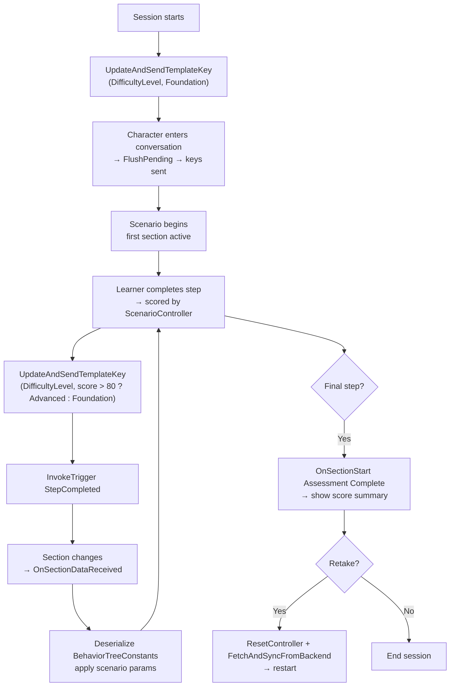

# Usage Examples

## Building Complete Narrative Design Setups

The following examples show how to compose `ConvaiNarrativeDesignManager`, `ConvaiNarrativeDesignTrigger`, and `IConvaiNarrativeDesign` into complete, working setups. They are ordered from simple to advanced and cover different domains to illustrate the breadth of what Narrative Design supports — from a single-button welcome kiosk to a fully adaptive multi-step scenario.

Each example is self-contained. Start from whichever matches your current complexity level. If any step is unfamiliar, the relevant detail page is linked inline.

***

## Example 1 — Simple: Scripted Welcome Sequence

**Complexity:** Beginner | **Activation mode:** Manual | **Features used:** Manager, Trigger (Manual), one template key

**Scenario:** A visitor arrives at a reception desk. A "Start" button in the UI kicks off the experience by sending a single trigger that moves the character from an idle state into an active welcome section.

### Setup



**Prepare the scene**

Add `ConvaiNarrativeDesignManager` to the character GameObject and sync sections from the dashboard. You need at least two sections: an idle section (where the character waits) and a welcome section (where the character begins the experience).



**Set the visitor's name before the session**

Before starting the session, send a template key so the character can reference the visitor by name:

```csharp
public class ReceptionController : MonoBehaviour
{
    [SerializeField] private ConvaiNarrativeDesignManager _narrativeManager;
    [SerializeField] private string _visitorName;

    private void Start()
    {
        _narrativeManager.UpdateAndSendTemplateKey("VisitorName", _visitorName);
    }
}
```



**Add a Manual trigger**

Add `ConvaiNarrativeDesignTrigger` to any GameObject (it won't be in the world — it's driven by UI). Set **Activation Mode** to **Manual** and fetch/select the welcome trigger from the dashboard.



**Wire the UI button**

In the Button component's **On Click ()** event, assign the `ConvaiNarrativeDesignTrigger` and select `ConvaiNarrativeDesignTrigger.InvokeTrigger`.



**Wire the section event**

In the Manager's **Narrative Sections** list, find the welcome section entry and add an `OnSectionStart` listener. Point it to whatever should change in the scene when the welcome begins — for example, enabling a name badge UI or starting an ambient animation.



**What happens at runtime:** Player clicks Start → `InvokeTrigger()` sends the trigger to the backend → the graph moves to the welcome section → `OnSectionStart` fires on the welcome section entry → the character begins the welcome.

***

## Example 2 — Intermediate: Branching Conversation

**Complexity:** Intermediate | **Activation mode:** Manual (code-driven) | **Features used:** Manager, `IConvaiNarrativeDesign`, `InvokeSpeech`, multiple template keys

**Scenario:** An orientation assistant can guide users through three independent topic areas (e.g., facilities, systems access, policies). Topic selection is driven by UI buttons, and the user can navigate freely between topics. Open-ended follow-up questions are supported after each topic.

### Setup

Sync all topic sections in the Manager. No `ConvaiNarrativeDesignTrigger` component is needed — triggers are sent directly via `IConvaiNarrativeDesign`.

```csharp
public class OrientationController : MonoBehaviour
{
    [SerializeField] private ConvaiCharacter _character;
    [SerializeField] private TextMeshProUGUI _activeTopicLabel;

    private void OnEnable()
    {
        _character.NarrativeDesign.OnSectionChanged += OnSectionChanged;
    }

    private void OnDisable()
    {
        _character.NarrativeDesign.OnSectionChanged -= OnSectionChanged;
    }

    // Called by UI buttons
    public void SelectTopic(string triggerName)
    {
        _character.NarrativeDesign.InvokeTrigger(triggerName);
    }

    // Called by a free-text input field's submit event — plain text context injection
    // The character responds naturally in its own words
    public void AskFollowUp(string userQuestion)
    {
        _character.NarrativeDesign.InvokeSpeech(userQuestion);
    }

    // Called when a scripted announcement is needed — character says this verbatim
    public void AnnounceToUser(string announcement)
    {
        _character.NarrativeDesign.InvokeSpeech($"<speak>{announcement}</speak>");
    }

    private void OnSectionChanged(string previous, string next)
    {
        // Update breadcrumb UI — look up the human-readable name from the Manager
        if (_narrativeManager.FindSectionConfig(next) is { } cfg)
            _activeTopicLabel.text = cfg.SectionName;
    }
}
```

Assign trigger names to buttons in the Inspector: `"TopicFacilities"`, `"TopicSystemsAccess"`, `"TopicPolicies"`.

Set `TriggerOnce = false` on all triggers so the user can revisit any topic. Send template keys (`UserName`, `Department`) from a form before the session opens using `UpdateTemplateKeys`.

**`InvokeSpeech` has two modes:** plain text makes the character respond naturally in its own words (useful for free-text follow-up questions); wrapping the message in `<speak>` tags makes the character say that text verbatim (useful for scripted announcements or exact prompts). Neither mode advances the graph. See Controlling What the Character Says for the full reference.

***

## Example 3 — Intermediate: Proximity-Triggered Exhibit Tour

**Complexity:** Intermediate | **Activation mode:** Proximity | **Features used:** Manager, Trigger (Proximity), zone events, batch template keys

**Scenario:** A product showroom has five display stations. As the visitor walks toward each station, a host character begins narrating that product. Each station is independent and can be visited in any order.

### Setup

Create one `ConvaiNarrativeDesignTrigger` per station. For each:

* **Activation Mode:** `Proximity`
* **Proximity Radius:** adjust per station size (visible as green sphere gizmo in Scene view)
* **Trigger Once:** `true`
* **Reset On Scene Load:** `true` (so the tour resets on each visit)

Wire station-specific context via template keys. Populate them from a `ScriptableObject` at `Start()`:

```csharp
[CreateAssetMenu(menuName = "Showroom/Station Data")]
public class StationData : ScriptableObject
{
    public string ProductName;
    public string LaunchYear;
    public string KeyFeature;
}

public class StationController : MonoBehaviour
{
    [SerializeField] private ConvaiNarrativeDesignManager _narrativeManager;
    [SerializeField] private StationData _data;

    private void Start()
    {
        _narrativeManager.UpdateTemplateKeys(new Dictionary<string, string>
        {
            { "ProductName", _data.ProductName },
            { "LaunchYear",  _data.LaunchYear  },
            { "KeyFeature",  _data.KeyFeature  }
        });
    }
}
```

Use `OnPlayerEnterZone` to highlight the product model (e.g., enable an outline shader). Use `OnPlayerExitZone` to remove the highlight.


If station proximity radii overlap, two triggers may fire in the same frame, sending two graph transitions before the backend can respond to the first. Space your stations so proximity zones do not intersect, or use Collision mode with physically separated trigger colliders.


***

## Example 4 — Advanced: Adaptive Scenario with Dynamic Feedback

**Complexity:** Advanced | **Activation mode:** Code-driven | **Features used:** Manager, `IConvaiNarrativeDesign`, `OnSectionDataReceived`, `BehaviorTreeConstants`, dynamic template keys, retake flow

**Scenario:** A technical skills evaluator runs a multi-step scenario. After each step, the learner's performance is scored. The character's level of guidance and the scenario's challenge level adapt dynamically based on the running score. The scenario can be retaken, resetting all state.

### Session Lifecycle



### Implementation

```csharp
public class ScenarioController : MonoBehaviour
{
    [SerializeField] private ConvaiNarrativeDesignManager _narrativeManager;
    [SerializeField] private ConvaiCharacter _character;

    private int _totalScore;
    private int _stepCount;

    private void OnEnable()
    {
        _character.NarrativeDesign.OnSectionDataReceived += OnSectionDataReceived;
    }

    private void OnDisable()
    {
        _character.NarrativeDesign.OnSectionDataReceived -= OnSectionDataReceived;
    }

    public void StartScenario(string learnerName)
    {
        _totalScore = 0;
        _stepCount  = 0;
        _narrativeManager.UpdateTemplateKeys(new Dictionary<string, string>
        {
            { "LearnerName",    learnerName   },
            { "DifficultyLevel", "Foundation" }
        });
        _narrativeManager.SendTemplateKeysUpdate();
    }

    public void OnStepCompleted(int stepScore)
    {
        _totalScore += stepScore;
        _stepCount++;

        string level = (_totalScore / _stepCount) > 80 ? "Advanced" : "Foundation";
        _narrativeManager.UpdateAndSendTemplateKey("DifficultyLevel", level);
        _character.NarrativeDesign.InvokeTrigger("StepCompleted");
    }

    private void OnSectionDataReceived(NarrativeSectionData data)
    {
        if (string.IsNullOrEmpty(data.BehaviorTreeConstants)) return;

        // BehaviorTreeConstants is a JSON string authored in the Convai dashboard
        // containing scenario-specific parameters for this section
        var constants = JsonUtility.FromJson<ScenarioConstants>(data.BehaviorTreeConstants);
        ApplyScenarioParameters(constants);
    }

    public async void RetakeScenario()
    {
        _narrativeManager.ResetController();
        await _narrativeManager.FetchAndSyncFromBackendAsync();
        StartScenario("LearnerName");
    }

    private void ApplyScenarioParameters(ScenarioConstants constants)
    {
        // Apply values from the dashboard-authored constants to your scene
    }

    [Serializable]
    private class ScenarioConstants
    {
        public float TimeLimit;
        public int   RequiredScore;
        public bool  ShowHints;
    }
}
```

**What `BehaviorTreeConstants` provides:** a JSON string that you author in the Convai dashboard per section. It carries any data you want to inject into Unity from the graph — time limits, scoring thresholds, hint flags, or other scenario parameters. The SDK delivers it in every `NarrativeSectionData` payload.


`BehaviorTreeCode` and `BehaviorTreeConstants` are read-only from the SDK side. They carry data authored in the Convai dashboard and are not modifiable at runtime from Unity.


***

## Conclusion

These four examples cover the full range of Narrative Design use cases — from a single-trigger welcome sequence wired entirely in the Inspector to a fully adaptive scenario where the character's behaviour changes dynamically based on performance data. Each pattern builds on the same three components: the Manager, the Trigger, and the `IConvaiNarrativeDesign` API. For help diagnosing issues in any of these setups, see Troubleshooting & Diagnostics.
