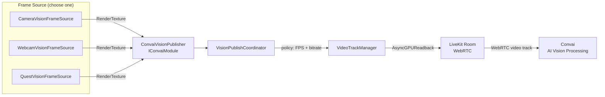

# Vision

### Real-Time Scene Vision for Convai Characters

Vision gives Convai characters the ability to see what is happening inside your Unity scene. When Vision is active, a continuous video stream is captured from a configurable source — a scene camera, a physical webcam, or the passthrough feed of a Meta Quest headset — and published to Convai, where it is processed alongside the character's conversation context. Characters can then respond to what they observe, describe objects, flag hazards, or guide users based on live visual input.

Vision is a module-level feature that depends on `ConvaiRoomManager` operating in **Video** connection mode. On native platforms the video stream is sourced from a `RenderTexture`; on WebGL it is sourced from the visible browser canvas via `canvas.captureStream()`.

***

### Architecture

A frame source captures images from your scene and passes them to `ConvaiVisionPublisher`, which manages a WebRTC video track through the LiveKit layer. The coordinator applies the configured publish policy (frame rate and bitrate), then forwards frames to Convai for AI processing alongside the audio conversation.

On WebGL, `ConvaiVisionPublisher` bypasses the frame source entirely and publishes the browser canvas directly via `canvas.captureStream()`. The WebRTC and Convai processing layers are identical.

***

### Key Concepts

| Concept             | What it means                                                                                                                                                                             |
| ------------------- | ----------------------------------------------------------------------------------------------------------------------------------------------------------------------------------------- |
| **Frame Source**    | A `MonoBehaviour` that captures frames and exposes them as a Y-flipped `RenderTexture`. Three built-in implementations cover Unity cameras, physical webcams, and Meta Quest passthrough. |
| **Publish Policy**  | Controls the client-side frame rate and bitrate used when streaming to Convai. Does not control which AI model or vision provider is used on the backend.                                 |
| **Video Track**     | A WebRTC video track published to the active Convai room. Identified by the **Video Track Name** field on `ConvaiVisionPublisher` (default: `"unity-scene"`).                             |
| **Room Connection** | Vision only publishes when `ConvaiRoomManager` is connected with **Connection Type** set to **Video**. Audio-only connections do not carry video.                                         |

***

### Component Placement

Understanding which component belongs where prevents the most common setup mistakes.

| Component                 | Where to place it                         | Notes                                        |
| ------------------------- | ----------------------------------------- | -------------------------------------------- |
| `ConvaiRoomManager`       | Any persistent scene GameObject           | **Connection Type** must be set to **Video** |
| `ConvaiVisionPublisher`   | Any persistent scene GameObject           | Typically placed on or near the NPC's root   |
| `CameraVisionFrameSource` | Same or child GameObject as the publisher | One per capture source                       |
| `WebcamVisionFrameSource` | Same or child GameObject as the publisher | One per capture source                       |
| `QuestVisionFrameSource`  | Same or child GameObject as the publisher | Meta Quest 3 / 3S only; requires Meta XR SDK |
| `VisionDebugPreview`      | Any scene GameObject                      | Editor-only; auto-disabled in player builds  |


Vision requires `ConvaiRoomManager.Connection Type` set to **Video**. If it is set to `Audio`, `ConvaiVisionPublisher` remains idle regardless of how other components are configured.


***

### Platform Support

| Platform           | Supported frame sources                              | Notes                                                                                                             |
| ------------------ | ---------------------------------------------------- | ----------------------------------------------------------------------------------------------------------------- |
| PC / Mac / Console | `CameraVisionFrameSource`, `WebcamVisionFrameSource` | Full RenderTexture pipeline; max 30 fps                                                                           |
| Android / iOS      | `CameraVisionFrameSource`, `WebcamVisionFrameSource` | Webcam source requests camera permission at startup                                                               |
| WebGL              | _(Canvas, automatic)_                                | `canvas.captureStream()` path — no frame source component needed; frame rate capped at 15 fps; **HTTPS required** |
| Meta Quest 3 / 3S  | `QuestVisionFrameSource`                             | Requires Meta XR SDK and `horizonos.permission.HEADSET_CAMERA`; bound to `PassthroughCameraAccess` via reflection |


**WebGL: HTTPS required.** The `canvas.captureStream()` API is blocked by browsers on non-HTTPS origins. `http://localhost` is the only exception. Deploy your WebGL build to an HTTPS host before testing Vision in production.


***

<table data-view="cards"><thead><tr><th></th><th data-hidden data-card-target data-type="content-ref"></th></tr></thead><tbody><tr><td><strong>Quick Start</strong> Get a character receiving a live camera feed with a step-by-step Inspector walkthrough — no code required.</td><td><a href="/broken/pages/70515e065a7d7dd65d86be9b0fcac460288a91cd">Broken link</a></td></tr><tr><td><strong>Frame Sources</strong> Configure CameraVisionFrameSource, WebcamVisionFrameSource, and QuestVisionFrameSource for every platform and use case.</td><td><a href="/broken/pages/76e0440eec44ff67685a61c41ee3c744cffbe2b7">Broken link</a></td></tr><tr><td><strong>Publishing &#x26; Policies</strong> Choose a publish policy, tune frame rate and bitrate, and understand platform-specific behaviour including WebGL.</td><td><a href="/broken/pages/092390546007bc6d69b875d6c60a8fa53ec0f684">Broken link</a></td></tr><tr><td><strong>Scripting API</strong> ConvaiVisionPublisher properties and methods, runtime state monitoring, and domain events for analytics integration.</td><td><a href="/broken/pages/b58c5dc0bda1b3fbb429202bc17d6cd7c347ca79">Broken link</a></td></tr><tr><td><strong>Custom Frame Sources</strong> Implement IVisionFrameSource to publish any custom video pipeline — interface contract, Y-flip requirement, and minimal implementation.</td><td><a href="/broken/pages/cf4da70a92c4a179edee5be41b336e5474318d56">Broken link</a></td></tr><tr><td><strong>Debug Preview</strong> Visualise the active frame source as an on-screen overlay and monitor capture health in the Editor.</td><td><a href="/broken/pages/53b1c8bc7e1b762dccd2fbfcfb5539845129a067">Broken link</a></td></tr><tr><td><strong>Usage Examples</strong> End-to-end examples for safety training, equipment onboarding, VR walkthroughs, and manual-trigger sessions.</td><td><a href="/broken/pages/21dd9aa1be75510e782eab5b03994a99f86532bf">Broken link</a></td></tr><tr><td><strong>Troubleshooting &#x26; Diagnostics</strong> Diagnose publishing failures, blank feeds, permission errors, and platform-specific issues with a structured checklist and decision tree.</td><td><a href="/broken/pages/dc524e5bfdc39bb4955dc7378c746a976212a5ca">Broken link</a></td></tr></tbody></table>

### Next Steps

Vision connects your Unity scene directly to the character's perception, enabling responses grounded in what the character can see. Start with [Quick Start](/broken/pages/70515e065a7d7dd65d86be9b0fcac460288a91cd) to get a working stream from a scene camera in a few steps, then use [Frame Sources](/broken/pages/76e0440eec44ff67685a61c41ee3c744cffbe2b7) to select the right capture method for your platform.
