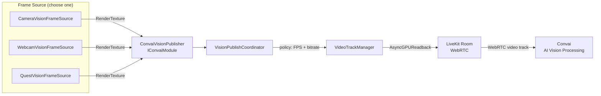

Vision streams a live camera feed from Unity to Convai, where it is processed alongside the audio conversation. This page explains the pipeline architecture, the role of each component, and what the SDK does at runtime when Vision starts.

## Architecture

A frame source captures images from your scene and passes them to `ConvaiVisionPublisher`, which manages a WebRTC video track through the LiveKit layer. The coordinator applies the configured publish policy (frame rate and bitrate), then forwards frames to Convai for AI processing alongside the audio conversation.

On WebGL, `ConvaiVisionPublisher` bypasses the frame source entirely and publishes the browser canvas directly via `canvas.captureStream()`. The WebRTC and Convai processing layers are identical across all platforms.

## Key concepts

| Concept | What it means |
| --- | --- |
| **Frame Source** | A `MonoBehaviour` that captures frames and exposes them as a Y-flipped `RenderTexture`. Three built-in implementations cover Unity cameras, physical webcams, and Meta Quest passthrough. |
| **Publish Policy** | Controls the client-side frame rate and bitrate used when streaming to Convai. Does not control which AI model or vision provider is used on the backend. |
| **Video Track** | A WebRTC video track published to the active Convai room. Identified by the **Track Name** field on `ConvaiVisionPublisher` (default: `"unity-scene"`). |
| **Room Connection** | Vision only publishes when `ConvaiRoomManager` is connected with **Connection Type** set to **Video**. Audio-only connections do not carry video. |

## Component placement

Understanding which component belongs where prevents the most common setup mistakes.

| Component | Where to place it | Notes |
| --- | --- | --- |
| `ConvaiRoomManager` | Any persistent scene GameObject | **Connection Type** must be set to **Video** |
| `ConvaiVisionPublisher` | Any persistent scene GameObject | Typically placed on or near the NPC's root |
| `CameraVisionFrameSource` | Same or child GameObject as the publisher | One per capture source |
| `WebcamVisionFrameSource` | Same or child GameObject as the publisher | One per capture source |
| `QuestVisionFrameSource` | Same or child GameObject as the publisher | Meta Quest 3 / 3S only; requires Meta XR SDK |
| `VisionDebugPreview` | Any scene GameObject | Editor-only; auto-disabled in player builds |

## Startup sequence

When `ConvaiRoomManager` connects with **Connection Type** set to **Video**, the following occurs automatically for `AutoCompatible`, `HighResponsiveness`, and `LowOverhead` policies:

1. `ConvaiRoomManager` establishes a Video connection to Convai.
2. `ConvaiVisionPublisher` detects the active room and resolves the frame source via `GetComponent` or `GetComponentsInChildren`.
3. The frame source starts capture and signals `Ready`. For `CameraVisionFrameSource`, this renders the assigned camera (or `Camera.main`) into a `RenderTexture`.
4. `VisionPublishCoordinator` applies the selected publish policy (for example, `AutoCompatible`: 10 fps, 750 kbps) and begins forwarding frames to the video pipeline.
5. A WebRTC video track named `"unity-scene"` is published to the Convai room. `ConvaiVisionPublisher.IsPublishing` becomes `true` and the `VideoTrackPublished` domain event fires.

For the `Manual` policy, step 5 does not happen automatically — call `EnablePublishing(true)` from a script to start publishing.

## Next steps


[Vision quick start](quick-start.md)



[Vision frame sources](frame-sources.md)



[Vision scripting API](scripting-api.md)

