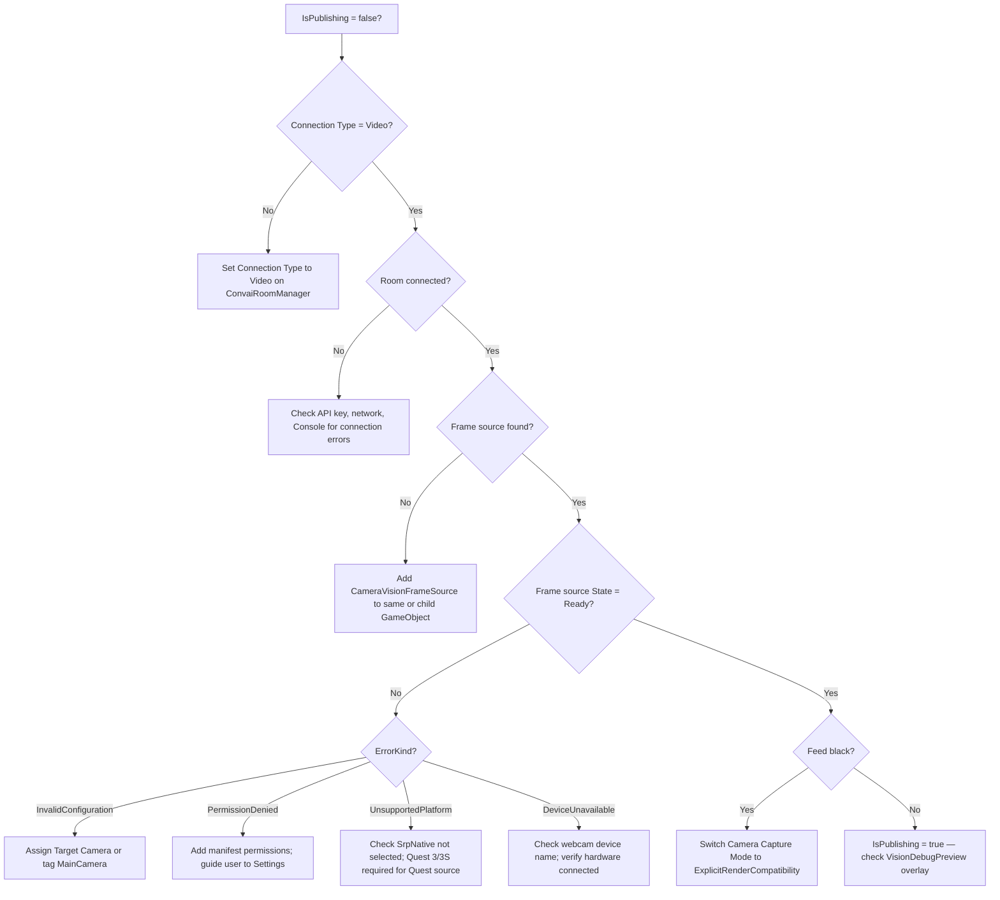

Work through this page top to bottom. Most Vision failures fall into one of four categories: connection misconfiguration, frame source failure, platform-specific restrictions, or WebGL origin policy.

## Quick checklist

Before diving into specific issues, verify these five things in order:



### Confirm Connection Type is Video

Select `ConvaiRoomManager` in the Hierarchy. Confirm **Connection Type** is set to **Video**. `ConvaiVisionPublisher` remains completely idle when Connection Type is `Audio` — it logs a message and returns without error.



### Confirm the room has connected

`ConvaiVisionPublisher` does not publish until the room is connected. Check the Console for `[ConvaiRoomManager]` connection logs. Confirm `ConvaiManager.ActiveManager` is not null at runtime.



### Confirm a frame source is present

On native platforms (not WebGL), `ConvaiVisionPublisher` requires a frame source. Confirm `CameraVisionFrameSource`, `WebcamVisionFrameSource`, or a custom `IVisionFrameSource` is on the same GameObject or a child. Check the Console for:

```
[ConvaiVisionPublisher] No IVisionFrameSource found.
```



### Confirm the frame source is Ready

Open the frame source component in the Inspector at runtime. Confirm `State` is `Ready`. If it is `Failed`, check `ErrorKind` and `StatusMessage` in the Inspector or Console.



### Add VisionDebugPreview

Add `VisionDebugPreview` to any scene GameObject. Press Play. If the overlay shows a live image and `FPS > 0`, the feed is reaching the publisher. If the overlay is blank or FPS stays at zero, the frame source is not producing frames — continue to [Frame source issues](#frame-source-issues) below.



## Common issues

| Symptom | Likely cause | Fix |
| --- | --- | --- |
| `IsPublishing` stays `false` | Connection Type is `Audio` | Set **Connection Type** to **Video** on `ConvaiRoomManager`. |
| `IsPublishing` stays `false` | Room not connected | Wait for connection or check API key / network. |
| `IsPublishing` stays `false` | No frame source found | Add `CameraVisionFrameSource` to the same or child GameObject. |
| Debug overlay blank, FPS = 0 | Frame source in `Failed` state | Check `ErrorKind` — see [Frame source issues](#frame-source-issues). |
| Feed is black | Wrong `CameraCaptureMode` for render pipeline | See [Black feed](#black-feed). |
| `SrpNative` selected | Unimplemented backend | `CameraVisionFrameSource` enters `Failed` immediately — use `ExplicitRenderCompatibility` on SRP/URP. |
| Webcam not opening | Permission denied (Android / iOS) | Declare `android.permission.CAMERA` in manifest; add `NSCameraUsageDescription` in Info.plist. |
| Quest feed not starting | Missing manifest permissions | Declare both `horizonos.permission.HEADSET_CAMERA` and `android.permission.CAMERA`. |
| Quest feed not starting | Wrong hardware | `QuestVisionFrameSource` requires Quest 3 or 3S. Quest 2 and Quest Pro are not supported. |
| WebGL feed not publishing | Non-HTTPS origin | Deploy to HTTPS. `http://localhost` is the only exception. |
| WebGL feed not publishing | Frame source assigned | On WebGL the frame source is ignored — remove or leave blank; publisher uses `canvas.captureStream()`. |
| Debug overlay blank on WebGL | Expected — no RenderTexture | `VisionDebugPreview` has no texture to display on WebGL. Verify via `IsPublishing` instead. |

## Frame source issues

#### Black feed

A black feed (overlay visible but all pixels black) on `CameraVisionFrameSource` indicates the wrong capture backend for the active render pipeline.

| Render pipeline | Recommended mode | Why |
| --- | --- | --- |
| Built-in Render Pipeline | `Auto` (uses `BuiltInHooks`) | `Camera.onPreRender` / `Camera.onPostRender` hooks work correctly. |
| URP / SRP | `Auto` (uses `ExplicitRenderCompatibility`) | Explicit `Camera.Render()` in `LateUpdate` — works on all SRP versions. |
| URP / SRP with black feed on Auto | `ExplicitRenderCompatibility` | Forces explicit render path; resolves black feeds on custom SRP configurations. |


Do not select `SrpNative`. It is not implemented in this SDK build. Selecting it causes `CameraVisionFrameSource` to enter `Failed` state immediately with `ErrorKind = UnsupportedPlatform`.


#### Camera not assigned

If **Target Camera** is blank and no camera in the scene is tagged **MainCamera**, `CameraVisionFrameSource` enters `Failed` state at startup:

```
ErrorKind = InvalidConfiguration
StatusMessage = "No camera assigned and Camera.main is null."
```

Fix: assign a camera to the **Target Camera** field, or tag one camera **MainCamera**.

#### Webcam permission denied

On Android and iOS, `WebcamVisionFrameSource` requests camera permission on `StartCapture()`. If the user denies it:

```
State = Failed
ErrorKind = PermissionDenied
```

**Android:** Verify `AndroidManifest.xml` declares `android.permission.CAMERA`.  
**iOS:** Verify `Info.plist` contains `NSCameraUsageDescription` with a non-empty string.

If permission was previously denied by the user, the system will not show the dialog again. Direct the user to the device Settings app to re-enable it.

#### Quest passthrough not starting

`QuestVisionFrameSource` requires both manifest permissions and the correct hardware.

Required manifest entries:

```xml
<uses-permission android:name="horizonos.permission.HEADSET_CAMERA" />
<uses-permission android:name="android.permission.CAMERA" />
```

Without both declarations, passthrough capture fails silently and the frame source enters `Failed` state. The device does not show a permission dialog — it simply denies access.

Supported hardware: Meta Quest 3 and Quest 3S only. Quest 2 and Quest Pro do not expose `PassthroughCameraAccess`.

## Decision tree



## Enable frame health probe

For persistent blank or black frames that do not produce a `Failed` state, enable the diagnostic probe on `CameraVisionFrameSource`:

1. Select the **ConvaiVisionRoot** GameObject.
2. On `CameraVisionFrameSource`, enable **Enable Diagnostic Frame Health Probe**.
3. Press Play and watch the Console.

The probe performs a synchronous GPU-to-CPU pixel readback every frame and logs the result. This confirms whether the `RenderTexture` contains image data or is genuinely blank.


Disable **Enable Diagnostic Frame Health Probe** before shipping. It performs a synchronous GPU readback every frame, which causes a GPU pipeline stall and significantly reduces frame rate.


## Logging

All Vision log messages use `LogCategory.Vision`. Set the log level to `Verbose` in **Tools → Convai → Configuration → Logging** to see all state transitions, frame source discovery, and publishing events.

| Prefix | Component |
| --- | --- |
| `[ConvaiVisionPublisher]` | Publisher lifecycle, frame source discovery, policy changes |
| `[VisionPublishCoordinator]` | Track open/close, frame routing |
| `[CameraVisionFrameSource]` | Camera capture backend selection, state transitions |
| `[WebcamVisionFrameSource]` | Device open, permission request, state transitions |
| `[QuestVisionFrameSource]` | Passthrough API binding, state transitions |
| `[VisionDebugPreview]` | Frame source discovery, fallback switches |

## Next steps

If the issue is not covered here, subscribe to `VisionCaptureStopped` and `VideoTrackUnpublished` and log the `Reason` and `ErrorMessage` fields. See [Vision scripting API](scripting-api.md) for the event subscription pattern.
