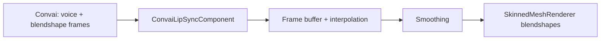

# Add Lip Sync

### Synchronize Your Character's Mouth to Convai Audio

The Convai SDK for Unity includes a real-time lip sync system that drives `SkinnedMeshRenderer` blendshapes in sync with the character's voice audio. It supports three industry-standard blendshape formats and handles playback buffering, smoothing, and fade-out automatically.

### How It Works

When Convai sends voice audio, it also streams a sequence of blendshape frames in the character's transport format (ARKit, MetaHuman, or CC4 Extended). The SDK buffers and interpolates these frames, applies optional smoothing, and writes the result to your character's `SkinnedMeshRenderer` every frame.

***

### Quick Setup



**Add the Component**

Add `ConvaiLipSyncComponent` to the same GameObject as your `ConvaiCharacter` (or to any child GameObject).



**Set the Profile ID**

In the Inspector, set **Locked Profile ID** to the transport format your character uses:

* `arkit` — Apple ARKit (61 blendshapes)
* `metahuman` — Unreal MetaHuman (275+ blendshapes)
* `cc4extended` — Character Creator 4 Extended (240+ blendshapes)



**Assign Target Meshes**

In the **Target Meshes** list, add all `SkinnedMeshRenderer` components that have facial blendshapes.



**Enter Play Mode**

Leave **Mapping** empty — the SDK auto-selects a matching bundled map for the chosen profile. Enter Play Mode and speak to the character.

The character's mouth moves in sync with its voice output.


If the mouth does not move, confirm that your `SkinnedMeshRenderer` blendshape names match the expected naming convention for the chosen profile. ARKit uses camelCase names (e.g., `jawOpen`, `mouthSmileLeft`). MetaHuman uses the `CTRL_expressions_` prefix. Use a custom map if your rig uses different names — see [Profiles and Mappings](/broken/pages/a11cf9562beb5ec94dc413e6691640d8fbcc0bab).




***

### Bundled Profiles

Choose the profile that matches the blendshape format your character was rigged with.

| Profile      | Locked Profile ID | Blendshapes | Typical Character Source                  |
| ------------ | ----------------- | ----------- | ----------------------------------------- |
| ARKit        | `arkit`           | 61          | Apple-rigged characters, some custom rigs |
| MetaHuman    | `metahuman`       | 275+        | Unreal MetaHuman exported to Unity        |
| CC4 Extended | `cc4extended`     | 240+        | Reallusion Character Creator 4 characters |


If your character was rigged with non-standard blendshape names, create a custom map to route the SDK's output channels to your rig's actual names. See [Profiles and Mappings](/broken/pages/a11cf9562beb5ec94dc413e6691640d8fbcc0bab).


***

### Playback Settings

**Core Setup:**

| Field              | Default        | Description                                                            |
| ------------------ | -------------- | ---------------------------------------------------------------------- |
| `_lockedProfileId` | `arkit`        | Transport format the SDK streams (`arkit`, `metahuman`, `cc4extended`) |
| `_mapping`         | _(none)_       | Optional custom mapping asset (leave empty to use bundled auto-map)    |
| `_targetMeshes`    | _(empty list)_ | `SkinnedMeshRenderer` components to write blendshapes to               |

**Playback & Behavior:**

| Field              | Default | Range    | Description                                                    |
| ------------------ | ------- | -------- | -------------------------------------------------------------- |
| `_smoothingFactor` | `0.5`   | 0–0.9    | Exponential smoothing per frame (higher = smoother but slower) |
| `_fadeOutDuration` | `0.2`   | 0.05–2.0 | Seconds to fade all blendshapes to 0 after audio ends          |
| `_timeOffset`      | `0.0`   | -0.5–0.5 | Shift playback timing relative to audio (negative = earlier)   |

**Streaming & Latency:**

| Field                       | Default    | Range    | Description                                          |
| --------------------------- | ---------- | -------- | ---------------------------------------------------- |
| `_latencyMode`              | `Balanced` | —        | Preset that controls buffer depth vs. responsiveness |
| `_maxBufferedSeconds`       | `3.0`      | 1–10     | Ring buffer capacity in seconds                      |
| `_minResumeHeadroomSeconds` | `0.12`     | 0.05–0.3 | Buffer refill threshold after starvation             |

**Latency Mode Options:**

| Mode              | Use Case                                                         |
| ----------------- | ---------------------------------------------------------------- |
| `Balanced`        | Default. Recommended for most deployments                        |
| `UltraLowLatency` | Minimal delay; susceptible to starvation on unstable connections |
| `NetworkSafe`     | High buffering; best for unreliable or high-latency networks     |
| `Custom`          | Unlocks manual control over buffer fields above                  |

***

### Usage Examples

#### Example 1: ARKit Character

**Scenario:** A corporate training simulation uses a character rigged with Apple ARKit blendshapes.

**Setup:**

1. Add `ConvaiLipSyncComponent` to the NPC GameObject (same as `ConvaiCharacter`).
2. Set `_lockedProfileId` to `arkit`.
3. In the **Target Meshes** list, add the `SkinnedMeshRenderer` from the avatar's head mesh.
4. Leave `_mapping` empty — the bundled ARKit auto-map covers standard camelCase ARKit blendshape names (`jawOpen`, `mouthSmileLeft`, etc.).

**Expected outcome:** The avatar's mouth, lips, and jaw animate in sync with the character's voice during conversation. Blendshapes return to neutral smoothly after each response ends (`_fadeOutDuration` = 0.2s default).

***

#### Example 2: MetaHuman Character

**Scenario:** A high-fidelity medical simulation uses an Unreal MetaHuman character exported to Unity.

**Setup:**

1. Add `ConvaiLipSyncComponent` to the NPC GameObject.
2. Set `_lockedProfileId` to `metahuman`.
3. In the **Target Meshes** list, add all `SkinnedMeshRenderer` components on the MetaHuman head and teeth meshes — MetaHuman separates these into multiple renderers.
4. Leave `_mapping` empty — the bundled MetaHuman map targets `CTRL_expressions_` prefixed blendshapes.
5. Increase `_smoothingFactor` to `0.7` for more fluid animation on high-poly rigs.

**Expected outcome:** All facial regions animate together — lips, jaw, cheeks, and tongue shapes — producing highly realistic mouth movement. Smoothing reduces per-frame jitter visible on high-resolution meshes.

***

### Profiles and Mappings

For cases where bundled profiles and auto-maps do not cover your rig, create custom assets.


[Broken link](/broken/pages/a11cf9562beb5ec94dc413e6691640d8fbcc0bab)


***

### Next Steps

After lip sync is configured, validate your complete setup.


[Broken link](/broken/pages/67514c0f1b44e879dcc78060744e45eae64b6522)

