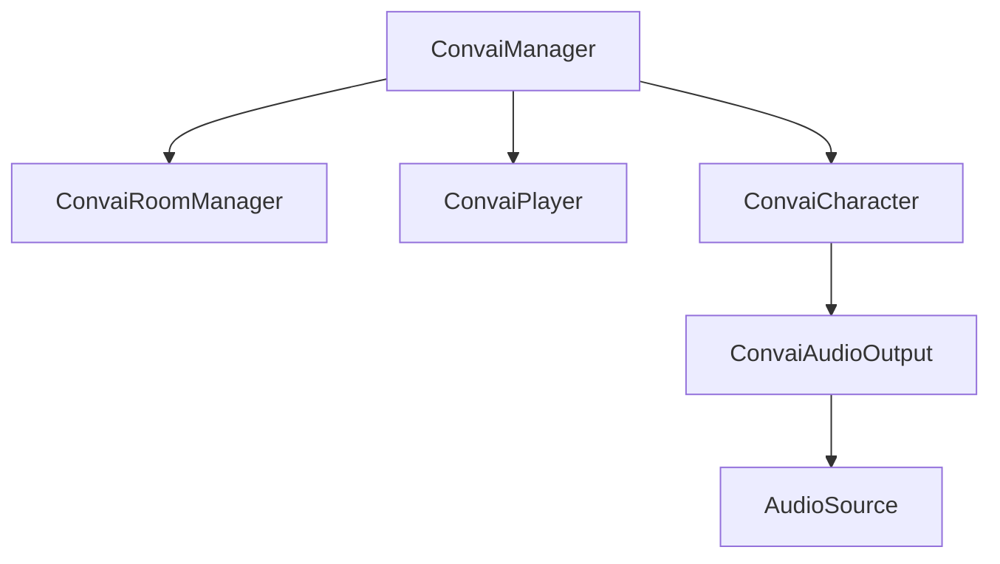

Every Convai-powered scene is built from four core components. Understanding what each one does and how they relate to each other makes building and debugging your setup straightforward.

## Component overview

The diagram below shows how the components depend on each other at runtime.



`ConvaiManager` is the root. It bootstraps the SDK, manages the room connection through `ConvaiRoomManager`, and owns references to all `ConvaiCharacter` and `ConvaiPlayer` instances in the scene.

## ConvaiManager

`ConvaiManager` is the SDK's entry point. It must be present in every scene that uses Convai. It initializes all internal services and injects dependencies into the other components automatically.

**Add it:** Use **GameObject > Convai > Setup Required Components** to add `ConvaiManager` and its companion components in one step. Do not add it manually via Add Component — the wizard ensures the correct setup.

**Key behavior:**

* Singleton. Only one `ConvaiManager` may exist per scene.
* Runs at execution order `-1100` — it initializes before all other components.
* Auto-discovers `ConvaiCharacter` and `ConvaiPlayer` instances in the scene on startup.
* Injects dependencies into discovered components automatically when `_autoInject` is enabled (default: on).

**Useful properties at runtime:**

| Property                      | Type                             | Description                            |
| ----------------------------- | -------------------------------- | -------------------------------------- |
| `IsBootstrapped`              | `bool`                           | SDK internal services are initialized  |
| `IsInitialized`               | `bool`                           | Bootstrap complete and event hub ready |
| `IsConnected`                 | `bool`                           | Room connection is active              |
| `Characters`                  | `IReadOnlyList<ConvaiCharacter>` | All characters owned by this manager   |
| `Player`                      | `ConvaiPlayer`                   | The player component in this scene     |
| `ActiveConversationCharacter` | `ConvaiCharacter`                | Currently active conversation target   |

## ConvaiRoomManager

`ConvaiRoomManager` manages the connection lifecycle between your scene and Convai. It handles connecting, disconnecting, and reconnecting the audio session. It lives on the same GameObject as `ConvaiManager`.

**Key behavior:**

* Auto-connects on `Start()` when `ConnectOnStart` is `true` (default: `true`).
* Reconnects automatically on transient failures, up to `_maxReconnectAttempts` (default: `3`).
* Manages the microphone — starts capturing audio `_autoMicStartDelaySeconds` (default: `0.5s`) after the connection is established.

**Inspector fields:**

| Field                       | Default     | Description                                                      |
| --------------------------- | ----------- | ---------------------------------------------------------------- |
| `ConnectOnStart`            | `true`      | Connect to Convai automatically when the scene starts            |
| `_connectionType`           | `Audio`     | `Audio` for voice-only; `AudioVideo` to also send camera frames  |
| `_pushToTalkKey`            | `KeyCode.T` | Keyboard key used for push-to-talk input mode                    |
| `_maxReconnectAttempts`     | `3`         | Attempts before giving up on reconnection                        |
| `_autoMicStartDelaySeconds` | `0.5`       | Seconds to wait after connection before opening the microphone   |
| `_roomRejoinTtlSeconds`     | `60`        | Seconds after disconnect during which the session can be resumed |

Turn-taking settings are also configured here. See [Configure conversation input mode](configure-conversation-input-mode.md).

## ConvaiCharacter

`ConvaiCharacter` represents one AI character in your scene. Each NPC or virtual instructor that talks to players needs its own `ConvaiCharacter` component. Multiple characters are fully supported — each maintains an independent session.

**The Character ID field is required.** Get this value from your character's profile on the [Convai dashboard](<code class="expression">space.vars.dashboard_url</code>).

**Inspector fields:**

| Field                           | Default   | Description                                                     |
| ------------------------------- | --------- | --------------------------------------------------------------- |
| `_characterId`                  | _(empty)_ | **Required.** Unique ID from your Convai dashboard              |
| `_characterName`                | _(empty)_ | Display name shown in transcripts and logs                      |
| `_nameTagColor`                 | White     | Color used to identify this character in the transcript UI      |
| `_autoConnect`                  | `false`   | Start a conversation immediately after the scene loads          |
| `_enableRemoteAudio`            | `true`    | Play back the character's voice audio                           |
| `_enableSessionResume`          | `false`   | Resume the previous session on reconnect                        |
| `_characterReadyTimeoutSeconds` | `30`      | Seconds to wait for the character-ready signal (0 = no timeout) |

**Useful properties at runtime:**

| Property             | Type           | Description                                                   |
| -------------------- | -------------- | ------------------------------------------------------------- |
| `IsCharacterReady`   | `bool`         | Character has received the ready signal from Convai           |
| `IsSessionConnected` | `bool`         | Connected to the room (ready signal may not have arrived yet) |
| `IsInConversation`   | `bool`         | Connected and ready — true conversation state                 |
| `IsSpeaking`         | `bool`         | Character is currently outputting audio                       |
| `SessionState`       | `SessionState` | Full connection state enum                                    |

**Component dependencies:** `ConvaiAudioOutput` (handles audio playback for this character) must be on the same GameObject. `ConvaiAudioOutput` requires an `AudioSource` on the same GameObject.

## ConvaiPlayer

`ConvaiPlayer` identifies the user in the conversation. It provides the player's display name and color to the transcript UI and lets Convai attribute player speech to the correct participant.

**One `ConvaiPlayer` per scene.** Multiple player components in the same scene are not supported.

**Inspector fields:**

| Field           | Default    | Description                                                     |
| --------------- | ---------- | --------------------------------------------------------------- |
| `_playerName`   | `"Player"` | Display name shown in the transcript UI                         |
| `_playerId`     | _(empty)_  | Local ID for transcript attribution (empty = use `_playerName`) |
| `_nameTagColor` | Green      | Color used to identify the player in the transcript UI          |


`PlayerId` is a local display identifier for the transcript UI only. It is not the server-generated speaker ID used for Long-Term Memory. The server-assigned speaker ID is resolved after connection and is not set manually.


**Useful methods:**

```csharp
// Override display name at runtime (for example, after a player logs in)
GetComponent<ConvaiPlayer>().SetRuntimeDisplayName("Dr. Reyes");

// Set both name and ID together
GetComponent<ConvaiPlayer>().Configure("Dr. Reyes", "user-123");
```

## Optional components

### ConvaiAudioOutput

Handles audio playback for a single character. Add it to the same GameObject as `ConvaiCharacter`. Requires an `AudioSource` on the same GameObject.

| Field          | Default | Description                        |
| -------------- | ------- | ---------------------------------- |
| `Volume`       | `1.0`   | Playback volume (0–1)              |
| `IsMuted`      | `false` | Mute this character's audio output |
| `_use3DAudio`  | `true`  | Enable spatial (3D) audio          |
| `_minDistance` | `1`     | Spatial audio minimum distance     |
| `_maxDistance` | `50`    | Spatial audio maximum distance     |

### ConvaiSceneConfig

An optional ScriptableObject (**Assets > Create > Convai > Scene Config**) that lets you define character IDs, prefabs, and auto-connect behavior in a reusable asset rather than inline in the Inspector. Useful for managing multiple characters across scenes. See Advanced Topics for full details.

## Next steps

Now that you understand the components, build your own scene from scratch.


[Build a custom scene](build-a-custom-scene.md)

