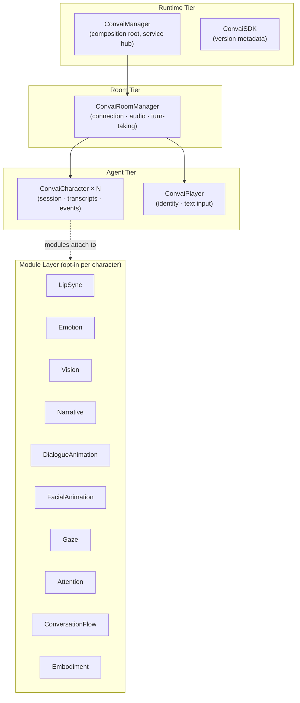

The SDK is organized into four tiers: Runtime, Room, Agent, and Module. As a developer, you interact primarily with the Agent tier (character and player components) and the Module layer (opt-in feature modules). The Runtime and Room tiers handle connection and service bootstrapping with minimal configuration required.

## System diagram

The dashed line from `ConvaiCharacter` to the Module Layer means modules are optional components you add to the same GameObject as the character — not required for basic conversation.

## Runtime tier

The Runtime tier boots when your scene loads and provides services to everything below it.

`ConvaiSDK` is a static class that exposes the SDK version (`ConvaiSDK.Version`). You rarely reference it directly.

`ConvaiManager` is the composition root. It is a singleton (`ConvaiManager.ActiveManager`) marked with `[DefaultExecutionOrder(-1100)]` so it initializes before other scene objects. It owns:

* **Service accessors** — `TryGet` methods for every internal service (microphone, audio, agent registry, notification, settings panel, etc.)
* **High-level facades** — `ConvaiManager.Audio`, `ConvaiManager.Transcripts`, `ConvaiManager.Events` for the most common scripting tasks
* **Connection control** — `ConnectAsync()`, `DisconnectAsync()`, `SetConversationInputModeAsync()`
* **Agent references** — `Characters`, `Player`, `ActiveConversationCharacter`


Most integration code only needs `ConvaiManager.ActiveManager` and the character's own events. The `TryGet` service accessors are for advanced use cases where you replace or extend internal services.


## Room tier

`ConvaiRoomManager` owns the live connection to Convai. One `ConvaiRoomManager` per scene, managed by `ConvaiManager`.

It is responsible for:

* **Room connection lifecycle** — connecting, disconnecting, reconnecting
* **Microphone capture** — starting and stopping audio input, mute control
* **Turn-taking mode** — hands-free (`ConversationInputMode.HandsFree`) or push-to-talk (`ConversationInputMode.PushToTalk`)
* **Dynamic context transport** — sending state updates and events to Convai at runtime
* **Audio playback coordination** — enabling remote character audio, WebGL user-gesture handling

`ConvaiRoomManager` exposes coordinators for diagnostics, audio, ownership, and connection management. These are accessible via `ConvaiManager.ActiveManager.TryGetRoomConnectionService()` for advanced scripting.

## Agent tier

The Agent tier contains the components you place on scene GameObjects.

### ConvaiCharacter

Add `ConvaiCharacter` to each NPC or agent GameObject. One component per character. It owns:

* Character ID — the unique ID from your Convai dashboard
* Session state — `Disconnected`, `Connecting`, `Connected`, `Reconnecting`, `Disconnecting`, `Error`
* Conversation lifecycle — `StartConversationAsync()`, `StopConversationAsync()`, `ToggleSpeech()`
* Transcript and event callbacks — `OnTranscriptReceived`, `OnEmotionChanged`, `OnActionsReceived`, `OnSpeechStarted`, `OnSpeechStopped`, `OnCharacterReady`
* Action configuration — via `ConvaiActionConfigSource` component

`ConvaiCharacter` can be configured inline in the Inspector or via a reusable `ConvaiCharacterProfile` ScriptableObject asset.

### ConvaiPlayer

Add `ConvaiPlayer` to your player GameObject. One per scene is standard. It owns:

* Player display name and name tag color for transcript attribution
* Text message sending — `SendTextMessage(string message)`
* Runtime identity override — `SetRuntimeDisplayName(string displayName)`


`ConvaiPlayer.PlayerId` is a local display identifier for transcript UI attribution. It is not the server-generated speaker ID used for Long-Term Memory tracking.


## Module layer

Modules are optional Unity components you add to the same GameObject as `ConvaiCharacter` (or `ConvaiRoomManager` for Vision). Each module is independent — add only what your project needs.

| Module              | What it does                                                                                                     |
| ------------------- | ---------------------------------------------------------------------------------------------------------------- |
| LipSync             | Real-time blend shape mouth animation driven by audio playback; supports ARKit, MetaHuman, and CC4 Extended maps |
| Emotion             | Receives Convai emotion signals, smooths them, and dispatches to blend shape or Animator parameter bindings      |
| Vision              | Publishes camera, webcam, or Meta Quest passthrough frames to Convai for multimodal awareness                    |
| Narrative           | Manages story section progression through trigger-based events tied to conversation flow                         |
| DialogueAnimation   | Drives a four-layer animator stack (base idle, masked overlays, body talk, head talk) during dialogue            |
| FacialAnimation     | Plays facial animation clips at runtime, composited against lip sync and emotion outputs                         |
| Gaze                | Blends eye and head actuators toward conversation partners and attention targets                                  |
| Attention           | Resolves weighted focus targets, providing gaze direction to the Gaze module                                     |
| ConversationFlow    | Bridges the conversation event stream to per-frame dialogue state (Idle, Speaking, Reacting, etc.)               |
| Embodiment          | Foundational behavior profile and lifecycle management for physical presence and behavioral modules              |

`ConversationFlow` is provisioned automatically at runtime when a `ConvaiCharacter` initializes. All other modules — `LipSync`, `Emotion`, `Vision`, `Narrative`, `DialogueAnimation`, `FacialAnimation`, `Gaze`, `Attention`, and `Embodiment` — are opt-in.

## Configuration model

Every major component supports two configuration modes, selectable in the Inspector.



Values are set directly on the component in the Inspector. This is the default mode and is suitable for most scenes — no additional assets required.



Values come from a reusable `ConvaiCharacterProfile` or `ConvaiRoomManagerProfile` ScriptableObject. Use this when you want shared defaults across multiple scenes or prefab variants, or when you need to swap character behavior without modifying individual prefabs.



## Next steps


[Feature map](feature-map.md)



[Getting Started](../getting-started/README.md)

