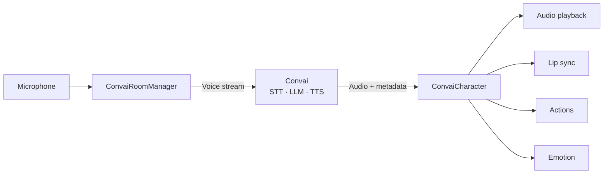

# What Is the Convai Unity SDK

### Real-Time AI Characters for Unity

The Convai Unity SDK connects Unity characters to Convai so they can speak, listen, reason, and act — in real time. A player speaks into a microphone; the SDK captures audio, streams it to Convai for speech recognition and language understanding, generates a response with text-to-speech, and plays it back on the character with synchronized lip sync, facial emotion, and optional in-scene actions.

The SDK targets Unity developers building training simulations, interactive experiences, and games that require characters a player can have a real conversation with.

***

### What It Includes

The SDK ships with a complete conversation pipeline and a set of opt-in feature modules.



Always active once connected:

* **Real-time voice input** — microphone capture, streaming speech recognition
* **Language understanding and generation** — Convai processes and responds in character
* **Text-to-speech** — voice generated by Convai, played back through Unity audio



Opt-in, each added as a Unity component:

* **Lip sync** — real-time blend shape mouth animation; supports ARKit, MetaHuman, and CC4 Extended maps
* **Emotion** — maps Convai emotion signals to facial blend shapes or Animator parameters
* **Actions** — character executes structured in-scene commands dispatched by Convai
* **Long-term memory** — character remembers each player across separate sessions
* **Narrative design** — trigger-based story section progression tied to conversation flow
* **Vision** — character sees through a Unity camera, webcam, or Meta Quest passthrough
* **Dynamic context** — inject runtime state and events into the character's knowledge at any time



Optional helpers that run entirely in Unity without backend communication:

* **Dialogue animation** — four-layer animator stack driving body and head movement during speech
* **Gaze & attention** — eye and head gaze blended toward focus targets and conversation partners



Project Settings API key configuration, scene setup menu, Scene Validator, and custom Inspectors for every SDK component.



***

### Voice → Convai → Character Flow

`ConvaiRoomManager` handles the streaming connection to Convai. `ConvaiCharacter` receives the response — audio, transcript, emotion signals, and action commands — and routes each to the appropriate module or output.

***

### Requirements

| Requirement     | Minimum                                                |
| --------------- | ------------------------------------------------------ |
| Unity version   | 2023.1.1f1                                             |
| Render pipeline | Built-in, URP, or HDRP                                 |
| Platform        | Windows, macOS, Linux, Android, iOS, Meta Quest, WebGL |
| Network         | Internet connection to Convai                          |
| API key         | Free account at [convai.com](https://www.convai.com/)  |


The sample scenes use URP. If your project uses the Built-in render pipeline, the samples require minor material reassignment. The SDK itself works with all three pipelines.


***

### Next Steps

Install the SDK and add your first character.


[Broken link](/broken/pages/0967634742fecc28d7a3c429a75d845f8c059838)


If you want to understand the system architecture before setting up, read the architecture overview next.


[Broken link](/broken/pages/df64fbe457211c033f6c0ecb0e7067cc0eb6ea3a)

