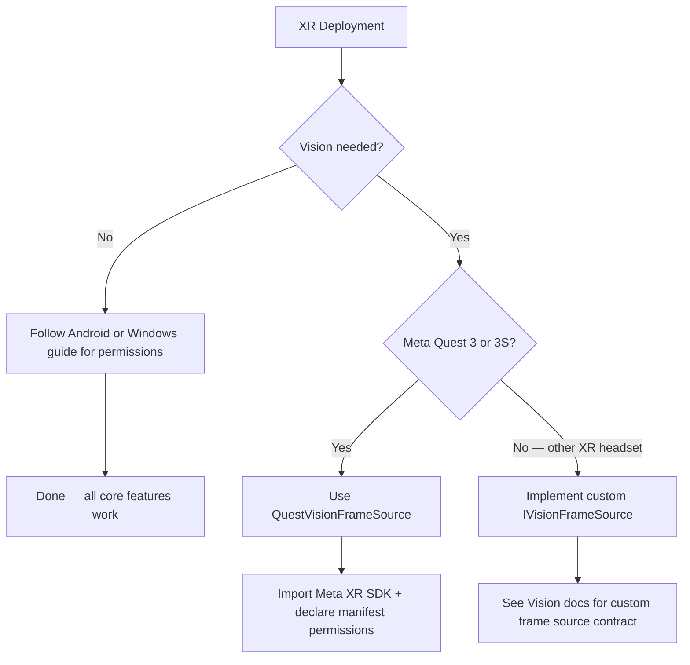

# XR Headsets

### XR Headset Deployment Guide

The Convai Unity SDK runs on Android-based XR headsets (Meta Quest, Horizon OS, Android XR) and Windows XR headsets without extra configuration for core features. Voice conversation, lip sync, actions, emotion, and long-term memory work the same as on any other supported platform. Vision is the only feature that requires XR-specific integration work — and only when you want the AI character to see the real world through the headset's cameras.

***

### Core Feature Support on XR

| Feature              | Android XR (Meta Quest, Horizon OS)            | Windows XR                              |
| -------------------- | ---------------------------------------------- | --------------------------------------- |
| Voice conversation   | ✅ Full                                         | ✅ Full                                  |
| Lip sync             | ✅ Full                                         | ✅ Full                                  |
| Actions              | ✅ Full                                         | ✅ Full                                  |
| Emotion              | ✅ Full                                         | ✅ Full                                  |
| Long-Term Memory     | ✅ Full                                         | ✅ Full                                  |
| Narrative Design     | ✅ Full                                         | ✅ Full                                  |
| Vision (passthrough) | ✅ `QuestVisionFrameSource` (Quest 3 / 3S only) | ⚠️ Custom `IVisionFrameSource` required |
| Spatial audio        | ✅ Full                                         | ✅ Full                                  |

For Android-based XR headsets, all core setup follows the Android platform guide — including the `RECORD_AUDIO` manifest declaration and runtime permission flow.


[Broken link](/broken/pages/d7cab15c72c25569429349891965eaf09c98fc72)


Vision is the only feature that varies between XR platforms. The decision tree below shows when extra setup is needed:



***

### Vision on Meta Quest

`QuestVisionFrameSource` streams the passthrough camera feed from a Meta Quest headset to Convai, enabling the AI character to see and respond to the real world the learner is looking at.

**Supported hardware:** Meta Quest 3 and Quest 3S running Horizon OS with the Passthrough Camera API available.

The component uses reflection to bind to the Meta XR SDK's `PassthroughCameraAccess` at runtime. The Convai SDK has no hard compile-time dependency on any Meta SDK package — you can update or swap the Meta XR SDK version without changes to the Convai SDK.


`QuestVisionFrameSource` produces no frames in the Unity Editor or on non-Quest builds. `PassthroughCameraAccess` is only available on Horizon OS. Test Vision on a physical Quest device — the Editor will show the source in the `Starting` state indefinitely.


#### Required Permissions


Both permissions must be declared in your `AndroidManifest.xml`. The passthrough camera will not start without them, and `QuestVisionFrameSource` will enter the `Failed` state after three retry attempts.



```xml
<uses-permission android:name="horizonos.permission.HEADSET_CAMERA" />
<uses-permission android:name="android.permission.CAMERA" />
```


#### Set Up QuestVisionFrameSource



**Import the Meta XR SDK**

Install the Meta XR SDK package from the Meta XR Developer Hub or the Unity Asset Store. Add a `PassthroughCameraAccess` component to a GameObject in your scene — this component is provided by the Meta SDK and handles the low-level passthrough camera API.



**Add QuestVisionFrameSource**

Add the `QuestVisionFrameSource` component to a GameObject in your scene. This can be the same GameObject as `PassthroughCameraAccess` or a separate one.



**Assign the PassthroughCameraAccess Reference (Optional)**

Drag the `PassthroughCameraAccess` component into the **Passthrough Camera Access** field on `QuestVisionFrameSource`. If left empty, the component searches the active scene automatically when `StartCapture()` is called. Assign explicitly when multiple `PassthroughCameraAccess` instances are present in the scene.



**Add a Vision Publisher**

Add `ConvaiVisionPublisher` to the same GameObject. It auto-discovers `QuestVisionFrameSource` in the scene, or you can assign the frame source reference in the publisher's Inspector field.



**Declare Manifest Permissions**

Add both `horizonos.permission.HEADSET_CAMERA` and `android.permission.CAMERA` to your `AndroidManifest.xml` at `Assets/Plugins/Android/AndroidManifest.xml`. See the Required Permissions section above.




Build and deploy to your Quest device. After the scene loads, the Vision status in the Convai Settings Panel should show **Ready**. The character will begin receiving passthrough frames and can respond to what it sees.


#### Inspector Reference

| Field                         | Default             | Description                                                                                                                                                                 |
| ----------------------------- | ------------------- | --------------------------------------------------------------------------------------------------------------------------------------------------------------------------- |
| **Passthrough Camera Access** | None                | Optional reference to the `PassthroughCameraAccess` component. Auto-discovered from the active scene if left empty.                                                         |
| **Source Id**                 | `quest-passthrough` | Identifier used by `ConvaiVisionPublisher` to select this frame source.                                                                                                     |
| **Max Output Width**          | 1280                | Maximum pixel width of frames sent to Convai. Reduce to lower bandwidth usage.                                                                                              |
| **Max Output Height**         | 720                 | Maximum pixel height of frames sent to Convai.                                                                                                                              |
| **Target Frame Rate**         | 15                  | Frames per second cap for the passthrough capture loop. Lower values reduce bandwidth and processing load.                                                                  |
| **Flip Y**                    | true                | Flips the passthrough texture vertically so the published frame is top-down. Disable only if your Meta SDK version handles orientation before handing the texture to Unity. |


`QuestVisionFrameSource` retries finding `PassthroughCameraAccess` up to three times with one-second intervals between attempts before entering the `Failed` state. If your scene initializes `PassthroughCameraAccess` asynchronously or after a delay, ensure it is ready before `QuestVisionFrameSource.StartCapture()` is called.


***

### Vision on Other XR Platforms

No built-in frame source exists for non-Meta XR headsets — OpenXR-only devices, Windows Mixed Reality, HoloLens, or Android XR platforms that do not expose a passthrough camera through the Meta XR SDK.

To enable Vision on these devices, implement `IVisionFrameSource` and supply frames from your XR SDK's camera API:


```csharp
using System;
using Convai.Runtime.Vision.Sources;
using UnityEngine;

public class CustomXRVisionFrameSource : MonoBehaviour, IVisionFrameSource
{
    [SerializeField] private float _targetFrameRate = 15f;
    [SerializeField] private string _sourceId = "custom-xr";

    private RenderTexture _renderTexture;

    public bool IsCapturing { get; private set; }
    public long FrameCount { get; private set; }
    public (int Width, int Height) FrameDimensions => (_renderTexture ? _renderTexture.width : 0,
                                                       _renderTexture ? _renderTexture.height : 0);
    public float TargetFrameRate => _targetFrameRate;
    public string SourceId => _sourceId;
    public RenderTexture CurrentRenderTexture => _renderTexture;
    public bool IsFrameReady { get; private set; }

    public event Action FrameReady;

    public void StartCapture()
    {
        // Initialize your XR SDK camera and RenderTexture here.
        // Each time a new frame is available, blit it into _renderTexture (top-down / Y-flipped),
        // then increment FrameCount, set IsFrameReady = true, and raise FrameReady?.Invoke().
        IsCapturing = true;
    }

    public void StopCapture()
    {
        IsCapturing = false;
        IsFrameReady = false;
    }
}
```


Assign your custom source to `ConvaiVisionPublisher` via its Inspector field. See the Vision feature documentation for the full `IVisionFrameSource` contract, publishing policies, and debug preview setup.

***

### Usage Examples

#### Surgical Resident Training with Passthrough Scene Awareness

A surgical resident training application on Quest 3 places learners in a simulated operating environment. The Convai character plays a surgical team member who can see and comment on physical props the resident holds up — anatomical models, instruments, and procedure reference cards.

**Setup:** `QuestVisionFrameSource` on a scene GameObject with **Passthrough Camera Access** auto-discovered. `ConvaiVisionPublisher` on the same object. Both permissions declared in the manifest. The character's Convai configuration includes a vision-aware system prompt instructing it to acknowledge and respond to what it sees in the passthrough feed.

**Outcome:** The character responds to visual context alongside conversation — "I can see you are preparing the scalpel — let's review the incision depth for this procedure." The resident practices both verbal interaction and physical task execution without any object detection code in the Unity project.

***

#### Industrial Safety Inspection with Environmental Object Recognition

A factory safety training application on Quest 3S guides equipment operators through machinery inspection. The AI character identifies physical components visible in the passthrough feed and adapts its safety guidance based on what the operator is looking at.

**Setup:** Same configuration as the medical training example. **Target Frame Rate** is set to 10 (reduced from 15) to accommodate an industrial network environment with limited bandwidth. **Max Output Width** is set to 960 to reduce per-frame payload size without meaningful quality loss for object recognition tasks.

**Outcome:** The character identifies machinery in the passthrough view and provides component-specific safety instructions — no hardcoded object detection, no custom computer vision pipeline. The SDK streams passthrough frames to Convai, which handles scene understanding and generates contextually appropriate guidance.

***

### Troubleshooting

| Symptom                                                                           | Likely Cause                                                                                                                                                               | Fix                                                                                                                                                                                                                                     |
| --------------------------------------------------------------------------------- | -------------------------------------------------------------------------------------------------------------------------------------------------------------------------- | --------------------------------------------------------------------------------------------------------------------------------------------------------------------------------------------------------------------------------------- |
| Source transitions to `Failed / DeviceUnavailable` a few seconds after scene load | `PassthroughCameraAccess` not found after three retry attempts — OR — missing `horizonos.permission.HEADSET_CAMERA` / `android.permission.CAMERA` in `AndroidManifest.xml` | (1) Add `PassthroughCameraAccess` to the scene or assign it explicitly in the **Passthrough Camera Access** Inspector field. (2) Verify both permissions are declared in `AndroidManifest.xml` and appear in the exported APK manifest. |
| `QuestVisionFrameSource` produces no output in the Editor                         | Expected — `PassthroughCameraAccess` only runs on Horizon OS                                                                                                               | Test on a physical Quest 3 or 3S device.                                                                                                                                                                                                |
| Character does not respond to visual context                                      | Vision publisher not connected, or Vision not enabled in character config                                                                                                  | Verify `ConvaiVisionPublisher` is in the scene and Vision is enabled in the character's Convai dashboard configuration.                                                                                                                 |
| Passthrough feed correct but image appears upside down                            | **Flip Y** was disabled                                                                                                                                                    | Re-enable **Flip Y** in the `QuestVisionFrameSource` Inspector.                                                                                                                                                                         |

***

### Next Steps

With `QuestVisionFrameSource` configured and manifest permissions declared, your Quest build is ready for on-device testing. Review the Vision feature documentation to configure publishing policies, set frame rate and resolution for your bandwidth target, and enable the debug preview overlay during development.


[Broken link](/broken/pages/cbff5b80d79f91ca5428015279c5944636660905)



[Broken link](/broken/pages/d7cab15c72c25569429349891965eaf09c98fc72)

