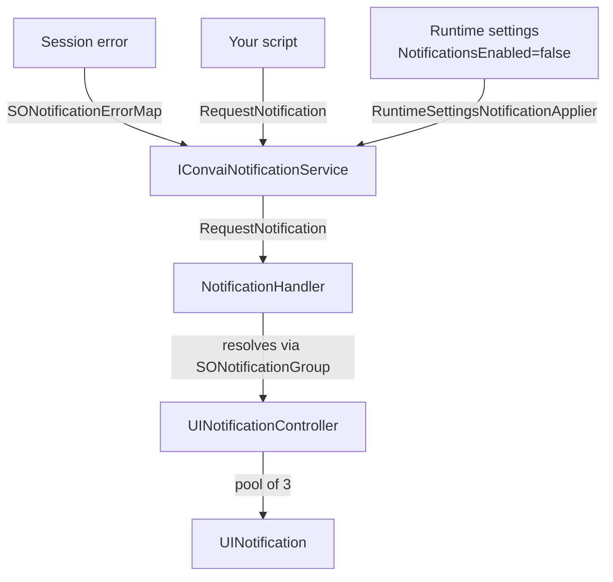

The notification system displays transient, toast-style popups in your scene. It handles session error alerts automatically — when Convai reports a connection or authentication error, the system maps the error code to a notification asset and queues it for display. You can also trigger custom notifications from code at any point during a session.

Up to three notifications appear on screen simultaneously. Additional notifications queue internally and display as space becomes available.

## How the notification system works

The following diagram shows the system's data flow:



`IConvaiNotificationService` is the single entry point for all notification requests. `NotificationHandler` resolves the notification asset by ID using `SONotificationGroup`, then passes it to `UINotificationController`, which manages a pool of reusable `UINotification` elements. Session errors route through `SONotificationErrorMap` to map error codes to notification assets automatically.

## `SONotification` — notification asset

Each notification is a ScriptableObject asset containing the content to display.

**Create:** Right-click in the Project window → **Create → Convai → Notification System → Notification**

| Field | Description |
| --- | --- |
| `icon` | `Sprite` shown in the notification icon slot. Optional — leave empty for no icon |
| `notificationTitle` | Title text shown in bold |
| `notificationMessage` | Body text. Supports multi-line content |
| `Id` | Stable string identifier used for error mapping and deduplication cooldowns. Defaults to the asset name if empty |

**Fluent setters for runtime creation:**

```csharp
var notification = ScriptableObject.CreateInstance<SONotification>();
notification
    .SetTitle("Scenario Complete")
    .SetMessage("All required steps have been completed. Proceed to debrief.")
    .SetIcon(successIcon);
```

## `SONotificationGroup` — notification registry

`SONotificationGroup` groups all notification assets your scene recognizes. `NotificationHandler` loads one group from `Resources/SONotificationGroup` automatically.

**Create:** Right-click → **Create → Convai → Notification System → Notification Group**

| Field | Description |
| --- | --- |
| `soNotifications` | Array of all `SONotification` assets to register |

**Lookup methods:**

```csharp
if (SONotificationGroup.GetGroup(out SONotificationGroup group))
{
    if (group.TryGetById("scenario-complete", out SONotification notification))
    {
        // use notification
    }
}
```


The group asset must be saved to `Assets/Resources/SONotificationGroup.asset`. The path string used at runtime is `"SONotificationGroup"` — no file extension, no subdirectory. If the asset is missing, `NotificationHandler` logs `"[NotificationHandler] SONotificationGroup asset could not be resolved."` and no notifications display.


## Add the notification system to your scene



### Create your notification assets

Create one `SONotification` asset per alert type. Give each a unique `Id` string that matches what your error map or scripts reference.



### Create and populate a notification group

Create an `SONotificationGroup` asset. Add all your `SONotification` assets to its `soNotifications` array. Save to `Assets/Resources/SONotificationGroup.asset`.



### Add the NotificationSystem prefab

Drag `NotificationSystem.prefab` into your scene. Find it at `Prefabs/Notifications/NotificationSystem.prefab` in the <code class="expression">space.vars.sdk_package_id</code> package. This prefab contains both `NotificationHandler` and `UINotificationController`.

In `NotificationHandler`'s Inspector, assign your `SONotificationGroup` asset to the `notificationGroup` field.


**Screenshot required before publishing:** Capture the Unity Inspector with the `NotificationHandler` component selected. The image must show the `notificationGroup` field with an `SONotificationGroup` asset assigned.


<figure><figcaption><p>TODO: Replace with screenshot showing NotificationHandler Inspector with notificationGroup assigned.</p></figcaption></figure>



### Configure timing (optional)

Adjust `UINotificationController` Inspector fields to match your project's visual pacing. The defaults are suitable starting points for most scenarios.

When setup is correct, triggering a notification causes the panel to slide in from `activeNotificationPos`. The slide-in animation runs for `slipDuration` seconds (default `0.3`s).



## `UINotificationController` inspector reference

| Field | Default | Description |
| --- | --- | --- |
| `uiNotificationPrefab` | — | `UINotification` prefab to pool |
| `spacing` | `100` | Vertical pixel spacing between stacked notifications |
| `activeNotificationPos` | — | Anchored position where visible notifications appear |
| `deactivatedNotificationPos` | — | Anchored position where hidden notifications wait off-screen |
| `activeDuration` | `4.0` | Seconds a notification remains visible before sliding out |
| `slipDuration` | `0.3` | Seconds for slide-in and slide-out animations |
| `delay` | `0.3` | Delay seconds before the slide animation begins |
| `slipAnimationCurve` | — | Easing curve for the slide animation |

**Concurrency and queuing:** Up to 3 notifications display simultaneously. When a 4th notification is requested while 3 are active, it queues and displays as soon as one of the active notifications dismisses.

**Animation sequence per notification:** slide in (`slipDuration`) → visible for `activeDuration` → delay (`delay`) → slide out (`slipDuration`) → next queued notification starts.

## Trigger notifications from code

Access `IConvaiNotificationService` through `ConvaiManager`:

```csharp
using Convai.Runtime.Components;
using Convai.Runtime.Presentation.Views.Notifications;
using UnityEngine;

public class ScenarioNotifier : MonoBehaviour
{
    [SerializeField] private SONotification _stepCompleteNotification;
    [SerializeField] private SONotification _failureNotification;

    public void NotifyStepComplete()
    {
        if (ConvaiManager.ActiveManager.TryGetNotificationService(out var service))
            service.RequestNotification(_stepCompleteNotification);
    }

    public void NotifyFailure()
    {
        if (ConvaiManager.ActiveManager.TryGetNotificationService(out var service))
            service.RequestNotification(_failureNotification);
    }

    public void DismissAll()
    {
        if (ConvaiManager.ActiveManager.TryGetNotificationService(out var service))
            service.DismissNotification();
    }
}
```

`DismissNotification()` clears all currently displayed notifications immediately, including any animations in progress.


The notification service enforces a **10-second cooldown** per notification `Id`. Duplicate requests within 10 seconds are silently discarded. This prevents error floods from filling the screen. The cooldown resets automatically after 10 seconds.


## Automatic error-to-notification mapping

Session errors automatically trigger notifications via `SONotificationErrorMap`. This asset maps error code strings to `SONotification` assets using an ordered rule list. The **first matching rule wins**.

**Create:** Right-click → **Create → Convai → Notification System → Session Error Map**

Save to `Assets/Resources/SONotificationErrorMap.asset` for automatic loading.

### `SessionErrorNotificationRule` fields

| Field | Default | Description |
| --- | --- | --- |
| `ErrorPattern` | — | The error code string to match against the session error |
| `MatchType` | `Exact` | `Exact` — full string equality. `Prefix` — error code starts with this pattern |
| `Notification` | — | `SONotification` to display when this rule matches |

**Example rule table:**

| ErrorPattern | MatchType | Notification |
| --- | --- | --- |
| `AUTH_FAILED` | `Exact` | `Notification_AuthError` |
| `CONNECTION_` | `Prefix` | `Notification_ConnectionError` |
| `RATE_LIMIT` | `Exact` | `Notification_RateLimit` |

Rules are evaluated top-to-bottom. Place more specific rules above broader prefix matches.

## Respect the notifications runtime setting

The notification system respects the **Notifications** toggle in the built-in Settings Panel. When the user disables notifications:

* Any currently displayed notification dismisses immediately
* Subsequent `RequestNotification` calls are silently ignored
* The log records: `"Cannot send notification because notifications are disabled in runtime settings."`

To toggle notifications from script:

```csharp
if (ConvaiManager.ActiveManager.TryGetRuntimeSettingsService(out var settings))
{
    settings.Apply(new ConvaiRuntimeSettingsPatch { NotificationsEnabled = false });
}
```

## Usage examples

### Corporate onboarding — step completion alerts

A corporate onboarding simulation notifies the trainee each time they complete a required dialogue checkpoint with the AI HR representative:

* Create an `SONotification` asset with `Id = "checkpoint-complete"`, a checkmark icon, and the message "Checkpoint complete. Move to the next topic."
* Call `service.RequestNotification(checkpointNotification)` from the checkpoint evaluation handler
* The notification appears for 4 seconds and dismisses without interrupting the ongoing conversation
* The 10-second cooldown prevents duplicate notifications if the evaluation logic fires multiple times

At runtime, each checkpoint completion produces a brief confirmation that appears and clears without pausing the dialogue.

### Connection error in firewall-restricted environments

A training simulation running on a corporate network requires informative error messages when the connection fails:

* Create an `SONotificationErrorMap` with a rule: `ErrorPattern = "CONNECTION_"`, `MatchType = Prefix`
* Set `Notification` to an asset with the message "Connection failed. Please contact IT support at ext. 4400."
* The error map fires automatically on any `CONNECTION_` prefixed error — no additional code required

At runtime, any connection failure produces a clear, actionable notification instead of a silent failure.

### Multi-scenario reset — dismiss all on scenario change

A multi-scenario simulation clears any lingering notifications when transitioning between scenarios:

```csharp
public void TransitionToNextScenario()
{
    if (ConvaiManager.ActiveManager.TryGetNotificationService(out var service))
        service.DismissNotification();

    LoadNextScenario();
}
```

At runtime, calling `DismissNotification()` immediately clears the screen before the next scenario loads, ensuring stale alerts do not appear in the wrong context.

## Troubleshooting

| Symptom | Likely cause | Fix |
| --- | --- | --- |
| No notifications appear; console shows `"[NotificationHandler] SONotificationGroup asset could not be resolved."` | Group asset not in `Resources/` | Save to `Assets/Resources/SONotificationGroup.asset` |
| Console shows `"[NotificationHandler] No UINotificationController found and no prefab set."` | `NotificationSystem.prefab` not in scene or `notificationControllerPrefab` not assigned | Add the prefab to the scene or assign a controller prefab in `NotificationHandler` Inspector |
| Console shows `"[NotificationHandler] Notification service not available; notifications will be deferred until services initialize."` | Notification triggered before `ConvaiManager` finishes initialization | Delay notification calls until `ConvaiManager.IsInitialized` is `true` |
| Console shows `"[NotificationHandler] No notification registered in the notification group for id: {id}"` | Notification `Id` in script does not match any asset in `SONotificationGroup` | Check the `Id` field on the `SONotification` asset and update the group |
| Console shows `"[NotificationHandler] UINotificationController is null, cannot display notification."` | Controller reference lost or not found in scene | Verify `NotificationSystem.prefab` is in the scene |
| Notification requested but not shown; no console errors | 10-second cooldown active for this notification | Wait 10 seconds or use a different notification asset with a unique `Id` |
| Notifications disabled after Settings Panel interaction | User toggled **Notifications** off | Re-enable via Settings Panel or `IConvaiRuntimeSettingsService.Apply(new ConvaiRuntimeSettingsPatch { NotificationsEnabled = true })` |
| 4th notification not showing immediately | Max 3 concurrent — 4th is queued | Expected behavior — it displays as soon as an active notification dismisses |

## Next steps

With the notification system in place, you can surface connection errors, scenario events, and custom alerts without interrupting the AI conversation. To give users control over whether notifications appear, wire the Settings Panel. To restyle the notification visuals, see Customizing UI Components.


[Settings Panel](settings-panel.md)



[Customizing UI Components](customizing-ui-components.md)

